## Introduction 

개인적인 소회를 기록하는 행위에 그리 능숙한 편은 아니다. 그럼에도 2025년은 단순한 연차의 축적으로 치부하기엔 너무 많은 것이 바뀌었다. 커리어와 개인사 양면에서 삶의 궤도가 급격히 뒤틀리는 감각을 경험한 해였고, 특히 'NC AI'의 독립 법인 분사와 그 과정에서 마주한 기술적·조직적 격변은 내 업무의 지향점을 근본적으로 재정의하는 결정적 계기가 되었다. 그 기록과 함께 한 해를 반추하며 글을 시작해보려 한다.
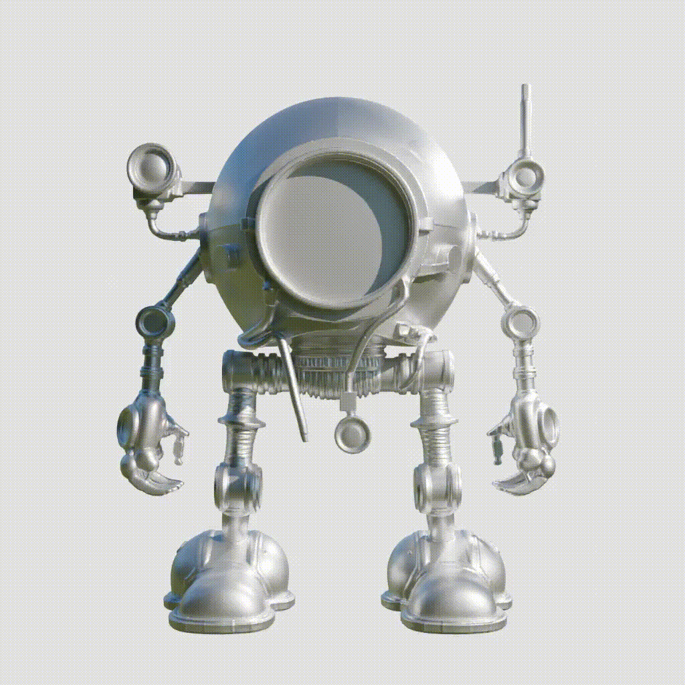

- *Generated by Varco3D, NC AI's proprietary 3D Genrative Model* 

---

#### 2025 연초까지의 기록 

재직 중인 'NC AI'는 본래 엔씨소프트 산하의 Research 본부였다. 4,000명 규모의 게임사 내부에 200명에 달하는 거대 연구 조직이 공존한다는 기묘한 구조는, 내부자로서도 그 지속 가능성에 끊임없이 의구심을 갖게 하는 대목이었다. 특히 조직의 방향성이 모호했던 2024년 이전까지, 이곳에서의 시간은 성장이 아닌 정체에 가까웠다.

'AI 연구소'라는 수식어가 무색하게 연구 성과는 현장과 동떨어져 있었고, 실무와의 접점 또한 희박했다. 그 부재의 시간 속 답답함을 해소하고자 2024년 중순부터 외부 사이드 프로젝트에 몰두하기 시작했다. 솔직히 말하면 그것은 이직을 향한 준비 과정이자 일종의 도피였다.

떠날 궁리를 하던 2024년 11월, 전문연구요원 기초군사훈련을 목전에 둔 시점에 NC Research 분사 소식이 들려왔다. 조직은 '엑소더스'라 불러도 무방할 만큼 거센 이직의 파고에 휩싸였다. 연일 퇴직 인사가 쏟아지는 어수선한 흐름에 떠밀려, 나 역시 여러 기업에 서류를 던지며 탈출구를 모색했다.

그러나 분사라는 격랑의 한복판에서 예기치 못한 변곡점을 마주했다. 사내 다른 팀에서 3D 생성 서비스를 구상하던 현재 팀의 리더였다. 스타트업 창업 경험에서 배어 나오는 특유의 실행력, 위기를 기회로 치환하려는 태도는 강렬한 인상을 남겼다. 무엇보다 ‘3D 생성 AI를 실제 서비스로 만들어보겠다’는 그의 비전은, 연구와 현실 사이에서 방황하던 내게 선명한 방향을 제시했다. ‘이 팀에서라면 NC에서 경험해보지 못한 본질적인 성과를 낼 수 있겠다’는 생각이 처음으로 들었다.

이직과 잔류, 두 갈래 길 위에서 합격 소식과 오퍼 레터들이 도착하며 번민은 깊어졌다. 새로운 팀으로의 이동은 비전의 갈증을 해소할 수 있었지만, 동시에 외부 제안들과의 현실적 조건 차이를 무시하기는 어려웠다. 고민 끝에 요청한 경영진 면담을 통해 기술적 도전과 합리적인 처우 모두를 충족할 수 있는 가능성을 확인했고, 그렇게 3D 생성형 AI 서비스 개발에 합류해 생성 모델 연구에 몰두하게 되었다.

---

## 1. Back to the 2024

본격적으로 Varco3D를 이야기하기에 앞서, 기술적 배경을 먼저 정리해두려 한다. 3D 생성 연구가 태동하던 2024년으로 거슬러 올라가, 당시의 연구 동향과 사내 프로젝트의 발전 과정을 살펴보자.

### 1.1 *Non-Native* 3D Generation 

2024년 이전까지 '3D 생성'은 SDS(Score Distillation Sampling)를 필두로 한 최적화 기반 방식(Optimization-based method)이 약진하고 있었다.

Stable Diffusion으로 대표되는 2D 이미지 생성 모델의 성공은 '2D 모델이 3D 정보를 내재적으로 이해하고 있을 것'이라는 가설로 이어졌고, 이를 NeRF (Neural Radiance Fields) 와 결합한 SDS는 거부할 수 없는 매력적인 연구 소재였다. 최적화 기반 방식이라 에셋 하나를 생성하는 데 드는 GPU 리소스가 상대적으로 적다는 점도, 자원이 한정된 연구실에서 쉽게 접근할 수 있는 이점이었다.

당시 게임 업계에서는 단순 Reconstruction 연구가 (NeRF/GS) 실질적인 생산성으로 이어지기 어렵다는 인식이 만연했기에, SDS의 유행에 발맞춰 팀 전체의 연구 방향을 '3D 생성'으로 재편하게 되었다. 그러나 loss term 설계만으로 SDS의 태생적인 성능의 한계를 극복하기란 쉽지 않았다. SDS는 잘 학습된 2D Diffusion(혹은 Flow) 모델을 강제적으로 mode seeker로 국한시킨다고 볼 수 있는데, 이로 인해 다음과 같은 문제들을 야기하였다. 

1. **Saturated Color**: high CFG scale 을 써서 mode seeking 을 강제하기 때문
2. **Janus Problem (multi-face problem**): frontal bias of 2D model & multi-view consistency
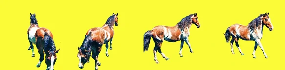
3. **Slow speed**: 에셋을 생성하기 위해 2D 모델을 수백 번 추론하며 NeRF나 3D Gaussian Splatting(GS)을 업데이트해야 하기 때문 
4. **Noisy Geometry** 

SDS 연구가 발전하며 따라 색감이나 Janus problem 등은 어느 정도 완화되었으나, 기하학적 품질과 속도 문제는 여전히 난제로 남았다. 특히 2024년 당시 SOTA 였던 'Dreamcraft3D'의 결과물조차 Polygonal Mesh 로 변환했을 때의 처참한 Geometry 품질은 SDS의 한계를 극명하게 보여주었다.
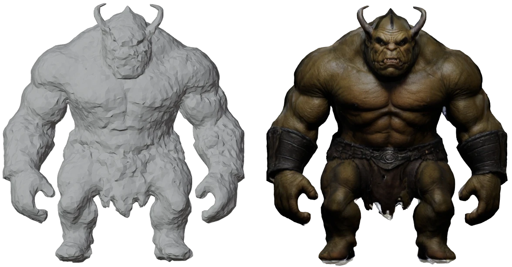

이러한 문제의 원인은 SDS의 optimization objective 에서 찾을 수 있다. 

$$ \nabla_{\theta} \mathcal{L}_{SDS} \approx \mathbb{E}_{t, \epsilon} \left[ w(t) ( \underbrace{\epsilon_{\phi}(x; y, t) - \epsilon}_{\text{Guidance Term (Residual)}} ) \frac{\partial x}{\partial \theta} \right]
\\
\text{where } \theta : \text{3D model, } x : \text{rendered image} \\ {}
$$

$$ 
\frac{\partial C}{\partial \theta} = \underbrace{\frac{\partial C}{\partial c} \frac{\partial c}{\partial \theta}}_{\text{Color update}} + \underbrace{\frac{\partial C}{\partial \sigma} \frac{\partial \sigma}{\partial \theta}}_{\text{Geometry update}} \\ {} \\ \rightarrow \Delta \sigma \propto (\epsilon_{\phi} - \epsilon) \cdot {\partial C}{\partial \sigma}
$$

SDS loss로 3D 모델을 업데이트할 때, chain rule을 따라가 보면 texture와 geometry의 update term이 분리되지 않음을 알 수 있다. 이로 인해 2D 모델의 high-frequency noise가 geometry update에 그대로 전달되며, 텍스처를 입히지 않은 메시의 표면이 매우 거칠게 표현되는 결과를 초래한다.

> **Noisy Geometry 에 대한 제언**
>
> a. SDS의 3D representation으로 NeRF를 선택하든, GS를 선택하든 두 representation 모두 clean mesh로 잘 변환하는 것 자체가 굉장히 어려운 문제다.
>
> b. Polygonal Mesh로 변환하지 않고 NeRF나 GS를 그대로 쓰는 것 또한 문제가 많다. 엔진에서 GS rendering 자체는 많이 지원하더라도, deformation이나 rigid body 설정 후 충돌 판정 등은 성능과 안정성 측면에서 Mesh에 비할 바가 못 된다.

---

### 1.2. *Texture* Generative AI

비슷한 시기, 사내의 다른 팀에서는 Polygonal Mesh의 texture를 2D 생성 AI로 생성하고 편집하는 Texture Copilot을 연구 중이었다.

[NC Research Blog: Texture Copilot](https://ncsoft.github.io/ncresearch/3f0ba4889e331ddbed68c9dd48d845fa18d874de)

<iframe width="480" height="270" src="https://www.youtube-nocookie.com/embed/HvyPxxDzrwo?si=1A8HVOcStAQE4rAS" title="YouTube video player" frameborder="0" allow="accelerometer; autoplay; clipboard-write; encrypted-media; gyroscope; picture-in-picture; web-share" referrerpolicy="strict-origin-when-cross-origin" allowfullscreen></iframe>

이는 주어진 메시를 다각도에서 Depth & Normal map으로 렌더링한 후, ControlNet을 이용해 Multi-view 이미지를 생성하고 이를 다시 메시에 역투영(Back-projection)하는 방식이었다. 
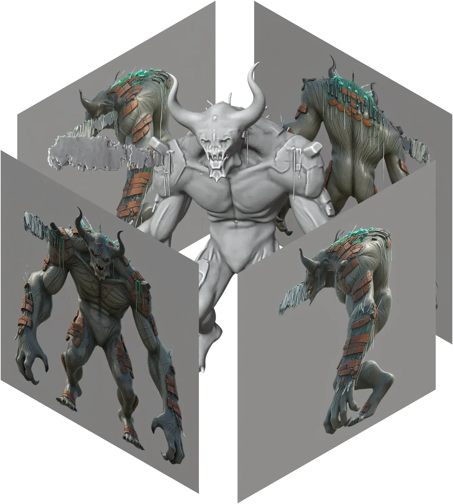

- *Visualization of multi-view images back-projection on mesh*

혁신적인 접근법이었고, 실제 게임 개발 공정에도 적용되는 성과를 거두었으나, 2D 모델 특유의 frontal view bias로 인한 Janus problem, 서비스의 태생상 기성 Geometry가 무조건 필요하다는 등의 단점이 존재하였다.

---

### 1.3. Beyond SDS; Native 3D Generation

그 무렵, 3D 생성 연구의 또 다른 축에서는 3D Native VAE를 이용한 3D Diffusion 모델 연구가 확장되고 있었다. **'VecSet VAE'** 로 대표되는 이 방식은 Polygonal Mesh에서 샘플링한 포인트 클라우드를 latent space로 압축하고, 다시 그 공간에서 SDF field를 복원하는 VAE 구조다. (자세한 사항은 [3D 생성 모델의 시대](https://hwan-h-heo.github.io/blogs/posts/an-era-of-3d-generation/)를 참고)

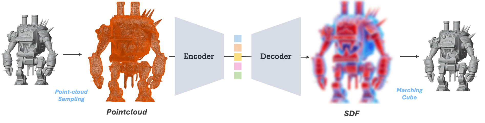
- *ShapeVAE illustration*

이러한 ShapeVAE를 통해, 수십만개 이상의 faces를 가지는 mesh를 2K~8K 정도의 token length로 압축한 latent space로부터 Diffusion Model, 혹은 Flow Matching 모델을 학습하는 것이 **'3D Native Generative Model'** 의 기본 골자다.

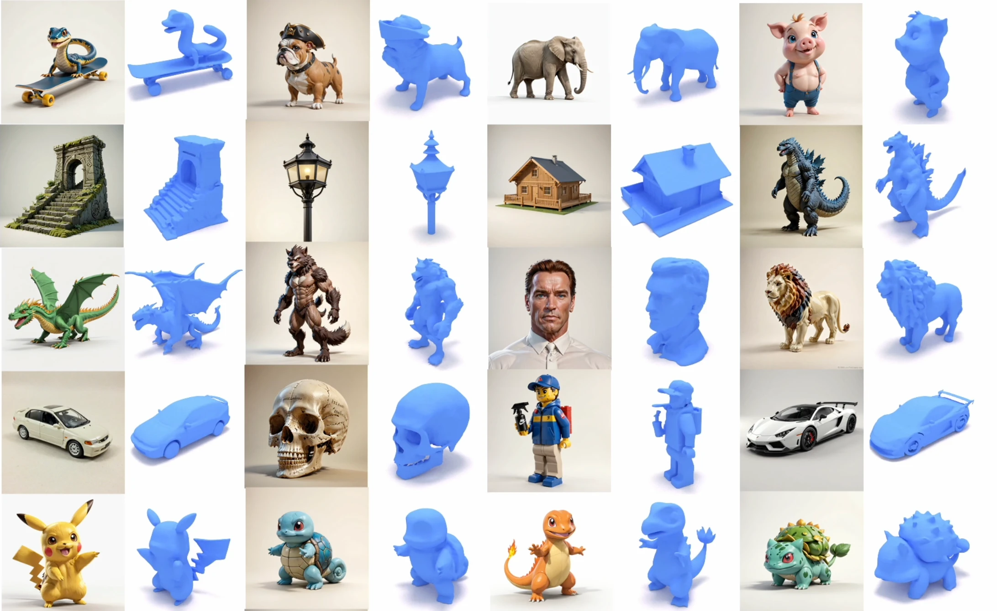
- ShapeVAE 에서 학습된 3D DiT 중 하나인 [Direct3D](https://nju-3dv.github.io/projects/Direct3D/) 의 sample results 

나는 이 3D native geometry 생성 연구와 Texture Copilot의 아이디어를 결합하면, SDS의 고질적인 문제들을 우회하는 완결된 파이프라인을 구축할 수 있으리라 판단했다. 이러한 믿음을 바탕으로 2024년 말, ShapeVAE 와 DiT 모델을 직접 학습하고, Texturing 에서는 Janus 문제를 해결하기 위해 Multi-View 생성을 위한 어텐션 모듈을 설계하는 등의 시도를 담은 CaPa 프로젝트를 진행하게 된다.

[**CaPa Project Page**](https://ncsoft.github.io/CaPa/)
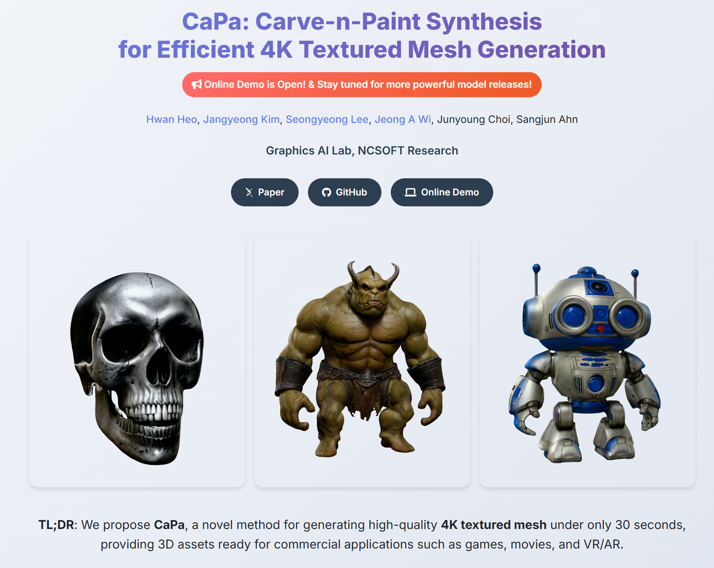

프로젝트를 진행하며 최적화 기반의 3D 생성 방법론은 결국 한계에 다다를 것이라 확신했다. ShapeVAE 기반의 DiT는 feed-forward 방식이기 때문에 SDS보다 asset 생성에 훨씬 빠르며, DiT 모델의 크기를 증대시키며 scaling law의 성공을 3D domain으로 확장할 수 있기 때문이다. 

---

## 2. Pursue SOTA: 3D Sovereign AI 

 

### 2.1. Varco3D-alpha

새로운 팀으로 옮긴 후 내가 수행한 첫 번째 업무는 CaPa 파이프라인을 확장하여 사내 3D 생성 서비스인 Varco3D-$\alpha$를 출시하는 것이었다. 모델 구조는 CaPa 를 계승한 전형적인 3D 생성 파이프라인을 따랐다.

1. **Geometry Generation**: ShapeVAE + DiT
2. **Texture Generation**: 2D Generative Model 을 차용한 Multi-View Image Synthesis to Mesh Back-projection

<iframe width="480" height="270" src="https://www.youtube-nocookie.com/embed/AtQNAuQY4-A?si=pQWlS8qawVOyFSqK" title="YouTube video player" frameborder="0" allow="accelerometer; autoplay; clipboard-write; encrypted-media; gyroscope; picture-in-picture; web-share" referrerpolicy="strict-origin-when-cross-origin" allowfullscreen></iframe>

이 모델을 학습시키며 얻은 중요한 직관 중 하나는, 'Geometry VAE'를 학습시키는 데는 2D 생성 모델보다 훨씬 적은 데이터와 리소스가 필요하다는 점이었다. 이는 3D geometry의 distribution이 RGB images보다 단순하다는 가정 때문인데, 실제로 아티스트가 제작한 polygonal mesh는 RGB image와 달리 high-frequency detail의 변화나 복잡한 배경이 많지 않다.

또한 당시 고성능 오픈소스 모델들은 라이선스 문제로 상업적 이용이 불가능했다. 이러한 배경이 '자체 모델을 지속적으로 고도화해야 한다'는 내부 공감대를 형성하는 계기가 되었다.

***cf.*** Denoising process visualization; Varco3D-$\alpha$ (Rectified Flow Model)

| Dragon Head | Steampunk Machine | 
| --- | --- | 
| 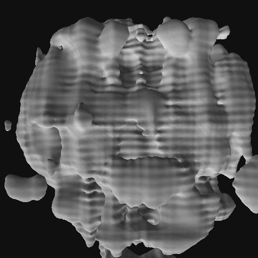 | |

---

### 2.2. SOTA Sparse Voxel Method

알파 버전 출시 이후, 팀은 중대한 기술적 변곡점을 맞이했다. 기존 VecSet 기반 방식 대신 Sparse Voxel(Sparse grid-based) 방식이 압도적인 디테일을 선보이며 등장했기 때문이다.

특히 Microsoft의 [Trellis](https://microsoft.github.io/TRELLIS/)와 뒤이어 등장한 [Sparc3D](https://lizhihao6.github.io/Sparc3D/)는 이전 모델들과는 두 단계 이상의 해상도(LoD) 차이를 보여주며 큰 충격을 안겼다.

| Hunyuan3D 2.5 | Sparc3D | 
| --- | --- | 
| 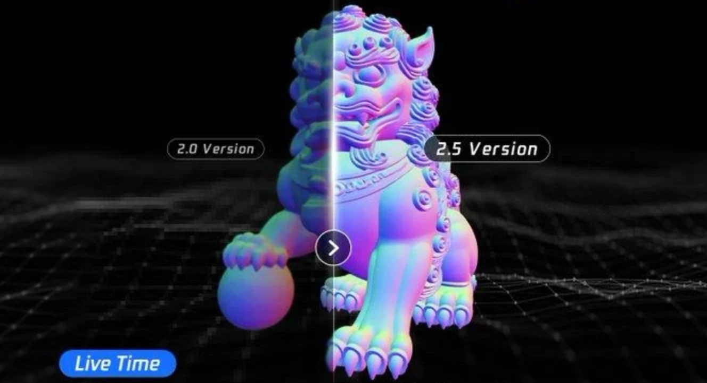 | 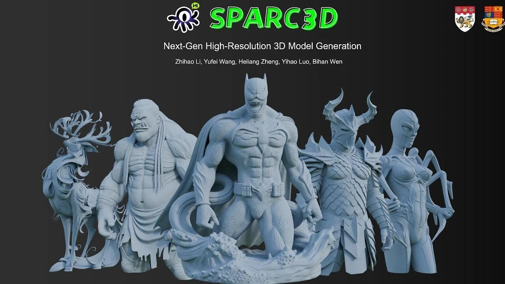 |

당시 나는 Sparc3D보다 먼저 공개된 10B 규모의 Hunyuan 3D 2.5를 보며, 고품질 mesh 생성은 결국 scaling law 으로만 도달할 수 있는 영역이라 믿고 있었다.

하지만 Sparc3D는 sparse operation을 적극 도입함으로써 적은 비용으로도 고품질 mesh 생성 모델 학습이 가능함을 입증했다. (VecSet VAE가 A100 32장으로 수렴까지 2주 이상 걸릴 때, Sparse Voxel VAE는 이틀이면 충분했다.)

> ***왜 이러한 차이가 나게되는 것일까?***

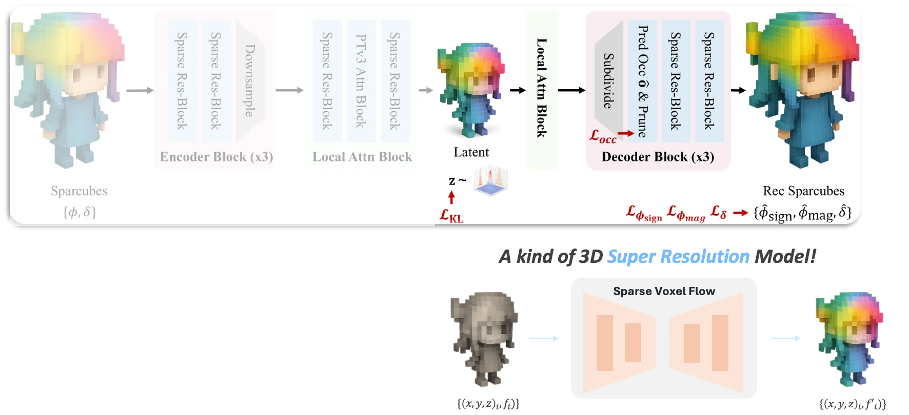
- *Sparc3D의 inference pipeline illustration 재구성*

이러한 성능 차이의 비밀은 구조적 특성에 있다.
그림과 같이, Sparse Voxel VAE의 decoding은 *저해상도의 sparse voxel latent grid* 를 *고해상도의 sparse voxel SDF grid* 로 매핑한다. 즉, sparse voxel VAE는 일종의 **'3D super-resolution'** 인 셈이다. 

이 구조에서 생성 모델(DiT)은 전체적인 형상을 만드는 대신, 이미 정의된 Active voxel 내에서 세부 디테일을 복원하는 데 집중한다. 전체 형상과 디테일 생성을 Decoupling 했기에 학습 효율이 극대화될 수 있었던 것이다.

> *'Active voxel 의 정보를 알고 있을 때' 란 가정을 기억하자. 즉 global shape 생성을 담당할 다른 모델이 필요하다는 뜻이다. *

이러한 가능성 아래, Sparc3D를 재구현하여 SOTA 레벨의 3D 생성 모델을 확보하는 것을 2025년 하반기 목표로 삼게 되었다. 

---

### 2.3. Varco3D 1.0-preview

Geometry Generation을 sparse voxel 기반으로 변경하기로 결정하며 맞닥뜨린 핵심 난제는 

*'active voxel 생성을 누구에게 맡길 것인가?'*

였다. 앞서 말했듯 sparse voxel 기반 3D gen model은 일종의 3D SR 모델이기 때문에, 'SR의 input', 즉 대략적인 global shape 정보를 생성할 방법이 필요했다.

Sparse voxel 기반 3D Generation의 본격적인 방향을 제시한 Trellis에서는 이를 위해 별도로 설계된 모델을 사용한다. 그러나 이 모델을 기존의 $256^3$ 해상도가 아닌, $1024^3$ 이상의 고해상도 Mesh 생성을 위해 사용하려면 Active Voxel의 해상도 또한 $128^3$ 수준으로 높여야 했는데, 이는 심각한 연산량 문제를 야기했다.
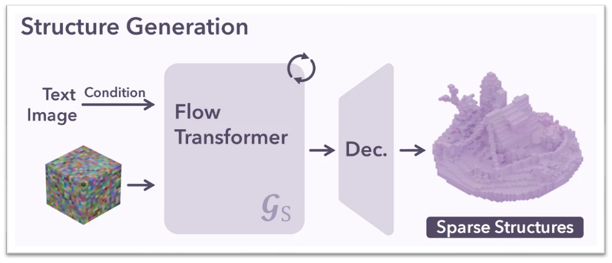

Trellis model formulation 으로 이는 $32^3$ 의 dense voxel grid 에서 diffusion-based model 을 학습 & 추론하는 것과 같다. 즉, $32^3 \times 32^3$, $1M$ tokens 의 full attention을 cost로 갖는 모델이고, 이를 당시 우리 자원으로 이를 학습시키는 것은 불가능에 가까웠다.

이때 나는 **'Varco3D-$\alpha$ (VecSet)로 만든 Coarse Mesh를 voxelize하여 DiT의 입력으로 사용하자'** 는 아이디어를 제안했다. 이미 검증된 VecSet 모델의 global shape 생성 능력을 그대로 활용하면서, 고해상도 연산 문제를 우회하는 전략이었다. (글을 쓰는 이 시점에서는 이미 보편적인 아이디어가 되어버렸다.)

| Coarse mesh from Varco3D-$\alpha$ | its voxelized ($128^3$ resolution) | 
| --- | --- | 
| 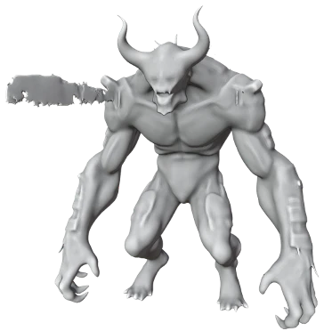 | 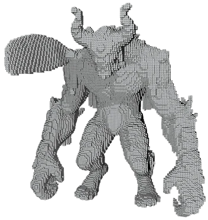 |

이를 위해 메시와 복셀 중심 간 거리를 병렬로 계산하는 CUDA 커널을 구현했고, 결과적으로 coarse mesh 생성, active voxel 생성으로 이어지는 공정을 5초 미만으로 단축할 수 있었다.

위 문제를 포함해, 기타 다른 이슈들을 해결하고 AWS의 64개 (8 multi-node) A100에서 training 을 성공하여 2025년 11월경 sparse voxel 기반의 자체 3D 생성 모델 Varco3D 1.0-preview를 선보일 수 있었다.

아래는 sparse voxel 기반 3D 생성 모델인 [***Varco3D 1.0-preview***](https://3d.varco.ai/explore) 의 결과이다. 

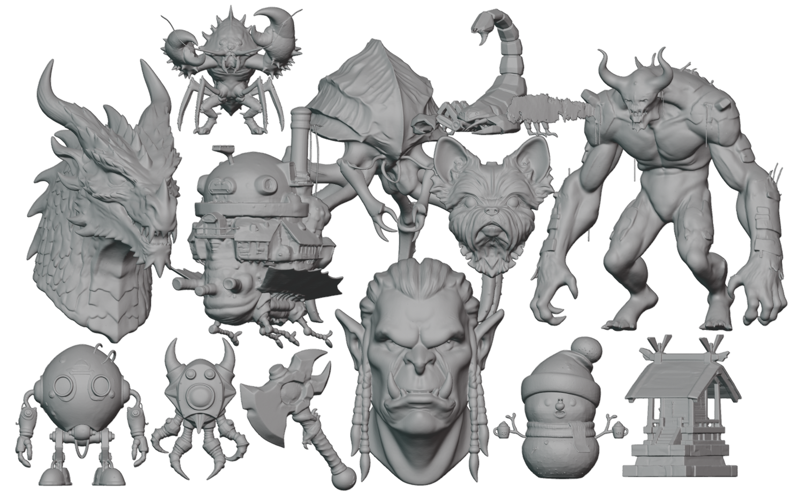

---

## 3. Back to the VecSet 

 

### 3.1. Lattice

Sparse voxel 기반 방법론(Sparc3D 등)이 global shape과 local detail 생성을 분리하여 학습 효율과 품질을 비약적으로 높인 사실을 기억하는가? 

[**Lattice**](https://lattice3d.github.io/)는 Tencent에서 공개한 Hunyuan3D 2.5/3.0 geometry 생성 모델의 핵심이 되는 구조다. Sparc3D 등과 마찬가지로 먼저 global shape을 생성한 후, 그 결과를 guidance 삼아 local detail을 생성 하는 two-stage 접근법을 VecSet 방법론에 적용하였다. 
*(사실 Hunyuan3D 2.5의 공개 시기를 고려하면, Tencent 내부에선 coarse-to-fine 구조를 Sparc3D 등의 연구보다 훨씬 먼저 실증하고 학습을 완료한 것으로 보인다)*
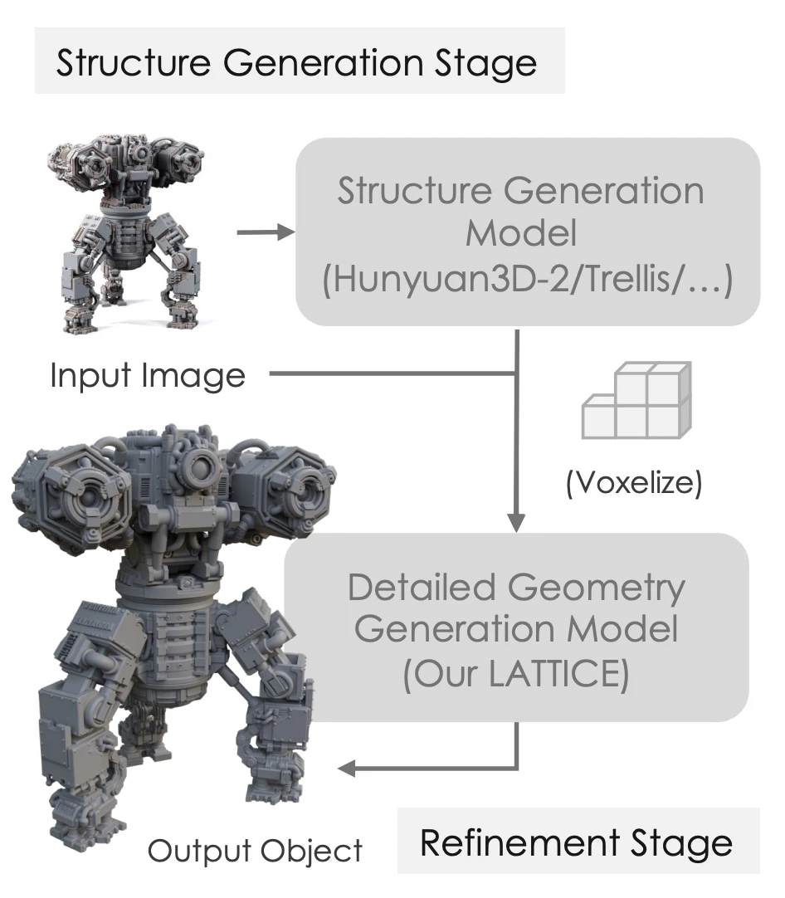

구체적으로는 다음과 같은 two-stage pipeline으로 구성되어 있다.

- **Coarse Generation**: 기존 VecSet 모델 등으로 coarse mesh를 생성한다.
- **Voxelize & Sampling**: 이를 voxelize한 후, 각 voxel 내부에서 FPS (Farthest Point Sampling)를 통해 대표점들을 추출한다.
- **Structure-Aware DiT**: 이 점들의 좌표를 **'Voxel Query'** 로 삼아, 좌표 정보에 RoPE (Rotary Positional Embeddings)를 적용하여 DiT에 입력한다.

${}$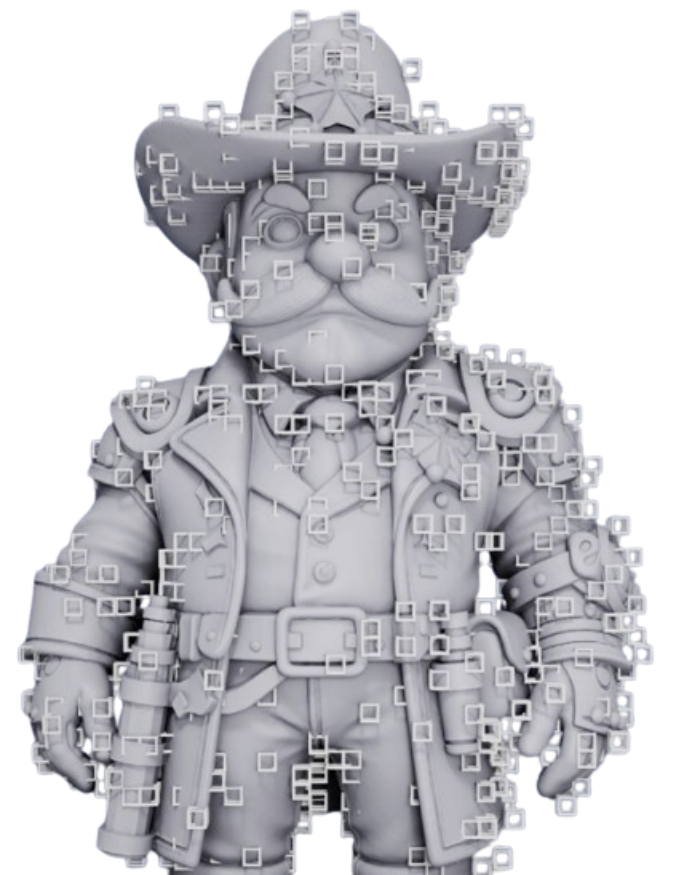

---

### 3.2. FlashVDM; vice-versa of Lattice?

이 논문의 아이디어는 VecSet decoding 가속화 연구인 [**FlashVDM**](https://github.com/Tencent-Hunyuan/FlashVDM)의 실험에서 파생된 것이라고 추측한다 (저자 또한 같다). FlashVDM은 SDF 추출에 **dense grid point query**가 필요했던 기존 VecSet decoding 단계에 **octree-decoding (Hierarchical Decoding)** 을 제안하여 수십배로 decoding 시간을 단축한 연구이다. 

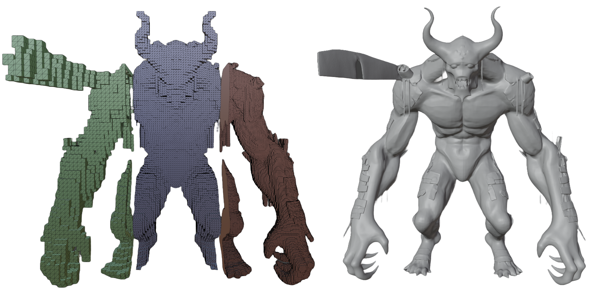

- ***Visualization of FlashVDM.*** *Right* 의 mesh 를 VAE decoder 를 통해 복원할 때, FlashVDM 은 *Left* 의 좌->우 처럼 coarse resolution 에서 먼저 active voxel 식별 후 이 active voxel 범위에서만 resolution 을 늘려가면서 고해상도의 SDF 를 복원한다. 
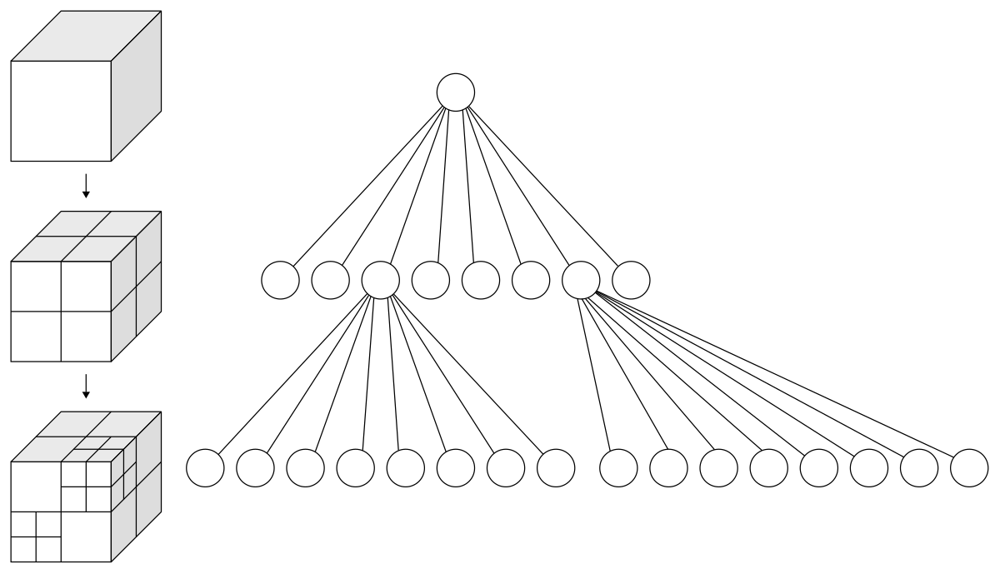

Octree-decoding 외에 FlashVDM에서 보고한 VecSet VAE의 중요한 특징은, VecSet VAE Decoder가 point query를 받아 SDF value를 decoding할 때, **공간상의 인접한 point query는 비슷한 latent token과의 attention에만 집중한다는 사실**이다. 이 발견을 역으로 뒤집으면, VecSet의 latent token은 이미 spatial location에 밀접한 관련을 가지며 그 자체로 강한 locality를 내재하고 있다는 결론에 이른다. 

이는 위치 정보만 잘 주어지면 전체 구조를 다시 학습할 필요 없이 세부 디테일만 채워 넣을 수 있다는 가정으로 이어진다. 즉, DiT 모델을 학습/추론할 때 3D spatial location 과의 연결 고리만 전달해 줄 수 있다면 sparse voxel 방법론과 마찬가지로 global shape에 대한 정보를 아는 refinement 모델을 설계할 수 있다. DiT가 텅 빈 공간에서 맨땅에 헤딩하듯 형상을 만드는 것이 아니라, global shape에 대한 강력한 guidance를 받으며 local detail 생성에만 집중하게 만드는 것이다. 

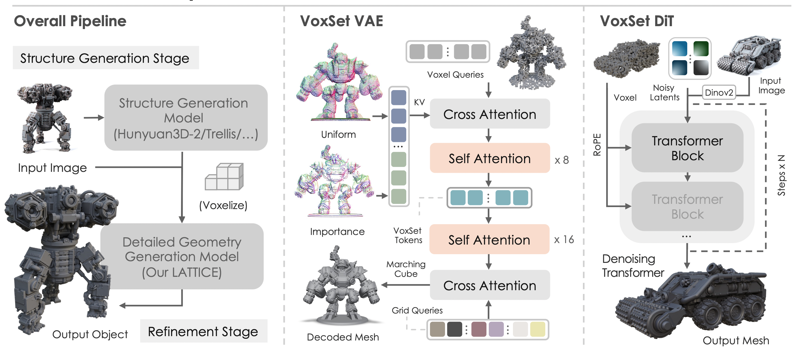

Lattice는 이를 위해 coarse mesh를 voxelize 한 후, sampling한 대표 좌표들을 RoPE embedding을 통해 주입함으로써 학습 효율을 극단적으로 단축하고 VecSet 에서도 coarse-to-fine 구조가 가능하게 만들었다. 

또한 Voxelize의 부수적인 장점도 존재한다. 기존 VecSet은 공간상의 *'어떠한 point coordinates'* 도 입력으로 받지만, voxelize 하게 되면 regular grid 상의 점으로 RoPE embedding이 집중하게 되어 생성 모델의 탐색 공간이 훨씬 줄어들게 된다. Inductive Bias 를 제공하여 모델이 공간적 선험 지식을 빠르게 습득하는 것이다. 

---

### 3.3. Varco3D-Lattice
 
Lattice 구조를 바탕으로 Varco3D-$\alpha$ 모델 구조에 Voxel query RoPE 를 추가한 Stucture-aware DiT 모델을 학습해보았다. 결과는 놀라웠는데, A100 64장 기준으로 수렴까지 한 달이 넘게 걸리던 기존 VecSet DiT와 달리, 단 하루 만에 DiT 모델이 수렴하는 모습을 보였다.

아래는 Varco3D-Lattice 을 통한 high-quality mesh 생성 과정: 1) coarse mesh 생성, 2) voxelize & voxel query sampling, 3) fine mesh 생성 과정을 시각화한 결과이다. 

| Coarse Mesh | Voxel Query | Fine Mesh |
| --- | --- | --- |
| 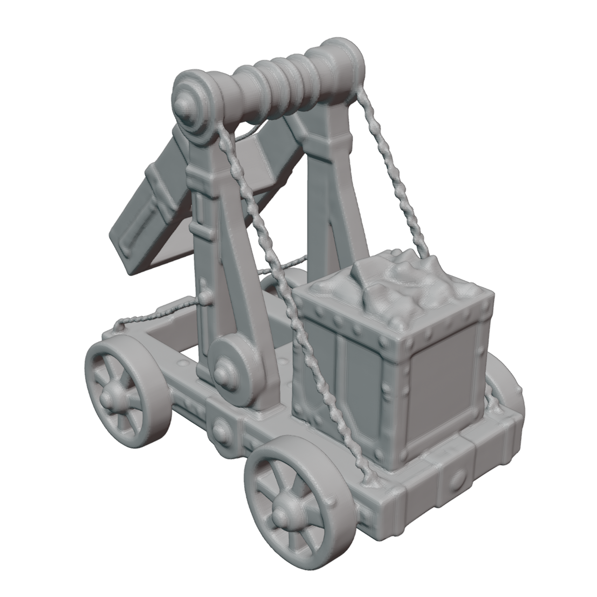 | 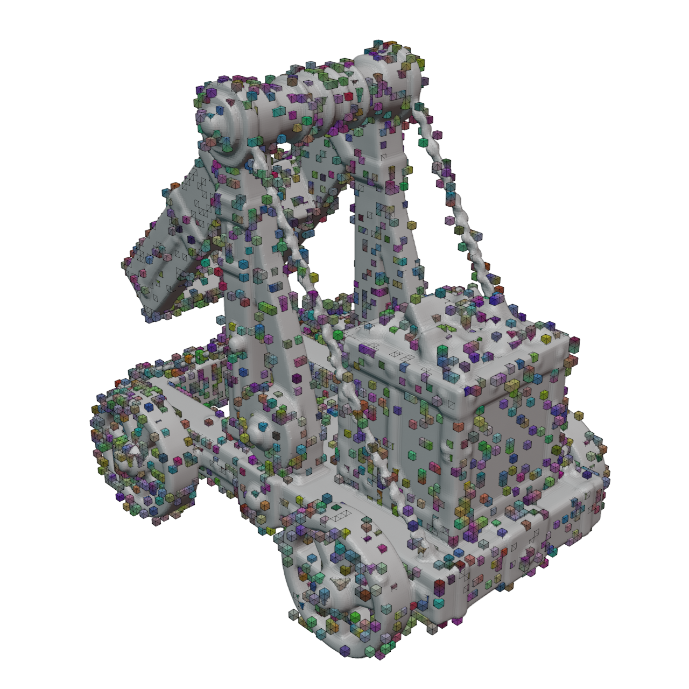 | 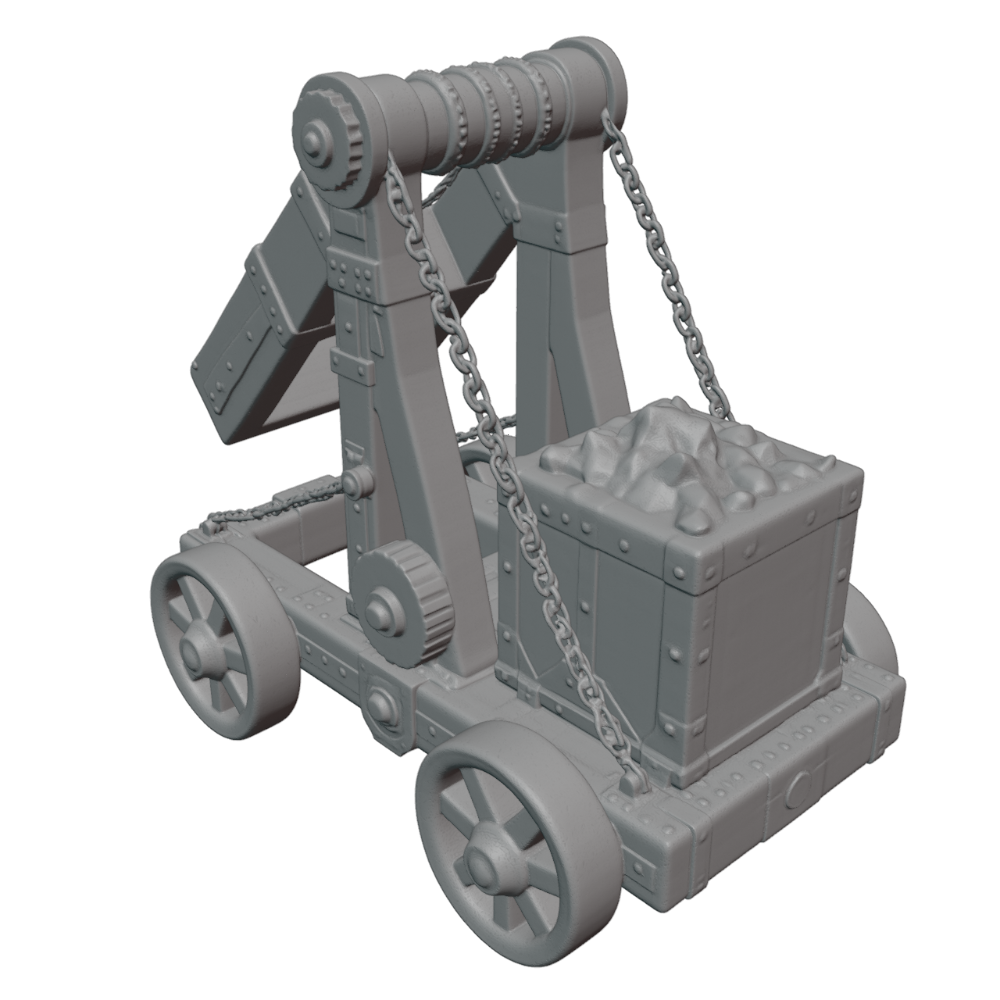 |

#### *vs.* Sparse-Voxel Method 

모델 결과물은 Varco3D 1.0-preview (Sparse Voxel) 이상의 디테일을 보여주면서도, 생성된 Mesh의 Topology가 훨씬 robust하고 artifact 형상이 적다는 점이 고무적이었다. 이 모델은 inference 최적화 과정을 거쳐 곧 Varco3D 1.0 model 로 정식 업데이트 될 예정이다. 

같은 coarse-to-fine 방식인 Varco3D 1.0 preview 와의 비교를 몇 가지 첨부한다. 

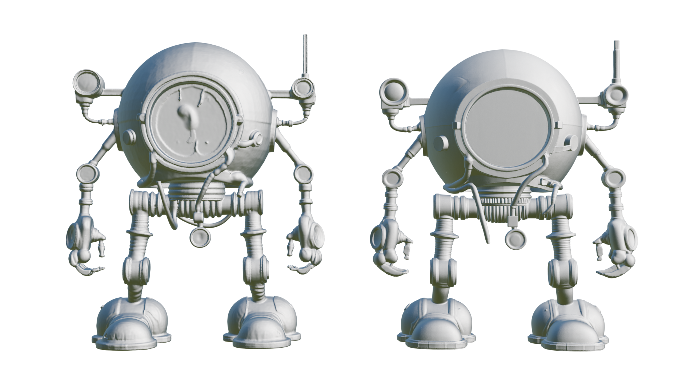
- **Varco3D 1.0-preview (sparse voxel)** *vs.* **Varco3D 1.0 (VecSet-Lattice)**

Sparse voxel 기반의 Varco3D 1.0 preview 모델이 과도한 detail, artifact 등도 생성하는데 반면, Varco3D 1.0 모델은 깔끔하고 robust 한 output 을 생성하였다. 

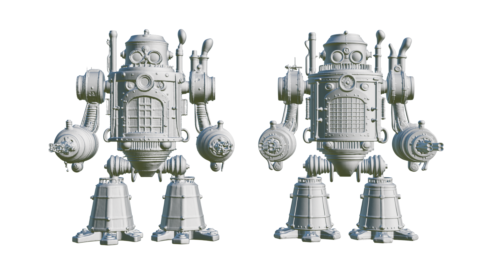

- **Varco3D 1.0-preview (sparse voxel)** *vs.* **Varco3D 1.0 (VecSet-Lattice)**

---

## 4. Next Step in 3D Generation

2026년을 맞이하며, Varco3D 1.0 개발 과정에서 느꼈던 'Sparse Voxel'과 'VecSet' 사이의 기술적 균형, 그리고 이를 넘어선 새로운 3D Representation의 가능성에 대해 정리하며 글을 맺으려 한다.

### 4.1. Sparse Voxel vs. VecSet

앞으로도 한동안은 Sparse Voxel과 VecSet 진영 간의 주도권 다툼이 계속될 것으로 보인다. 직접 두 모델을 모두 학습하고 서빙해본 입장에서 장단점을 정리하면 다음과 같다.

#### Sparse Voxel

***장점* — Detailed Generation**: FPS로 sampling하는 Lattice와 달리 active voxel 모두를 사용하기 때문에 local detail 측면에서 Lattice보다 뛰어날 때가 많다.

***단점* — 불안정성**: 학습과 추론의 안정성 측면에서는 아쉬움이 크다. Token length가 데이터마다 항상 다르고, $128^3$ 해상도의 active voxel 수만 해도 평균 80K 개가 넘는다. 또한 active voxel 모두를 사용하기 때문에 active voxel의 품질에 굉장히 많은 영향을 받는다.

이 정도 토큰 길이에서는 Full Attention 학습이 사실상 불가능하므로 Swin Transformer 류의 Sliding Window Attention을 쓰거나, 64/32 resolution으로 downsampling하여 Full Attention 후 다시 upsample해야 하는데, 이 과정에서 구조적 불안정성이 발생한다.

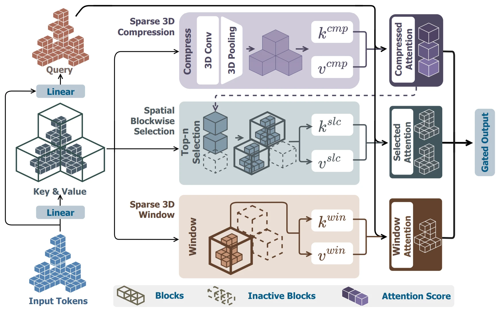

- Direct3D-S2 의 3D sliding window attention 메커니즘 

---

#### VecSet

***장점* — Full Attention**: Lattice 구조를 채택하면 훨씬 적은 token length (약 6K)만으로도 학습이 가능하여, Full Attention을 안정적으로 적용할 수 있다.

***장점* — Inference Time Scaling**: 가장 큰 장점은 추론 시 token 수를 32K 이상으로 늘려 디테일을 극대화하는 inference time scaling 이 가능하다는 점이다. VecSet의 경우 token 수가 고정되어 있지 않으므로, 추론 시점에 더 많은 token을 사용하여 더 정교한 결과를 얻을 수 있다.

***단점* — Decoding Time**: VecSet은 decoding 시 3D Representation을 복원하기 위해 dense grid의 모든 점을 Decoder에 쿼리해야 하는 구조다. FlashVDM 등으로 decoding time을 줄일 수 있긴 하지만, 고해상도 mesh의 경우 이마저도 수 분이 걸리며 sparse voxel 방법론 대비 긴 시간이 소요된다.

---

### 4.2. Beyond SDF: Trellis 2 & Faith-Contouring

마지막으로, 2026년 3D 생성 분야에서 주목하고 있는 것은 **3D Representation 그 자체의 변화이다.**

지금까지 설명한 모든 방식은 SDF (Signed Distance Function)의 그늘 아래 있었다. SDF는 공간상의 어떤 점이 물체의 표면으로부터 얼마나 떨어져 있는지(Distance), 그리고 안인지 밖인지(Sign)를 나타내는 값이다. 이를 Marching Cubes 알고리즘을 통해 Mesh로 변환하는데, 여기에는 치명적인 제약이 있다. 바로 **"반드시 닫힌 물체(Watertight)여야 한다"** 는 점이다. 물이 새지 않는 꽉 닫힌 도형만 표현 가능하기에, 찢어진 옷깃이나 얇은 종이, 혹은 투명한 유리의 단면 같은 '열린 표면(Open Surface)'을 생성하는 데 한계가 명확했다.

최근 공개된 [Trellis-2](https://microsoft.github.io/TRELLIS.2/) 와 [FaithC](https://github.com/Luo-Yihao/FaithC) 은 이 문제를 해결하기 위해, AI가 SDF 값을 예측하는 대신 **QEM (Quadric Error Metric)** 파라미터를 직접 예측하는 방식을 택했다. 

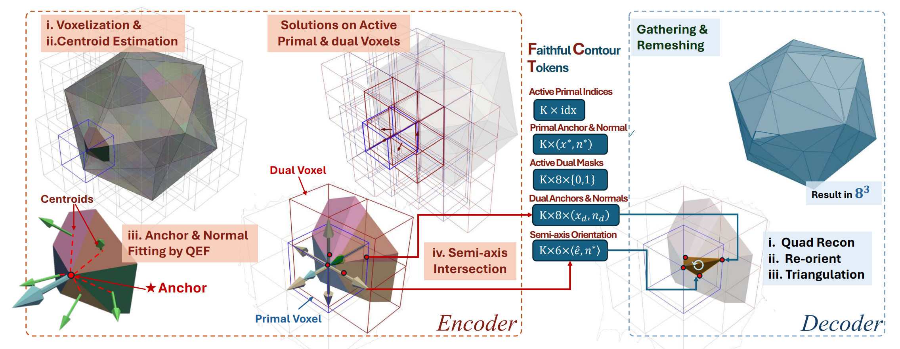

- *Illustration of FaithC*

물론 이 방식에도 명확한 trade-off가 존재한다. 직접 생성해보며 느낀 가장 큰 문제는 바로 '위상적 불연속성(Topological Discontinuity)', 쉽게 말해 결과물이 찢어지는 현상이었다. 이는 SDF라는 강력한 continuity constraint가 사라지다 보니, 모델이 생성한 각 voxel의 예측값들이 서로 매끄럽게 연결되지 못하기 때문에 발생하는 문제라고 생각한다.

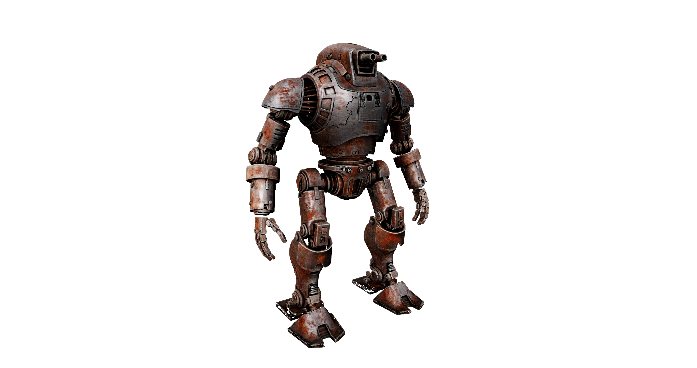

- Generated by Trellis 2

SDF는 수학적으로 '연속 함수' 공간에서 정의되기에, 해상도와 무관하게 표면이 매끄럽게 닫혀 있음이 보장된다. 하지만 discrete voxel grid 위에서 값을 예측하는 Trellis2/FaithC 류의 방식은, 인접한 voxel 간의 연결성을 모델이 완벽하게 학습하지 못하면 표면에 구멍이 뚫리거나 메쉬가 찢어지는 아티팩트가 빈번하게 발생했다.

이 문제를 해결할 아이디어로, 기존 Q matrix에 UDF(Unsigned Distance Function) 처럼 표면 연속성을 보장하는 정보를 추가 채널로 함께 예측하게 하는 방법을 생각해볼 수 있다. SDF처럼 '닫힌 도형'을 강제하지 않으면서도, UDF의 gradient를 통해 인접한 voxel 간의 topological continuity를 가이드한다면, 후처리 없이도 "찢어지지 않는 open surface"를 생성하는 robust한 native 3D generation이 가능하지 않을까 생각한다.

---

## Epilogue 

글을 맺으며, 연구자로서 마음 한구석에 자리 잡은 솔직한 소회를 꺼내 보려 한다.

냉정하게, 현재의 Varco3D는 아직 글로벌 빅테크들이 내놓는 Closed SOTA 모델들과 비교했을 때 우위에 서 있다고 말하기 어렵다. 수천, 수만 장의 H100을 투입하는 그들의 자본력 앞에서, 64장의 A100으로 모델을 학습해야하는 현실은 때로 무력감을 안겨주기도 한다. "자원이 부족하다"는 말은 비겁한 변명처럼 느껴지기도 하지만, 동시에 매일 아침 쏟아지는 새로운 연구들을 보며 따라가기에 급급할 때면 초조함이 밀려온다.

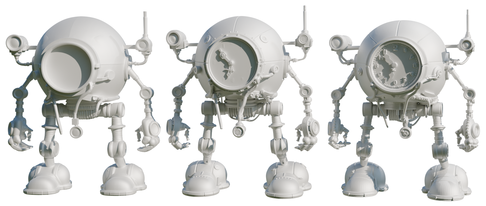

- Varco3D-1.0 *vs.* Hunyuan3D-3.1 *vs.*  Meshy-6 

하지만 이 초조함은 역설적으로 '순수 연구'에 대한 강렬한 갈망으로 이어진다. 단순히 남들이 닦아놓은 길을 더 효율적으로 따라가는데 매몰되지 않고, 3D Representation의 본질이 무엇인지, 수학적 연속성을 어떻게 딥러닝의 언어로 치환할 것인지와 같은 근원적인 질문에 답하고 싶다. 현재의 3D AI 서비스들이 넘지 못한 '실용성의 간극'은 결국 파라미터의 크기가 아니라, 표현 방식과 같은 3D에 대한 본질을 혁신할 때만 메워질 수 있다고 믿는다.

Sovereign AI 라는 거창한 구호 아래 자체 모델을 고집하는 이유는 단순히 라이선스 문제 때문만이 아니다. 빅테크의 자취만을 따라가는 추격자에 그치지 않고, 우리만의 관점으로 기술의 판도를 바꾸는 '날카로운 균열'을 만들어내겠다는 의지다. 자원의 한계가 상상력의 한계가 되지 않도록, 2026년에도 정체의 감각에 머무르지 않고 격랑을 거스르는 사람으로 남고 싶다.

<iframe src="https://3d.varco.ai/test-embed/02072a988541af639c393f1d4c45f2ef.glb" width="100%" height="500px" title="설명" style="border: none;"></iframe>

- Varco3D 1.0

---

You may also like

- [An Era of 3D Generative Models](/blogs/posts/?id=250302_3d_latent_diffusion)
- [Building Large 3D Generative Models (1) - 3D Data Pre-processing](/blogs/posts/?id=250702_building_large_3d_1)
- [Building Large 3D Generative Models (2) - Model Architecture Deep Dive: VAE and DiT for 3D](/blogs/posts/?id=250710_building_large_3d_2)

 
