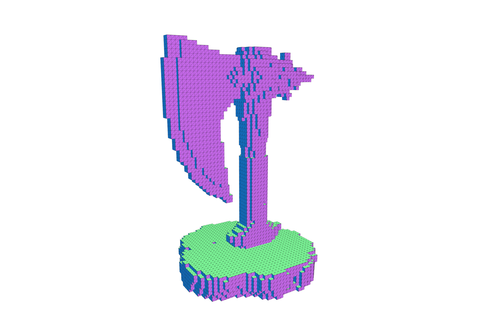
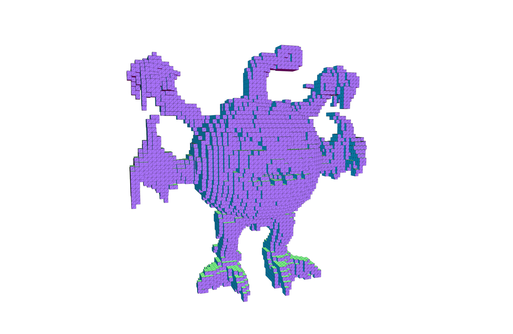
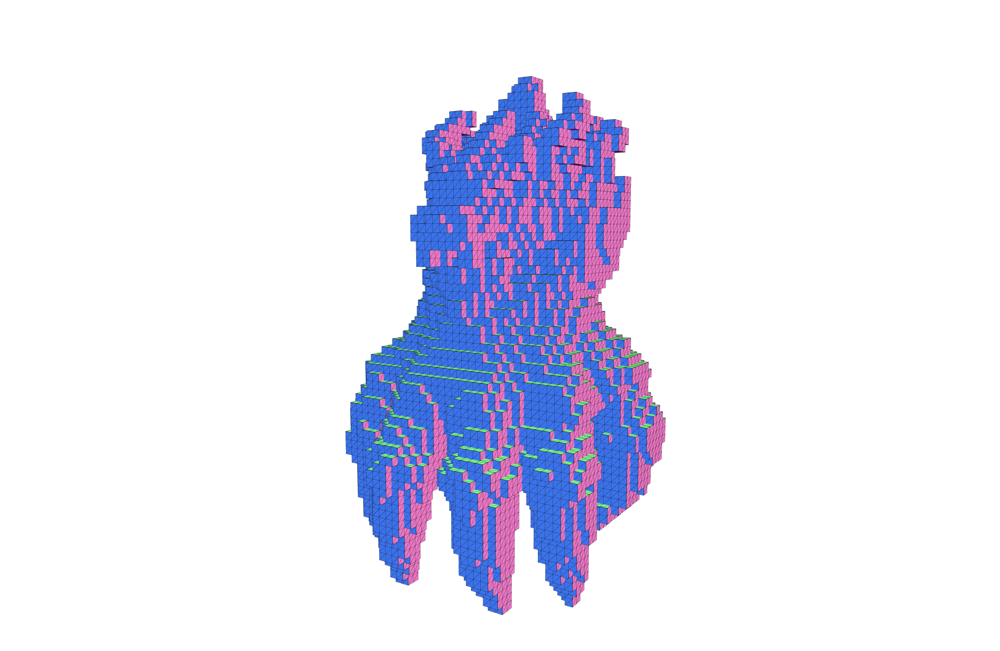
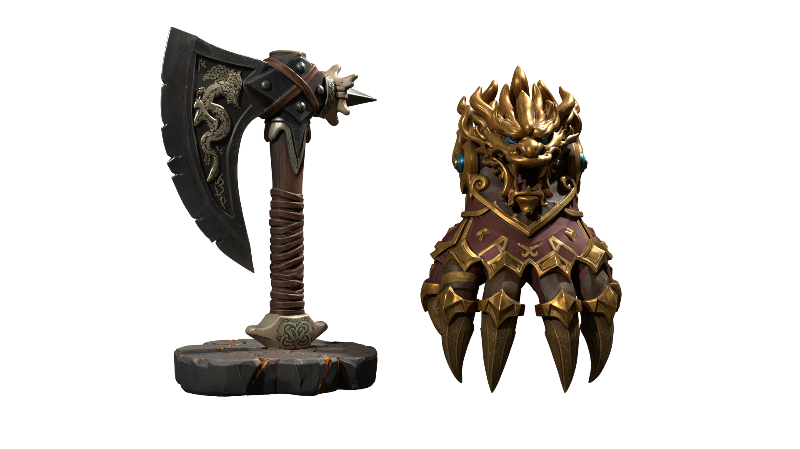

> Sparse 3D Generation is difficult to optimize. The number of active tokens changes for every input, and that variability limits the effectiveness of general-purpose optimization tools such as TensorRT and `torch.compile`.
>
> This article describes how, in VARCO3D 2.0, we **replaced unconditional cross-attention with a fixed-vector path** and fused memory-bound tensor paths with custom CUDA kernels and cuBLASLt epilogues, reducing 15-step denoise latency on A100 BF16 by **`25.66%`** on an equal-weighted average across assets. It also separates a bitwise-exact null-context path from tolerance-qualified fusion paths and lays out the numerical contract for validating and falling back in production.

## Opening the Loop

For an AI researcher, inference optimization usually sits closer to productization engineering than to the main line of research itself.

My own center of gravity had also been designing model architectures and representations, then improving quality. I often built tools that were directly needed in the research loop, such as viewers, experimental web applications, and profiling utilities, but I thought of custom CUDA extensions and runtime optimization as areas to tackle together with ML Engineers who are comfortable with advanced CUDA programming.

AI agents lower the barrier to entry in this area.

They make it possible to iterate quickly through repository exploration, connecting profiler traces to source code, CUDA/C++ implementation, Python bindings, correctness tests, and benchmarks. But lower implementation cost does not mean good optimizations appear automatically.

The first question in this work also had a familiar shape.

> Can we apply CUDA Graph, TensorRT, `torch.compile`, and similar tools to optimize the VARCO3D 2.0 Sparse 3D Generation model?

When the Agent probed a sparse transformer block with Dynamo, it found that a single block was split into `13` graphs and `12` graph breaks. The main causes were as follows.

- .item() and bincount arising from `SparseTensor` and layout handling
- layout and cache based on Python slice, list, and dict
- Python control flow in the `FlashAttention` dispatcher

In existing A100 measurements, even the path that compiled only the MLP failed to produce stable wall-time gains, and BF16 result differences appeared. In the profiler, about 87.6% of the total cost was already being spent in FlashAttention and cuBLAS/cuBLASLt GEMM.

***Agent's answer:***

> *Applying these tools to the full model is not impossible, but applying them directly to the current structure is not realistic.*
1. Put full `torch.compile` on hold.
2. A full TensorRT conversion has low expected benefit relative to its cost.
3. If we do try it, sparse metadata should be computed outside the graph, and only the tensor-only body of one block should be rewritten with `fullgraph=True, dynamic=True`.
4. TensorRT is also technically possible, but the inputs would need to be flattened from `SparseTensor` into tensor tuples such as `feats`, `coords`, and `cu_seqlens`, and TensorRT plugins would also have to be written for `varlen FlashAttention` and sparse operations. Otherwise, only dense Linear and parts of the MLP are likely to enter TensorRT, while the rest is split into PyTorch fallback. In other words, for the current model this is closer to runtime porting than a simple conversion.*

Therefore, the decision itself to lower the priority of full `torch.compile` and a TensorRT port was reasonable.
But the following two sentences do not mean the same thing.

"The current structure does not fit general-purpose compilers well."

vs.

"There is no computation in the current forward path left to optimize."

The problem was not the answer but the scope of the question. Because I asked, "Which general-purpose optimization tools can we apply?", the answer also ended with judging the cost-benefit of those tools. I changed the question again without constraining it to any particular tool.

> **In the current forward path, is there computation we never needed to run in the first place? Can the necessary computation also take a shorter path?**

This article starts from that question and records two directions that were validated on an actual production workload.

1. Analyze model semantics and remove unnecessary workload itself.
2. Directly fuse the memory round trips in local tensor paths that the compiler could not fuse.


---

## 1. Why Sparse 3D Resists the Usual Optimization Playbook

### 1.1. Sparsity Turns the Workload into a Moving Target

If you double the resolution of a 3D grid, the number of voxels increases eightfold.

$$
(2N)^3 = 8N^3
$$

This is why high-resolution 3D generation cannot easily process the entire space densely. Recent models represent only the regions where geometry is likely to exist, using sparse voxels or latent tokens.

A typical pipeline looks like this.

1. Generate a coarse 3D structure.
2. Convert the active regions into sparse coordinates or latent tokens.
3. Denoise only the active tokens with a Transformer.
4. Reconstruct a mesh from the sparse representation.


A sparse representation avoids computation over empty space. The tradeoff is that the number of active tokens varies from input to input.

| 3.9K voxel tokens | 24K voxel tokens | 13.4K voxel tokens |
| --- | --- | --- |
|  |  |  |

When the token count changes, these values change along with it.

- The $M$ dimension of the Transformer feature matrix and the GEMMs
- Varlen attention metadata
- Sparse coordinates and batch layout
- Intermediate activations and peak memory
- Tensor shapes in the CFG branch
- The amount of memory reserved by the allocator

In other words, dynamic shape does not merely change the size of a single tensor. Attention, GEMM, memory, and control flow all change together.

### 1.2. The Blind Spot in General-Purpose Optimization

In a 2D diffusion model, the latent shape is generally fixed over a sampling trajectory. LLMs also have dynamic sequence lengths, but their execution model has largely settled around KV cache, paged attention, and continuous batching.

Sparse 3D does not yet have a comparable standard runtime. But this was not a vague judgment that the problem was simply hard. I reviewed each path against representative blocks and actual profiler traces.

| Method | Actual observation | Decision |
| --- | --- | --- |
| CUDA Graph | To fix token counts into buckets, padding and a separate memory pool per graph are required. Padding tokens also enter attention and GEMM, reducing the benefit of sparse compute. | Under the production token distribution, the expected gain looked small relative to the management cost, so I deferred it. |
| `torch.compile` | A representative sparse transformer block was split into `13` graphs with `12` graph breaks. The main causes were `.item()` and `bincount` on `SparseTensor.shape/layout`, Python slice/list/dict-based layout and cache logic, the `varco_kernels` PyCapsule custom op, and Python branches in the FlashAttention dispatcher. Even MLP-only compile did not provide a stable wall-time gain, and BF16 results changed. | I deferred full-model compile. If trying it again, I would compute metadata outside the graph, validate only the tensor-only body with `fullgraph=True, dynamic=True`, and stop if the block-level gain is less than `3%`. |
| TensorRT | If converted directly, only parts of the dense Linear and MLP layers were likely to enter the engine, while FlashAttention, custom kernels, and the sparse metadata path would be split into PyTorch fallback. Full engine conversion would have required SparseTensor flattening, a `torch.library` schema and fake/meta kernel, varlen attention and sparse op plugins, and optimization profiles for each token range. | Technically possible, but in practice it was a separate porting project. With the current structure, the expected gain was low relative to the cost, so I deferred it. |

In the profiler, about `87.6%` of total cost was already FlashAttention and cuBLAS/cuBLASLt GEMM. This number does not mean there was only `12.4%` room left to optimize. Even kernels that are already fast can still be called unnecessarily, and memory movement and dispatch between kernels can still be reduced.

The direction, however, became clear.

1. Do not rebuild FlashAttention or GEMM itself from scratch.
2. Analyze the model semantics and remove unnecessary workload.
3. Directly fuse local tensor paths that the compiler misses.
4. Adopt each candidate only when it reduces actual denoise latency.

The result of reviewing general-purpose tools was not a dead end, but a starting point that made the problem smaller.

---

## 2. Null-Context Attention Is Work We Never Had to Do

### 2.1. Killing the Zero Tensor

Modern image-to-3D generation models often extract input image features from DINO-family VFMs and inject them into the 3D denoiser through cross-attention. If the image condition is dropped out during training, CFG similar to that used in 2D generative models can be applied at inference time.

The difference, however, is that instead of feeding an empty text string into a text encoder, as in 2D generation, to produce a negative condition, the unconditional branch explicitly uses a `zero valued tensor` as follows.

```python
uncond_context = torch.zeros_like(cond_context)
```

Although every value is 0, it still passes through the same execution path as an ordinary tensor.

- Zero tensor allocation and initialization
- Combining positive and negative conditions
- K/V projection and Q/K normalization
- Full-length cross-attention
- Output projection

The first change was to turn this tensor into an explicit symbolic state.

```text
zero-valued tensor
→ symbolic null condition
```

At first, I thought of this as an optimization that would merely remove the zero tensor allocation and null checks. But as I followed the forward path further, the question changed.

> When a condition whose values are all 0 is fed into attention, what is actually being computed?

### 2.2. In Null Attention, the Query Does Not Matter

Let us use a row-vector convention, where each row of a tensor is a token. The condition-side value projection can be written as follows.

$$
V = ZW_V + \mathbf{1}_L b_V^\top,
$$

Here, $Z\in\mathbb{R}^{L\times D_c}$ is the context token matrix, and $V\in\mathbb{R}^{L\times D_v}$ is the value matrix. For a simple affine projection, if the null context is $Z=0$, then

$$
V = \mathbf{1}_L b_V^\top.
$$

In other words, every valid context token has the same value row.

When the number of queries is $N$, let the attention probability matrix be $A\in\mathbb{R}^{N\times L}$. Since the softmax weights in each row sum to 1 over the valid positions after masking,

$$
A\mathbf{1}_L = \mathbf{1}_N.
$$

Therefore, the null-context attention output is

$$
\begin{aligned}
AV
&= A\mathbf{1}_L b_V^\top \\
&= \mathbf{1}_N b_V^\top.
\end{aligned}
$$

No matter how the query, key, attention logits, or softmax distribution vary, each output row becomes the same $b_V$.

Including the output projection,

$$
\begin{aligned}
Y_-
&= (\mathbf{1}_N b_V^\top)W_O + \mathbf{1}_N b_O^\top \\
&= \mathbf{1}_N c^\top,
\end{aligned}
$$

where the fixed row vector $c$ can be defined as

$$
c^\top = b_V^\top W_O + b_O^\top
$$

More generally, if we denote the condition-side transform by $\phi$, the necessary condition is not that the input tensor itself is 0. The key question is whether, after $\phi$, the value row is the same vector $v_0$ at every valid context position. In that case, the same derivation holds by replacing $b_V$ above with $v_0$.

This optimization requires the following conditions.

- Attention dropout is disabled at inference time
- At least one valid context token exists
- All valid value rows are identical after the condition-side transform
- The attention row weights over valid positions sum to 1
- The block is not joint attention where image tokens and shape tokens share the same softmax normalization

The conclusion is simple.

> ***We did not need to make null-context attention faster. We did not need the full unconditional attention workload at all.***

<video controls playsinline preload="metadata" aria-label="Null-context attention simplification animation">
  <source src="./assets/null-context-attention.mp4" type="video/mp4">
  Your browser does not support the video tag.
</video>

### 2.3. From a Compatible Reference Path to a Canonical Cache

The existing batched CFG path constructed the conditional and unconditional branches with the same token length.

```text
[conditional context, full zero-valued context]
→ Q/K/V projection
→ Q/K normalization
→ cross-attention
→ [2N, D] output projection
```

Mathematically, this can be separated completely as follows.

```text
conditional branch:
    original image-condition attention
    → [N, D] output projection

unconditional branch:
    cached constant row c
    → expand([N, D])
```

The initial byte-exact implementation removed the null attention itself, but kept the reference-compatible shape constraint to avoid BF16 differences that could arise when the GEMM shape of the output projection changed. This path was correct, but computation for the unconditional output projection and some reconstruction overhead remained.

The next step was to compute $c$ once, cache it, and broadcast it. However, when

$$
c^\top = b_V^\top W_O + b_O^\top
$$

was computed through a direct $M=1$ projection, its raw BF16 bits did not match the unconditional row from the existing production GEMM. Even when the mathematical expression is identical, changing the GEMM's $M$ dimension can change the library dispatch, tiling, and reduction order.

Additional experiments showed that if the output projection was run on a canonical `M=256` input where every row is $b_V$, then caching only the first row matched the existing reference row bitwise in the validated A100/PyTorch/CUDA production environment. With that result, the final runtime path could be organized as follows.

```text
conditional:
    [N, D] projection

unconditional:
    [1, D] row cache precomputed at canonical M=256
    → expand([N, D])
```

That is, even in batched CFG, the `[2N,D]` output projection no longer needs to be preserved for the unconditional branch. However, `M=256` is not a mathematical constant; it is an environment-dependent empirical calibration point. The fast path is enabled only after passing startup qualification, and the detailed numerical contract is described in Section 7.

During this implementation process, the Agent handled the following iterative work.

- Tracing how the null condition is created and propagated
- Implementing the symbolic sentinel and reference fallback
- Separating batched CFG and serial CFG call sites
- Implementing canonical cache creation and invalidation
- Adding a feature flag and startup self-test
- Running real-payload benchmarks and raw-bit equivalence tests
- Applying and validating minimal patches to public repositories

The Agent's largest contribution was not only in writing kernels on my behalf. It was in lowering the cost of falsification: when one hypothesis failed, it could be discarded, and other shapes and fallbacks could be tested quickly.

### 2.4. Putting the Shortcut on the Stopwatch

#### VARCO 3D 2.0

Fusion and null-context were independently toggled on and off across the same 10 payloads.

| Comparison | Sum of 10 asset means | Reduction | Output |
| --- | ---: | ---: | --- |
| `pure_eager`  | `239.829s` | `3.45%` |  |
| `null_context [N, D], [1, D]` | `229.348s` | `4.37%` | Byte-exact |

The null-context optimization reduced per-asset latency by `5.87~3.96%` while producing byte-exact outputs.

#### Public 3D Gen Models: Hunyuan3D, Direct3D, and Trellis

After seeing results in VARCO3D, I wanted to check whether this idea applied only to our implementation.
Because many recent image-to-3D models, like ours, use zero image tokens in the unconditional branch, I thought the same optimization would apply. So I applied the byte-exact optimization to three representative public models: Hunyuan3D 2.1, Direct3D-s2, and Trellis2.

| Model | Scope | Denoise latency reduction | Output |
| --- | --- | ---: | --- |
| Hunyuan3D 2.1 | Separate cross-attention in the shape denoiser | `2.5%` | Byte-exact |
| Direct3D-S2 | Cross-attention in the dense stage | `4.4%` | Byte-exact |
| TRELLIS.2 | Image-condition cross-attention | `5.2%` | Byte-exact |

Each number is a paired ablation comparing the reference path and optimized path under the same repository and inference settings. The input, seed, and model settings were kept identical within each model. Absolute latency was not compared across models.

Of course, this cannot be mechanically applied to every image-conditioning block.

- In the sparse stage of Direct3D-S2, the condition coordinate positional embedding makes the zero feature produce different values by position. I did not apply it to this stage.
- In joint attention, image tokens and shape tokens can share a single softmax normalization. Removing the image tokens also changes the normalization of the shape tokens. (Hunyuan3D 2.0)

Therefore, applicability should be judged not by whether "the negative condition is zero," but by whether **the value rows after the condition-side transform are actually identical**.

These results confirmed that null-context optimization is not just an accidental implementation property of VARCO3D. At the same time, because the applicability conditions are mathematically clear, it could be excluded from stages where they do not hold.

---

## 3. Fusing the Gaps the Compiler Missed

Branches that can be removed mathematically, as with null-context, are rare. Most active paths depend on the actual latent and timestep. After semantic elimination, the next tool I needed was the profiler.

The earlier compiler probe had already shown that roughly `87.6%` of cumulative CUDA kernel time was spent in FlashAttention and cuBLAS/cuBLASLt GEMM. The two largest regions were using `flash_attn` and `flex_gemm`, and building a new attention kernel or GEMM from scratch was outside the scope of this work.

But "most of the time is already spent in optimized kernels" is not the same as "there are no execution paths left to reduce."

- Normalization, indexing, and dtype conversion before and after kernels
- Paths that write intermediate tensors to global memory and then read them back
- Local chains where the Python dispatcher and small CUDA launches repeat

If full `torch.compile` had worked reliably, these pointwise chains and intermediate materializations are mostly where Inductor would have aimed. If sparse metadata and a custom backend make it difficult to compile the entire graph, then the answer is to directly fuse local paths whose role and inputs/outputs are clear.

### 3.1. What Fusion Actually Removes

When a PyTorch operation runs on the GPU, each operation leads to one or more CUDA kernel launches.

```python
y = x * scale
z = y + shift
out = z * gate
```

In eager PyTorch, `mul`, `add`, and `mul` are usually executed as separate pieces of GPU work. At each step, the following costs are repeated.

1. CUDA kernel launch
2. Load the input tensor from global memory
3. Elementwise operation
4. Store the intermediate tensor
5. Reload the intermediate in the next kernel

Even when the arithmetic itself is simple, kernel launches and memory traffic repeat. In particular, when small operations are called thousands of times or more, the cost becomes hard to ignore.

Kernel fusion handles this chain inside a single CUDA kernel.

```python
out = (x * scale + shift) * gate
```

After reading `x` once, it applies scale, shift, and gate in registers, and writes only the final result to global memory. This reduces the following costs.

- CUDA kernel launch
- Intermediate tensor allocation
- Intermediate global-memory write
- The next kernel's global-memory read
- Python and ATen dispatch overhead

In this model, patterns involving sparse batch indexing were more important targets than simple contiguous elementwise operations.

### 3.2. Letting an AI Agent Write CUDA, One Candidate at a Time

Using an AI Agent makes it possible to implement CUDA candidates quickly. At the same time, if multiple optimizations are introduced at once, it becomes impossible to tell which change actually reduced latency. So each cycle handled exactly one candidate.

```text
Real workload profile
→ choose one candidate
→ first define the memory/launch path to remove
→ keep the reference path and feature flag
→ Agent writes the fused implementation and binding
→ correctness test
→ verify the actual replacement in the profiler
→ real-payload ablation
→ accept or reject
```

The acceptance criteria were fixed as well.

1. Did the expected eager operation actually disappear from the profiler?
2. Does it satisfy the numerical contract for that path?
3. Did full denoise latency decrease, not just the microbenchmark?
4. Does it safely fall back to the reference path for unsupported shapes?

Once these criteria were in place, the Agent could iterate quickly through the implementation loop.

---

## 4. The Fused Kernels That Survived Production

### 4.1. Q/K RMSNorm, RoPE, and QKV Without the Extra Detour

The following operations were repeated before Transformer `self-attention`.

```text
Split Q/K
→ RMSNorm
→ dtype conversion
→ complex view and RoPE multiply
→ restore real tensor
→ QKV stack/cat
```

Seen one by one, none of these is a large cost. But across dozens of Transformer blocks and multiple denoising steps, normalized Q/K tensors, complex temporaries, and restacked tensors kept being materialized.

I fused this into a single `qk_rms_norm_rope_qkv_inplace` kernel.

The kernel operates directly on the packed QKV tensor and does the following.

1. Applies RMSNorm to Q and K
2. Computes the RoPE rotation
3. Writes the result back to the original QKV locations

In a representative profile of one denoising step, this path replaced the following eager operations.

- 8 multi-head RMSNorm calls
- 16 calls each to `_to_copy` and `copy_`
- 8 `mul` calls
- 4 calls each to `stack` and `cat`
- 8 calls each to `view_as_complex` and `view_as_real`

What became faster here was not just a single RMSNorm. The entire tensor lifecycle of attention preprocessing became shorter.

### 4.2. Sparse LayerNorm Meets AdaLN in One Pass

The existing path looked like this.

```python
normalized = layer_norm(x)
scale_token = scale[batch_ids]
shift_token = shift[batch_ids]
out = normalized * scale_token + shift_token
```

`scale[batch_ids]` and `shift[batch_ids]` each materialize an `[N,D]` tensor.

The `sparse_layer_norm_affine` kernel normalizes each token row, then reads the scale and shift for the corresponding `batch_id` in the same kernel and applies the modulation.

The following intermediates disappeared.

- Separate LayerNorm output
- Per-token scale tensor
- Per-token shift tensor
- Separate affine output

This candidate had a smaller absolute effect than Q/K fusion, but it reduced latency consistently across the token range.

### 4.3. The Leave-One-Out Truth Table

The table below shows the leave-one-out results from disabling only one candidate while leaving all other adopted fusions enabled. A positive number means the run became slower when that candidate was disabled.

| Candidate | Calls / iter | 10-asset avg | 30K | Decision |
| --- | ---: | ---: | ---: | --- |
| `qk_rms_norm_rope_qkv_inplace` | 60 | `+93.3ms` (`+6.43%`) | `+158.6ms` (`+4.13%`) | Adopted. Largest active-path contribution |
| `sparse_layer_norm_affine` | 120 | `+25.4ms` (`+1.89%`) | `+34.9ms` (`+0.91%`) | Adopted. Consistent improvement across the entire token range |
| `layer_norm` | 62 | `+15.6ms` (`+1.17%`) | `+14.0ms` (`+0.36%`) | Adopted. Small but stable improvement |
| `sparse_batch_mul_add` | 120 | `+11.4ms` (`+0.88%`) | `+8.3ms` (`+0.21%`) | Adopted. Simplifies the repeated residual path |
| `qk_rms_norm_cross_inplace` | 60 | `-1.3ms` (`≈0%`) | `-17.3ms` (`-0.45%`) | Neutral. Not treated as evidence for baseline performance |
| `gelu_tanh` | 60 | `-14.0ms` (`-0.84%`) | `-37.2ms` (`-0.97%`) | **Rejected. The custom kernel was actually slower** |

The `layer_norm` candidate replaced independent normalization on the residual path with a dedicated kernel, and `sparse_batch_mul_add` simplified batch-indexed modulation and the residual affine chain into a single kernel. `qk_rms_norm_cross_inplace` reduced cross-attention preprocessing, but because the gain did not reproduce on larger payloads, I did not count it as evidence for the baseline speedup.

In this process, the fact that the profiler's operation count went down had to be considered separately from the fact that product latency went down. GELU was the candidate where that distinction appeared most clearly.

---

## 5. When a Faster GELU Kernel Was the Wrong Boundary

### 5.1. Replacing a Kernel Is Not Yet Fusion

Let us briefly return to the `gelu` mentioned in the profiler table above.

The basis for this optimization, of course, was the profiler.
In the kernel-call analysis, a standalone `aten::gelu` appeared 48 times per step.

The first candidate seemed obvious.

> Build a custom `gelu_tanh` CUDA kernel and replace the existing call.

On the surface, it succeeded.

- `aten::gelu` disappeared from the profiler.
- It was correctly replaced by the custom kernel.
- It passed numerical tolerance.

But the actual denoise latency increased instead.

The execution path was still as follows.

```text
MLP GEMM output store
→ GELU input load
→ GELU output store
→ next GEMM input load
```

PyTorch GELU was already implemented efficiently for this A100 and tensor shape. I had replaced one kernel with another, but the global-memory round trip I wanted to remove was still there.
In other words, simply replacing the GELU formula with a fast CUDA kernel did not reduce the number of memory I/O operations.

I could have discarded the candidate here and moved on. Instead, I changed the question once more.

> If GELU itself is not slow, which boundary needs to disappear for the path to actually get faster?

### 5.2. Moving the Boundary into the cuBLASLt Epilogue

The existing MLP path was as follows.

```text
Linear(N → M)
→ store BF16 activation
→ standalone GELU
→ store second BF16 activation
→ Linear(M → N)
```

That is, touching only the standalone GELU boundary cannot eliminate the first GEMM output store and the GELU load. So I widened the fusion boundary back to the preceding GEMM.

Using cuBLASLt's bias+GELU epilogue, bias and GELU can be applied in the GEMM accumulator, and only the final activation needs to be stored.

```text
GEMM + bias + GELU epilogue
→ Linear(M → N)
```

This path removes the following costs.

- Standalone GELU launch
- GELU input global-memory read
- Intermediate BF16 activation before GELU
- One intermediate write/read round

In the final profiler, the standalone `aten::gelu` disappeared and was replaced by the same number of `_addmm_activation` cuBLASLt epilogue calls.

After this experience, I stopped choosing fusion candidates by operation name.

> **The fusion boundary should be determined not by the source-code operation, but by the memory round trip you are trying to remove.**

However, with the cuBLASLt epilogue, we cannot assume that the BF16 rounding boundary, GELU approximation, and internal evaluation order are the same as in the existing eager path. Therefore, I did not classify this path as a bitwise-exact optimization, and managed it with a separate tolerance test and model-level regression.

---

## 6. Benchmarking Where Token Counts Actually Move

### 6.1. Denoise Latency on Real Payloads

We reused the same manifest across 10 production assets whose active token counts ranged from `3,664–30,227`. All latency numbers are CUDA-synchronized 15-step denoise wall times, measured repeatedly after warm-up. The GPU was an NVIDIA A100-SXM4-80GB, the model dtype was BF16, and the stack used PyTorch 2.7.1+cu128 with CUDA 12.8.

The comparison paths were as follows.

- `pure_eager`: the reference path, with VARCO custom fusion and cuBLASLt GELU disabled, and the null-context fast path disabled as well
- `kernel_fusion`: the path with custom fusion and cuBLASLt GELU enabled, but the null-context fast path disabled
- `prior_exact_null`: the previous exact path, which removed null attention while preserving the reference-compatible output-projection constraint
- `canonical_cache_null`: the final path using an `M=256` canonical cache and `[N,D] + cached [1,D]` broadcast
- `canonical_cache_combined`: the path applying kernel fusion and the final null-context path together

The reductions below are not ratios of summed time. For each asset, we first computed the relative latency reduction, then averaged those values with equal weight across the 10 assets: a **per-asset macro average**. Speedup is the geometric mean of the per-asset speedups.


| Comparison | Equal-weight latency reduction |
| --- | ---: |
| `canonical_cache_null` vs `pure_eager` | **`4.37%`** |
| `kernel_fusion` vs `kernel_fusion` | **`18.734%`** |
| `canonical_cache_combined` vs `pure_eager` | **`25.66%`** |
| `canonical_cache_null` vs `prior_exact_null` | `0.53%` |
| `canonical_cache_combined` vs `prior_exact_combined` | `1.78%` |

The final combined path reduced equal-weight average per-asset latency by `25.66%` relative to pure eager. The canonical cache itself also delivered additional improvement over the previous byte-exact null implementation: `0.53%` on the null-only path and `1.78%` when combined with fusion.


### 6.2. Two Kinds of Optimization the Profiler Reveals

| Condition | CUDA launches | standalone `aten::gelu` | cuBLASLt `_addmm_activation` | FlashAttention kernel time |
| --- | ---: | ---: | ---: | ---: |
| `pure_eager` | 53,354 | 720 | 0 | `30.055 s` |
| `kernel_fusion` | 14,844 | 0 | 720 | `30.763 s` |
| `prior_exact_null` | 57,492 | 720 | 0 | `29.031 s` |
| `prior_exact_combined` | 18,982 | 0 | 720 | `29.720 s` |

The fusion group reduced CUDA launches by `72.18%` relative to eager, and moved 720 standalone GELU calls into the cuBLASLt epilogue.

By contrast, the earlier exact null path increased the total launch count because of the copy and indexing launches needed to construct the compact unconditional workload, but it reduced both the FlashAttention workload and wall time. This is why launch count alone is not enough to judge performance. The canonical cache later trimmed the remaining output-projection and reconstruction paths further, as reflected in the additional latency gains in 6.1 and 6.2.


---

## 7. Numerical Contracts for Fast Paths

Mathematically identical functions do not always produce the same floating-point bit pattern. In BF16 GEMM in particular, tensor shape, library dispatch, reduction order, and rounding boundaries can change the last bits of the result.

In this post, `bitwise-exact` or `byte-exact` means that **the raw BF16 bit patterns of target tensors with the same shape are all identical when viewed contiguously**. It does not mean simple equality of real values, nor byte equality of the serialized final mesh file.

Validation is done by reinterpreting the BF16 tensors as integer views and comparing them.

```python
import torch

def bf16_bits_equal(a: torch.Tensor, b: torch.Tensor) -> bool:
    if a.dtype != torch.bfloat16 or b.dtype != torch.bfloat16:
        raise TypeError("expected BF16 tensors")
    if a.shape != b.shape:
        return False

    a_bits = a.contiguous().view(torch.int16)
    b_bits = b.contiguous().view(torch.int16)
    return torch.equal(a_bits, b_bits)
```

On the null-context path, I used the tensor after the output projection of the target cross-attention block and the paired denoiser output as the verification boundaries.

### 7.1. Tensor Shape Is Part of the Contract

Let the existing batched CFG output projection be:

$$
Y = XW_O + \mathbf{1}_{2N}b_O^\top,
$$

$$
X =
\begin{bmatrix}
X_+ \\
\mathbf{1}_N b_V^\top
\end{bmatrix}
\in\mathbb{R}^{2N\times D}.
$$

Mathematically, this can be separated as follows.

$$
Y_+ = X_+W_O + \mathbf{1}_N b_O^\top,
$$

$$
Y_- = \mathbf{1}_N c^\top,
\qquad
c^\top=b_V^\top W_O+b_O^\top.
$$

In the production shapes I validated, the `[N,D]` conditional projection matched the conditional slice of the existing `[2N,D]` projection at the raw-bit level. The mismatch in the initial fully split implementation occurred at the unconditional row produced by a direct `M=1` GEMM.

In other words, the following two computations are equal in real arithmetic, but their BF16 bit patterns differed.

$$
\operatorname{Linear}_{M=1}(b_V)
\overset{\mathrm{bitwise}}{\ne}
\operatorname{row}_{-}
\left(
\operatorname{Linear}_{M=2N}(X)
\right).
$$

`M=1` can dispatch to GEMV or to another implementation in the skinny-GEMM family. In general, cuBLAS/cuBLASLt may choose the algorithm and tile configuration based on $M$, $N$, $K$, dtype, layout, and alignment; in BF16, differences in accumulation and rounding order can surface in the final bits.

This explanation is a possible mechanism for the mismatch I observed. The actual adoption decision did not depend on assuming that a particular kernel family or algorithm ID was the same. It depended only on the raw-bit qualification result.

### 7.2. Why the Direct M=1 Cache Did Not Make the Cut

The most direct implementation is to project just one row at startup.

```text
input:  [1, D] = b_V
linear: [1, D] W_O + b_O
cache:  [1, D]
```

However, this path was not bitwise-exact with the unconditional row of the reference `[2N,D]` GEMM. Even if the difference is small, it can accumulate through the residual path at every denoiser step, and the goal of this optimization was not "similar quality"; it was to run the existing exact null path with a shorter execution path.

Therefore, I did not accept the direct `M=1` result under a tolerance. Instead, I searched for a calibration shape that produced the same raw bits as the production reference.

### 7.3. Canonical Cache, Bitwise-Exact by Construction

At startup, construct a canonical input whose every row is $b_V$.

$$
X_{\mathrm{canonical}} =
\mathbf{1}_{256}b_V^\top
\in\mathbb{R}^{256\times D}.
$$

Apply the same dtype, layout, and output projection.

$$
C_{\mathrm{canonical}} =
X_{\mathrm{canonical}}W_O
+
\mathbf{1}_{256}b_O^{\top}.
$$

Since each row is mathematically identical, cache the first row.

$$
c_{\mathrm{cache}}^{\top} =
C_{\mathrm{canonical}}[0,:].
$$

At runtime, construct the unconditional output as a broadcastable view without allocation.

$$
Y_{-} =
\operatorname{expand}
\left(
 c_{\mathrm{cache}}, [N,D]
\right).
$$

In the validated production configuration on A100, PyTorch 2.7.1+cu128, and CUDA 12.8, this cache matched the existing reference unconditional row at the raw-bit level. This result does not necessarily mean that the same cuBLAS algorithm, tile shape, or reduction path was selected.

`M=256` is not mathematically special.
- cf: 256 was selected as a representative canonical tile threshold that encourages NVIDIA A100 Tensor Cores to reach Full Warp/Block occupancy and choose an optimal GEMM algorithm (rather than Skinny GEMV).

#### Startup qualification and fallback

The startup self-test runs in the following order for every target layer in the model.

1. Create the cache with a canonical `M=256` input.
2. Run the existing `[2N,D]` path at the production-equivalent reference shape configured for the worker.
3. Raw-bit compare the `[N,D]` conditional slice with the reference conditional slice.
4. Raw-bit compare the cached unconditional row with the reference unconditional row.
5. Enable the canonical-cache path only if every target layer and configured validation shape passes.
6. If any check fails, fallback to the existing exact reference-compatible path.

This qualification responds to the following changes.

- GPU architecture changes
- CUDA, cuBLAS, or PyTorch version changes
- Dtype, layout, stride, or alignment changes
- Weight reloads, parameter pointers, or parameter version changes
- Target layer configuration changes

The self-test is not a mathematical proof over every possible shape and future environment. It is a gate for the fast path, checking whether the expected numerical behavior is reproduced within the configured validation scope of the current worker.

### 7.4. Why the cuBLASLt GELU Epilogue Cannot Promise Bitwise Exactness

The existing eager path stores the GEMM output as BF16 and then applies GELU.

$$
y =
\operatorname{GELU}
\left(
\operatorname{round}_{\mathrm{BF16}}(Wx+b)
\right).
$$

The cuBLASLt epilogue may apply bias and GELU in a higher-precision accumulator and then store the result as BF16.

$$
y' =
\operatorname{round}_{\mathrm{BF16}}
\left(
\operatorname{GELU}(Wx+b)
\right).
$$

The two equations have different rounding boundaries. Also, we cannot assume that the GELU approximation and evaluation order in a vendor epilogue are identical to the eager implementation. Therefore, even when computing the same nominal activation, I did not require bitwise equivalence.

In two performance qualification runs, 30 MLP layers passed the predefined layer-level tolerance, and the maximum absolute difference observed was `0.0625`. I enabled the cuBLASLt fast path only after confirming that there were no NaN/Inf values and that a separate model-level regression also passed.

In production, I kept the following three paths distinct.

1. cuBLASLt bias+GELU fast path
2. Optimized path that preserves the existing BF16 rounding boundary
3. Full sequential reference path

### 7.5. One Optimization, One Contract

I did not use "no quality regression" and "every optimization is byte-exact" to mean the same thing.

| Optimization | Numerical contract | Qualification |
| --- | --- | --- |
| Null-context elimination + canonical cache | Raw BF16 bitwise equality at the target block and denoiser output | Raw-bit comparison against the reference row and output on every target layer; fallback to the prior exact path on failure |
| Q/K RMSNorm + RoPE fusion | Exact against the reference operation, or within a predefined BF16 tolerance | Differential tests by shape and dtype, plus model regression |
| Sparse LayerNorm, AdaLN, batch affine fusion | Exact against the reference operation, or within a predefined BF16 tolerance | Per-op differential tests and real-payload regression |
| cuBLASLt bias+GELU | Non-bitwise-exact, bounded numerical error | Layer-level tolerance, NaN/Inf checks, model-level regression |

As fast paths accumulate, observable fallback becomes more important. If a custom extension silently fails and returns to the eager path, the service can appear normal while a latency regression goes unnoticed.

I kept the following mechanisms for every optimization.

- Feature flag independent of the reference implementation
- Startup qualification and cache invalidation
- Validation of parameter pointer/version, dtype, device, and layout
- GPU, CUDA, and PyTorch environment fingerprint checks
- Unsupported shape and runtime exception fallback
- Fallback counts and reason logging
- Real-payload benchmarks and regression tests

The custom extension was not JIT-compiled in the serving worker. It was distributed as a prebuilt wheel built under the same conditions as the production environment.

---

## Conclusion

The Agent's first answer was not wrong. The representative block had been split into `13` graphs and `12` graph breaks, and most of the CUDA kernel time in the representative profiler was already in FlashAttention and GEMM. Deprioritizing full `torch.compile` and a TensorRT port was a reasonable call.

This work continued not because I rejected that answer, but because I changed the granularity of the question.

> Can a general-purpose compiler optimize the entire model?

to

> What computation in the current forward path does not actually need to run, and where is the memory path being interrupted unnecessarily?

With that shift, the key final production benchmark results were as follows.

- `canonical_cache_combined` vs `pure_eager`: equal-weight per-asset latency `−25.66%`
- Geometric-mean speedup: `1.348×`
- Additional improvement from canonical cache: `1.78%` over the prior exact combined path
- Largest-payload peak allocated in the previous four-way exact-path run: `4.954 GiB → 4.182 GiB`
- Null-context fast path: raw BF16 bitwise exact in the configuration that passed startup qualification
- cuBLASLt GELU path: managed separately as a bounded-error optimization, not a bitwise-exact one

From the perspective of a CUDA kernel specialist, the process of finding the `M=256` canonical cache or redesigning the GELU candidate may look somewhat indirect. I also learned through this work, by trial and error, that the essence of fusion is not simply reducing the number of kernels, but eliminating real global-memory round trips and intermediate materialization.


But the significance of this work is not that I solved the problem like a CUDA expert from the start. A researcher who understands the model's conditioning semantics and forward equation identified unnecessary computation mathematically, and used the Agent as an executor for repository exploration, implementation, benchmarking, and regression tests. That was enough to reduce VARCO3D 2.0's 15-step denoise latency by `25.66%` within a short period. I also confirmed that the same null-context optimization applies to the public implementations of Hunyuan3D 2.1, Direct3D-S2, and TRELLIS.2.

This is less a case of an AI Agent replacing CUDA expertise than of a domain-aware researcher expanding the engineering boundary they can work across directly. As the Agent lowers implementation cost, people can focus more on defining what computation is unnecessary, specifying what numerical contract is required, and deciding which results should be adopted in production.

---


This design did not end as a one-off experiment. The optimized kernel is being used in the actual VARCO3D 2.0 serving path, and the profiling, candidate selection, numerical qualification, and fallback principles organized through this process have been codified into the internal `worker-forward-optimize` skill and applied to other workers.



*Generated by VARCO3D 2.0.*

In the age of AI agents, the range of work one person can cover clearly expands. An AI researcher can build a webapp tool, bring ML Engineering tasks directly into their own workflow, and, at times, even put a custom CUDA extension onto the production path.

But that expansion does not mean "leaving all judgment to AI."

As the Agent lowers implementation cost, the human role moves to a higher layer. In this work, the result that proved more reusable than the custom CUDA kernel itself was precisely that structure of judgment.

The era in which going further required knowing everything is gradually passing. Instead, what matters more is knowing what you do not know, deciding what must be verified, and judging how far you can take responsibility.

If you can set that standard, even unfamiliar territory is no longer entirely someone else's work.
