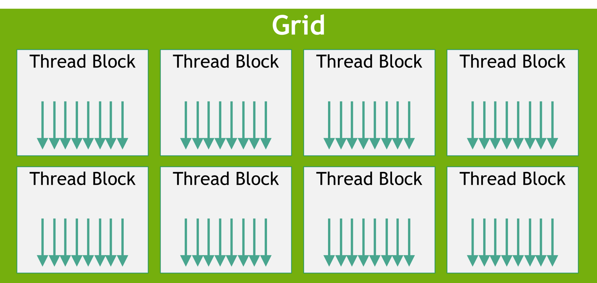
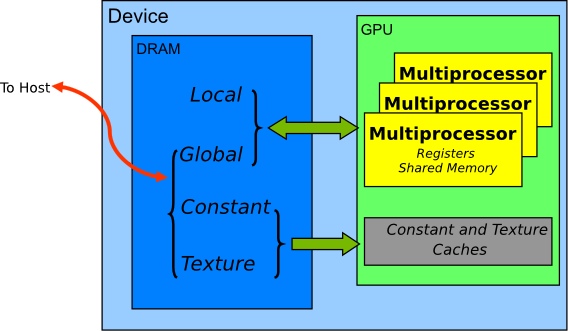
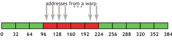

## Abstract

CUDA optimization is not a matter of creating many threads. We must consider together the granularity at which the GPU issues instructions, how it hides latency while execution is stalled, and how data moves between HBM and on-chip memory.

The questions that determine actual performance are usually the following.

- Do the lanes in a warp follow the same control flow?
- Are there enough executable warps to hide memory latency?
- Are global memory accesses coalesced?
- Is the same data reused from registers or shared memory?
- Do register and shared-memory usage constrain SM residency excessively?

This article connects CUDA kernels, threads, warps, blocks, SMs, occupancy, and the memory hierarchy into a single execution model. It provides the foundation for the discussions of GEMM, kernel fusion, and FlashAttention that follow.

---

## 1. Execution Model



*Source: [CUDA Programming Guide — Grid of Thread Blocks](https://docs.nvidia.com/cuda/cuda-programming-guide/01-introduction/programming-model.html)*

A CUDA program is divided into **host code**, which runs on the CPU, and **device code**, which runs on the GPU. A device function declared for parallel execution on the GPU is a **CUDA kernel**.

The simplest vector addition kernel looks like this.

```cpp
__global__ void add(
    const float* x,
    const float* y,
    float* z,
    int n)
{
    int i = blockIdx.x * blockDim.x + threadIdx.x;

    if (i < n) {
        z[i] = x[i] + y[i];
    }
}
```

Unlike an ordinary function call, a kernel launch includes an execution configuration.

```cpp
int threads = 256;
int blocks = (n + threads - 1) / threads;

add<<<blocks, threads>>>(x, y, z, n);
```

`<<<blocks, threads>>>` specifies one **grid** and the number and size of the **thread blocks** it contains.

```text
Kernel launch
  └─ Grid
      ├─ Thread Block 0
      │   ├─ Thread 0
      │   ├─ Thread 1
      │   └─ ...
      ├─ Thread Block 1
      └─ ...
```

Every thread executes the same kernel code, but computes a different data index through `blockIdx`, `blockDim`, and `threadIdx`.

```cpp
int i = blockIdx.x * blockDim.x + threadIdx.x;
z[i] = x[i] + y[i];
```

Having each thread process one element is merely the simplest mapping, not a rule. One thread may iterate over multiple elements, or multiple threads may cooperate to compute one output.

**Thread Block.**

A block is the fundamental scope within which threads can cooperate. Threads in the same block share the following resources.

- shared memory
- `__syncthreads()`, a block-level barrier
- cooperative loading, reduction, and scan

A block resides on a single SM for the duration of its execution. The registers and shared memory required by the block are also allocated on that SM, and this resource usage limits the number of blocks that can be resident concurrently.

**Grid.**

A grid is the complete set of blocks created by a single kernel launch. In a typical kernel, no assumption can be made about the execution order of blocks. There is no guarantee that block 0 will start or finish before block 1.

If global synchronization is required between blocks, one of the following approaches is typically used.

- Split the work into separate kernels and use the kernel boundary as a global barrier.
- Use a cooperative launch.
- Design a separate synchronization protocol with global atomics.

In most cases, splitting the work into separate kernels is the simplest approach and the easiest to verify.

**Asynchronous Launch.**

Kernel launches are asynchronous with respect to the host by default. The CPU can submit work to a CUDA stream and then continue executing subsequent host code.

However, the following operations can force the host to wait for GPU work to complete.

- explicit `cudaDeviceSynchronize()` or stream synchronization
- synchronous host-to-device / device-to-host copies
- operations that read a GPU result into a CPU scalar
- subsequent work in the same stream that depends on the result of preceding work

Overall latency includes not only the kernels themselves, but also host synchronization between launches and stream dependencies.

---

## 2. Warp Execution

CUDA threads are not executed one at a time as completely independent units in hardware. NVIDIA GPUs group 32 threads into a **warp** and issue instructions to that warp.[1]

```text
Warp
 ├─ lane 0
 ├─ lane 1
 ├─ ...
 └─ lane 31
```

Each thread has a lane ID within its warp. The warp scheduler selects an executable warp and issues an instruction to the active lanes of that warp.

This is why CUDA's execution model is called **SIMT**, or Single Instruction, Multiple Threads. Even when executing the same instruction, each lane can have different register values and memory addresses.

```cpp
out[i] = x[i] + y[i];
```

```text
lane 0  -> out[0]  = x[0]  + y[0]
lane 1  -> out[1]  = x[1]  + y[1]
...
lane 31 -> out[31] = x[31] + y[31]
```

This structure delivers high throughput for workloads that apply the same operation to large volumes of data. Conversely, execution efficiency falls when control flow or the amount of work differs significantly across lanes.

**Warp Divergence.**

When the lanes in a warp select different branches, **warp divergence** occurs.

```cpp
if (threadIdx.x % 2 == 0) {
    path_a();
} else {
    path_b();
}
```

Conceptually, each branch is executed with a different active mask.

```text
path_a
  even lanes: active
  odd lanes:  inactive

path_b
  even lanes: inactive
  odd lanes:  active
```

The two paths are not processed simultaneously across all lanes. As the different paths execute sequentially, lanes that do not belong to the current path remain inactive. The longer the branches and the more irregular the lane-level choices, the lower the effective throughput.

However, the mere presence of an `if` statement does not cause divergence.

```cpp
if (blockIdx.x < num_regular_blocks) {
    regular_path();
} else {
    tail_path();
}
```

If every lane in the same warp makes the same choice, the control flow is uniform. The compiler may also convert short conditionals into predicated instructions.

Therefore, what matters is not whether a branch exists, but the following.

> How often do the lanes in the same warp choose different paths, and how long do those paths last?

Kernels in which loop counts and branches depend on the input structure—such as mesh processing, BVH traversal, sparse voxels, and ray traversal—are particularly sensitive to divergence.

```cpp
while (node != nullptr) {
    if (intersects(node)) {
        node = node->child;
    } else {
        node = node->next;
    }
}
```

If each lane visits different nodes, the warp's rate of progress can be limited by the lane that remains active the longest. Common mitigation techniques include the following.

- Assign spatially coherent queries to the same warp.
- Sort or bucketize primitives with similar workloads.
- Restructure traversal around a persistent work queue.
- Separate the common path and exceptional path into different kernels.
- Regroup active work through warp-level compaction.

Reordering and compaction also have costs, so profiling is necessary to confirm that reducing divergence actually reduces kernel duration.

---

## 3. SM Scheduling

The GPU's actual execution resource is the **SM**, or Streaming Multiprocessor. Its details vary by GPU architecture, but conceptually it contains the following resources.

```text
SM
 ├─ Warp schedulers
 ├─ CUDA cores
 ├─ Tensor cores
 ├─ Load/store units
 ├─ Special-function units
 ├─ Register file
 └─ Shared memory / L1
```

Suppose one warp issues a global memory load and then waits for the result. Instead of waiting on that warp alone, the GPU issues an instruction from another ready warp resident on the same SM.

```text
Warp 0: global load → wait
Warp 1: arithmetic
Warp 2: shared-memory load
Warp 3: Tensor Core instruction
Warp 0: data ready → resume
```

This is **latency hiding**. For a GPU to achieve high throughput, it needs parallelism at two levels.

- **Thread-level parallelism**: Fill all SMs with enough blocks and warps.
- **Instruction-level parallelism**: Make independent instructions available for issue within a thread or warp.

Even with many threads, a long dependency chain or irregular memory accesses can leave too few ready warps. Conversely, even with few resident warps, sufficient software pipelining and instruction-level parallelism can maintain high throughput.

**Occupancy.**

Occupancy is the number of active warps actually resident on an SM divided by the maximum number of active warps allowed by the architecture.

$$
\text{occupancy}
=
\frac{\text{resident active warps per SM}}
{\text{maximum active warps per SM}}
$$

Occupancy is primarily limited by the following resources.

- registers per thread
- shared memory per block
- threads per block
- maximum blocks per SM
- maximum warps per SM

For example, increasing register usage per thread also increases the register allocation for the entire block. As a result, fewer blocks and warps may be resident concurrently on one SM.

However, high occupancy does not guarantee high performance.[2] A GEMM kernel may have low occupancy because it keeps many accumulators in registers, yet still be fast if it satisfies the following conditions.

- Tensor Core utilization is high.
- Data reuse from shared memory and registers is sufficient.
- A software pipeline hides memory latency.
- There are enough independent MMA instructions.

Forcing register usage down to increase occupancy may spill accumulators to local memory and make the kernel slower instead.

Occupancy is more accurately viewed as a diagnostic metric than as an optimization objective.

- Low occupancy together with low compute throughput may indicate insufficient parallelism.
- If compute throughput is high despite low occupancy, it may not be a problem.
- Even with high occupancy, warps can stall frequently because of memory dependencies.
- If increasing occupancy causes register spills, overall performance can deteriorate.

Therefore, occupancy should be considered alongside the following metrics.

- achieved memory bandwidth
- SM / Tensor Core utilization
- eligible warps per cycle
- warp stall reasons
- local loads/stores and register spills
- absolute kernel duration

---

## 4. Memory Hierarchy



*Source: [CUDA C++ Best Practices Guide — Device Memory Spaces](https://docs.nvidia.com/cuda/cuda-c-best-practices-guide/#device-memory-spaces)*

GPU memory can be viewed approximately as the following hierarchy.

```text
fast / small
────────────────────────
Register
Shared memory / L1
L2 cache
Global memory / HBM
Host memory
────────────────────────
slow / large
```

Each level differs not only in latency and capacity, but also in scope, visibility, and how it is managed.

| Memory | Scope | Managed by | Typical use |
|---|---|---|---|
| Register | thread | compiler | accumulator, address, temporary value |
| Shared memory | block | programmer | tile, reduction, transpose |
| L1 cache | SM | hardware | local reuse of global-memory data |
| L2 cache | device | hardware | cache shared across SMs |
| Global memory | device | allocation/API | tensors and large buffers |
| Local memory | logical thread scope | compiler | register spill, large local array |
| Constant memory | grid-wide read-only | programmer | small broadcast constants |
| Texture / read-only path | read-only workload | API/compiler | spatial locality, specialized addressing |

**Register.**

Registers are the fastest storage for a thread's scalars, addresses, accumulators, and small fragments.

```cpp
float acc = 0.0f;
float a = ...;
float b = ...;
acc += a * b;
```

`acc`, `a`, and `b` are generally placed in registers. Registers are not memory that a programmer accesses directly through pointers, but a limited SM resource that the compiler assigns to variables.

**Shared Memory.**

Shared memory is programmer-managed on-chip memory shared by threads in the same block.

```cpp
__shared__ float tile[32][33];
```

The programmer stages data from global memory into shared memory and, when necessary, synchronizes producers and consumers with a barrier. Shared memory acts not only as a cache, but also as a scratchpad for transposes, reductions, and data exchange.

**L1 and L2.**

Global memory accesses can pass through hardware caches. L1 is close to the SM, while L2 is shared by all SMs on the device.

Although caches reduce repeated accesses, a performance-critical kernel should not simply assume that “the cache will handle it.” Cache hit rates can be low when the working set is large or the access pattern is streaming, and multiple SMs and kernels compete for the same cache capacity.

**Global Memory and HBM.**

The underlying storage for PyTorch tensors and ordinary CUDA allocations is global memory. It provides high capacity and bandwidth, but its latency is higher than that of on-chip memory.

On modern GPUs, Tensor Core throughput has grown faster than HBM bandwidth. Consequently, a kernel that repeatedly reads the same data from HBM cannot fully utilize its arithmetic units. High-performance kernels reduce HBM traffic whenever possible and repeatedly reuse data from shared memory and registers after loading it once.

**Local Memory.**

Despite its name, `local memory` is not fast on-chip storage. It is logically private to each thread but physically resides in device memory.

Local memory traffic increases primarily in the following situations.

- register spills
- large local arrays whose indices are difficult to determine at compile time
- excessively large thread-local state

If local loads/stores stand out in Nsight Compute, the first things to inspect are register allocation and spills.

---

## 5. Memory Access



*Source: [CUDA C++ Best Practices Guide — Coalesced Access](https://docs.nvidia.com/cuda/cuda-c-best-practices-guide/#coalesced-access-to-global-memory)*

The first principle of global memory optimization is to service the requests of a warp with as few **memory transactions** as possible. This is called **coalescing**.[3]

**Coalescing.**

In the following access, the lanes of a warp read consecutive FP32 values.

```cpp
float v = x[base + threadIdx.x];
```

```text
lane 0  -> x[0]
lane 1  -> x[1]
...
lane 31 -> x[31]
```

The data used by the entire warp totals 128 bytes. If the address is properly aligned, the hardware can service the request using a small number of contiguous memory sectors.

In contrast, with a large stride, each lane touches a different sector or cache line.

```cpp
float v = x[threadIdx.x * stride];
```

```text
lane 0  -> x[0]
lane 1  -> x[1024]
lane 2  -> x[2048]
...
```

The values actually consumed still total 128 bytes, but far more bytes may need to be transferred to obtain them.

Coalescing is not merely a matter of checking whether indices are consecutive. The following two quantities must be compared.

1. The bytes actually consumed by the warp
2. The bytes transferred by the memory subsystem to service that request

$$
\text{memory efficiency}
=
\frac{\text{useful bytes}}
{\text{transferred bytes}}
$$

When efficiency is low, the number of memory instructions or transactions may be the bottleneck even if DRAM bandwidth has not reached its peak.

**Alignment and Vectorized Access.**

Even for consecutive accesses, an extra sector may be required if the starting address is misaligned with the transaction boundary. CUDA allocations themselves provide sufficient alignment, but misalignment can arise in the following cases.

- a tensor view with an offset
- an unusual row stride
- a payload that begins after the header of a custom packed format
- pointer arithmetic that adds an arbitrary offset

A vectorized load/store, in which one thread reads several values with one instruction, can reduce the number of instructions and address calculations.

```cpp
float4 v = reinterpret_cast<const float4*>(x)[i];
```

However, pointer alignment and tail handling must be correct. Using `float4` does not automatically make the access pattern of the entire warp coalesced.

**Data Layout.**

Memory layout should match the fields that a warp consumes at the same time.

An **Array of Structures** places the attributes of each element together.

```cpp
struct Vertex {
    float3 position;
    float3 normal;
    float2 uv;
};

Vertex vertices[N];
```

This layout is natural for a kernel that always reads position, normal, and UV together. A kernel that needs only position, however, still steps through the full struct and may generate unnecessary traffic.

A **Structure of Arrays** separates buffers by field.

```cpp
float3 positions[N];
float3 normals[N];
float2 uvs[N];
```

A stage that needs only position can read only `positions`. The components can also be separated when appropriate.

```cpp
float pos_x[N];
float pos_y[N];
float pos_z[N];
```

Neither layout is always superior. The criterion is simple.

> Place data that a warp uses at the same time close together in memory as well.

Because different stages of a 3D pipeline require different attributes, stage-specific compact buffers are often more efficient than a single general-purpose vertex struct.

---

## 6. On-Chip Reuse

The central role of shared memory and registers is to increase **arithmetic intensity** by reusing data fetched from HBM. Because both resources have limited capacity on an SM, however, there is a trade-off between reuse and residency.

**Shared-Memory Tiling.**

In matrix multiplication, when a block loads tiles of A and B into shared memory, it can reuse the same values across multiple output calculations.

```text
HBM: tile load once
        ↓
Shared memory: reuse across threads
        ↓
Register: accumulate outputs
```

Global memory traffic decreases, allowing more arithmetic to be performed per byte.

Shared memory is also useful for layout conversion. If a matrix transpose is performed directly in global memory, either the reads or the writes are likely to be strided. Using a shared-memory tile as a staging buffer can make both global accesses coalesced.

```text
Global read:  row-major, coalesced
        ↓
Shared memory: transpose tile
        ↓
Global write: row-major, coalesced
```

**Bank Conflict.**

Shared memory is divided into multiple banks and provides high throughput when the lanes of a warp access different banks. When different addresses map to the same bank, a **bank conflict** occurs and the requests may be serialized into multiple steps.

A typical transpose tile may encounter this problem during column access.

```cpp
__shared__ float tile[32][32];
```

If the row stride of 32 interacts poorly with the bank mapping, accesses in the column direction concentrate on the same bank. A common solution is padding.

```cpp
__shared__ float tile[32][33];
```

The logical tile size remains unchanged, but changing the physical row stride to 33 distributes the bank mapping.[3]

Global memory coalescing and shared-memory bank conflicts are distinct problems.

- **Coalescing**: the efficiency of warp transactions going to L1/L2/HBM
- **Bank conflict**: the efficiency with which lane accesses are processed in parallel within shared memory

A tiled kernel must satisfy both conditions.

**Register Pressure.**

Registers are the fastest storage, but each SM has a limited total supply. Increasing the number of registers per thread creates the following trade-off.

```text
registers per thread ↑
        ↓
registers per block ↑
        ↓
resident blocks / warps ↓
        ↓
occupancy may decrease
```

Conversely, reducing register usage too aggressively causes values to spill into local memory.

```text
insufficient registers
        ↓
local-memory spill
        ↓
additional load/store
        ↓
longer kernel duration
```

The goal of register optimization is not to minimize usage itself. It is to maintain sufficient reuse and instruction-level parallelism while avoiding spills and excessive reductions in residency.

Common causes of high register pressure include the following.

- large local arrays
- aggressive loop unrolling
- many output tiles per thread
- long live ranges
- complex address calculations
- temporary values introduced by fusion
- heavy epilogues that include activation, quantization, and other operations

Potential improvements also involve trade-offs.

- Shorten variable live ranges.
- Consider whether large thread-local state can be moved to shared memory.
- Reduce the unroll factor.
- Reduce the output tile per thread.
- Reconsider the fusion boundaries.
- Use compiler register limits while measuring spills.

---

## 7. Communication

The cost of a CUDA kernel is not determined by arithmetic and memory access alone. Communication and synchronization between threads can also become important bottlenecks.

**Block Barrier.**

```cpp
__syncthreads();
```

`__syncthreads()` waits until the participating threads in a block have reached the barrier. It is most commonly used after cooperatively loading a shared-memory tile and before consuming it.

The barrier must be executed under consistent control flow across the entire block.

```cpp
if (threadIdx.x < 16) {
    __syncthreads();  // unsafe: not all threads participate
}
```

If only some threads enter the barrier, deadlock or undefined behavior can occur. Even when barriers are necessary for correctness, using them too often reduces the number of ready warps and disrupts the pipeline.

**Warp Shuffle.**

Shuffle instructions can be used instead of shared memory to exchange register values within a warp.

```cpp
float other = __shfl_down_sync(0xffffffff, value, offset);
```

They are useful for reductions, scans, and broadcasts, and can eliminate a shared-memory write, barrier, and read.

```text
register in one lane
        ↓ shuffle
register in another lane
```

However, shuffles can only be used for communication within a warp. Exchanges across warps require shared memory or another synchronization mechanism.

**Atomic Contention.**

Atomic operations are used when multiple threads must update the same address.

```cpp
atomicAdd(counter, value);
```

Atomics ensure correctness, but requests concentrated on the same address cause serialization. A common solution is to aggregate updates hierarchically.

```text
thread-local accumulation
        ↓
warp reduction
        ↓
block reduction
        ↓
one global atomic per block
```

In mesh rasterization or voxelization, binning primitives into spatial tiles can also effectively reduce contention for the same voxel.

---

## 8. Performance Model

Before optimizing a kernel, it is necessary to classify what limits it. In general, the bottleneck is closest to one of **compute throughput**, **memory bandwidth**, or **latency / issue efficiency**.

**Compute-Bound.**

In a compute-bound kernel, the arithmetic pipeline or Tensor Core throughput is the limiting factor. Arithmetic intensity and compute utilization are high, while memory bandwidth has relatively more headroom.

Large GEMMs are a representative example. In this case, the following changes matter.

- Reduce the number of FLOPs itself.
- Use a more efficient instruction path.
- Optimize the Tensor Core tile and data type.
- Improve pipeline dependencies and instruction issue.

**Memory-Bound.**

In a memory-bound kernel, the limiting factor is how quickly data can be read from and written to HBM. Operations with low arithmetic intensity, such as simple elementwise operations, copies, and activations, fall close to this category.

In this case, the following changes are more effective than eliminating a few arithmetic instructions.

- Eliminate intermediate tensors.
- Fuse kernels.
- Reduce bytes per element.
- Improve coalescing and alignment.
- Increase on-chip reuse.

**Latency- or Issue-Bound.**

A kernel can be slow even when both compute utilization and DRAM throughput are low. In this case, the problem is not peak FLOPs or bandwidth, but an inability to issue enough work.

- The grid is too small to fill all SMs.
- The dependency chain is long.
- Memory accesses are irregular.
- Warp divergence is high.
- Atomic contention is severe.
- There are too many small kernels.
- Host launch gaps or synchronization are substantial.

Looking only at bandwidth figures can easily obscure the cause of this type of bottleneck.

**Arithmetic Intensity and Roofline.**

Arithmetic intensity is the number of operations performed per byte transferred.

$$
I
=
\frac{\text{FLOPs}}
{\text{transferred bytes}}
$$

From a Roofline perspective, attainable performance is limited by the smaller of the two bounds imposed by compute peak and memory bandwidth.

$$
P_{\text{attainable}}
\leq
\min
\left(
P_{\text{compute peak}},
I \cdot B_{\text{memory}}
\right)
$$

Here, `P_compute peak` is the maximum compute throughput and `B_memory` is the memory bandwidth.

FP32 vector addition performs two loads and one store per element.

- `x`: 4-byte load
- `y`: 4-byte load
- `z`: 4-byte store
- addition: 1 FLOP

Its approximate arithmetic intensity is therefore as follows.

$$
I
\approx
\frac{1\ \text{FLOP}}
{12\ \text{bytes}}
$$

This is a very low value. Reducing memory traffic matters more than making a minor optimization to the add instruction.

Matrix multiplication can reuse the same A and B elements across multiple outputs. With effective tiling, data fetched once from HBM is repeatedly reused from shared memory and registers, increasing arithmetic intensity and moving the operation closer to compute-bound.

This difference lies at the core of GEMM and FlashAttention. Neither operation merely performs FLOPs quickly; both reduce expensive data movement and maximize on-chip reuse.

---

## 9. Optimization Patterns

The preceding principles appear in several recurring forms in real kernels.

**Kernel Fusion.**

Consider running each operation in the following elementwise pipeline as a separate kernel.

```python
u = x * scale
v = u + shift
out = relu(v)
```

With separate kernels, the intermediate tensors are materialized in global memory.

```text
Kernel 1: x, scale read → u write
Kernel 2: u, shift read → v write
Kernel 3: v read → out write
```

Fusing them into one kernel eliminates intermediate traffic and launches.

```cpp
float value = x[i] * scale[i] + shift[i];
out[i] = max(value, 0.0f);
```

```text
x, scale, shift read → out write
```

If this operation is memory-bound, a substantial improvement is possible even with almost no change in arithmetic. However, as fusion grows, register pressure, code size, and scheduling complexity can increase, so combining as much as possible is not always the right answer.

**Tiled Transpose.**

In a naive matrix transpose, either the reads or the writes are likely to be strided.

```cpp
out[col * height + row] = in[row * width + col];
```

With a shared-memory tile, both global accesses can be made coalesced through the following sequence.

```text
1. Read an input row with coalesced accesses
2. Store it in a shared-memory tile
3. Block barrier
4. Read the tile using transposed indices
5. Write an output row with coalesced accesses
```

Padding is added to the tile to avoid bank conflicts.

```cpp
__shared__ float tile[TILE][TILE + 1];
```

This example contains all the core patterns of CUDA memory optimization.

- coalesced global access
- shared-memory staging
- block-level synchronization
- bank-conflict avoidance through padding

**Kernel Review.**

When examining a real kernel for the first time, checking it in the following order makes it easier to narrow down the cause.

**Execution**

- Is the grid large enough to fill the entire GPU?
- Does the block size align well with the warp size?
- Are warp divergence and per-thread workload imbalance substantial?
- Are there too few ready warps, or is the dependency chain long?

**Global Memory**

- Do the warp lanes access adjacent addresses?
- Are unnecessary intermediates being read and written?
- Is there misalignment or a large stride?
- Is the same data being read repeatedly from HBM?

**Shared Memory**

- Is reuse within the block large enough to justify the cost of shared-memory staging?
- Are there bank conflicts?
- Are there too many barriers?
- Does shared-memory allocation limit residency?

**Register**

- Is the register count per thread excessive?
- Are local-memory spills occurring?
- Does a larger register tile actually increase reuse, or does it only reduce occupancy?

**Pipeline**

- Are too many small kernels being launched?
- Is CPU synchronization or scalar readback involved?
- Can memory copies and computation overlap?
- Can kernel fusion eliminate intermediate traffic?

---

## Summary

CUDA performance cannot be explained by thread count alone.

1. A kernel launch creates a grid, and the grid consists of multiple thread blocks.
2. A block resides on one SM and uses shared memory and block-level synchronization.
3. Threads issue instructions in warp-sized units, so per-lane control flow and address patterns matter.
4. The GPU hides memory and pipeline latency by alternating among ready warps.
5. Occupancy is one means of providing the parallelism needed for latency hiding, not an optimization objective in itself.
6. Global memory traffic should be reduced through coalescing, alignment, and compact layouts.
7. Shared memory and registers increase arithmetic intensity by reusing data fetched from HBM.
8. Excessive use of on-chip resources can reduce occupancy and cause bank conflicts and register spills.
9. Before optimization, first classify whether the kernel is closest to compute-bound, memory-bound, or latency-bound.

The next article examines GEMM, the operation in which these principles are combined most intricately. It follows the transformation of naive matrix multiplication into a high-performance kernel through shared-memory tiling, register blocking, Tensor Cores, and software pipelining.

---

## References

1. NVIDIA, *CUDA Programming Guide*: https://docs.nvidia.com/cuda/cuda-programming-guide/
2. NVIDIA, *CUDA Best Practices Guide — Occupancy*: https://docs.nvidia.com/cuda/cuda-c-best-practices-guide/
3. NVIDIA, *CUDA Best Practices Guide — Coalesced Access and Shared Memory*: https://docs.nvidia.com/cuda/cuda-c-best-practices-guide/
4. NVIDIA, *CUDA Programming Guide — Asynchronous Data Copies*: https://docs.nvidia.com/cuda/cuda-programming-guide/04-special-topics/async-copies.html
