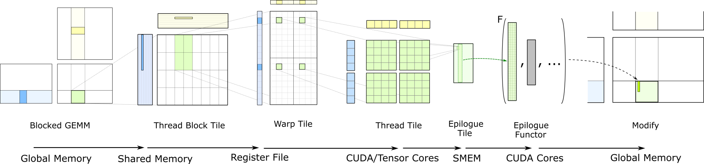
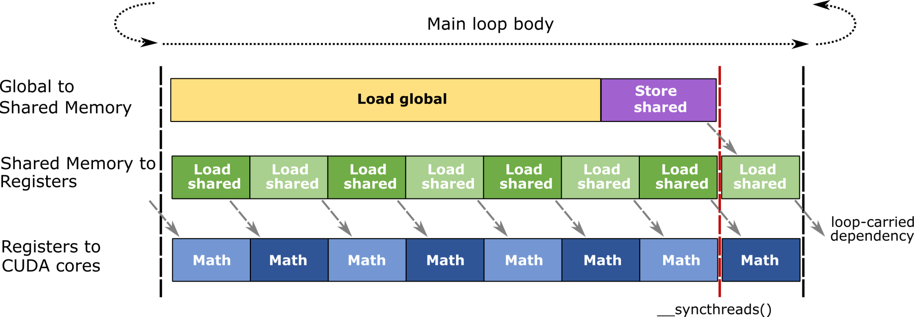

## Abstract

General Matrix Multiplication, or GEMM, multiplies two matrices and optionally adds a scaled existing matrix.

Linear layers, attention projections, and the dominant computations in MLPs are GEMMs, while some convolutions are computed as implicit GEMMs without expanding the input into an actual matrix. GEMM consequently accounts for a substantial share of GPU time in deep learning and HPC.

GEMM optimization starts by deciding how much work to leave to a library before handling Tensor Core instructions directly. Use cuBLAS as the baseline for a standard dense GEMM. Consider cuBLASLt when layouts, epilogues, workspace, or algorithm candidates need explicit control. Move down to CUTLASS or a custom kernel when neither API can express the required dataflow.

This order is not an absolute performance ranking. It is a policy for expanding the implementation scope only as far as necessary instead of starting with a custom kernel.

This article covers naive GEMM, hierarchical tiling, and Tensor Core pipelines in that order. Rather than finding the fastest tile on one particular GPU, it focuses on the problems a library handles internally and the choices that change with shape. The final section lays out a shape manifest and validation procedure for a real workload.

The API and architecture descriptions were checked against the official CUDA 13.3 and CUTLASS 4.6.1 documentation in August 2026. Support for cuBLASLt epilogues, dtypes, grouped GEMM, and CUTLASS schedulers varies by toolkit and GPU generation, so confirm the documentation and API queries for the deployment environment before applying them.

---

## 1. Between Libraries and Custom Kernels

GEMM, cuBLAS, cuBLASLt, CUTLASS, CuTe, and Tensor Cores belong to different abstraction layers.

```text
Mathematical operation
  GEMM
    ↓
Library / API
  cuBLAS / cuBLASLt
    ↓
Kernel construction
  CUTLASS device-wide operators and CuTe components
    ↓
Kernel policy
  tile, pipeline, epilogue, scheduler
    ↓
Hardware
  SM, Tensor Core, CUDA Core, register, shared memory, HBM
```

Moving down the stack provides finer control over dataflow. It also transfers responsibility for tails, alignment, numerical behavior, and architecture portability to the application.

First determine whether the current API can express the operation. If it can, measure whether it is fast enough on the actual workload. A custom kernel need not be considered until one of these two conditions fails.


| Requirement | First candidate | Reason to move down one level |
|---|---|---|
| Standard dense GEMM | cuBLAS | Layout, epilogue, workspace, or candidate control is required |
| Flexible layout, compute type, and epilogue | cuBLASLt | The API cannot express the required combination or dataflow |
| Custom mainloop, quantized decode, and scheduler | CUTLASS device operator / CuTe component | Provided components are still difficult to express or maintain |
| Fully specialized dataflow | Custom CUDA kernel | Measured benefit exceeds maintenance and validation cost |


`cuBLAS first` in the table means obtaining a standard-GEMM baseline with little code. Depending on the shape, cuBLASLt may be a better fit from the outset. A kernel written with CUTLASS is not always faster than either library.

cuBLASLt is not a higher version of cuBLAS. It is a separate API that describes layouts, algorithms, and heuristics more flexibly. [NVIDIA cuBLASLt documentation](https://docs.nvidia.com/cuda/cublas/#using-the-cublaslt-api)

The general GEMM has the following form.

$$
D=\alpha\,\operatorname{op}(A)\operatorname{op}(B)+\beta C
$$

Without transposition,

$$
A\in\mathbb{R}^{M\times K},\qquad
B\in\mathbb{R}^{K\times N},\qquad
C,D\in\mathbb{R}^{M\times N}
$$

and

$$
D_{ij}=\alpha\sum_{k=0}^{K-1}A_{ik}B_{kj}+\beta C_{ij}
$$

is computed. Counting the multiply and add as 1 FLOP each, the main matrix product requires approximately $2MNK$ FLOPs. This approximation excludes the operations that apply alpha and beta.

---

## 2. Data Reuse and Hierarchical Tiling

### Naive GEMM

The kernel below computes $D=AB$, restricted to $\alpha=1$, $\beta=0$, and no transposition. It assumes contiguous row-major buffers for A, B, and D. This example illustrates tile reuse, and its indexing differs from cuBLAS, which uses column-major storage by default.

```cpp
__global__ void naive_gemm(
    const float* A,
    const float* B,
    float* D,
    int M,
    int N,
    int K)
{
    int row = blockIdx.y * blockDim.y + threadIdx.y;
    int col = blockIdx.x * blockDim.x + threadIdx.x;

    if (row >= M || col >= N) {
        return;
    }

    float acc = 0.0f;
    for (int k = 0; k < K; ++k) {
        acc += A[row * K + k] * B[k * N + col];
    }
    D[row * N + col] = acc;
}
```

Outputs in the same row share one row of A. Outputs in the same column share one column of B. Caches and broadcasts reduce some traffic, but as the working set grows, this reuse cannot be left entirely to cache hits.

A high-performance GEMM divides its output into tiles at the CTA, warp or warp-group, and instruction levels. Each level explicitly reuses part of A and B.

### Tiles and Arithmetic Intensity

Suppose one CTA computes a $B_M\times B_N$ output tile and traverses the K dimension in units of $B_K$. One K tile performs

$$
2B_MB_NB_K\quad\text{FLOPs}
$$

and, for an element size of $b$ bytes, reading A and B once from HBM requires

$$
b(B_MB_K+B_KB_N)=bB_K(B_M+B_N)
$$

bytes. Ignoring output loads and stores, cache reuse between CTAs, and alignment and padding traffic, and assuming that the A/B tiles are fully reused within the CTA, the input-only arithmetic intensity is

$$
\operatorname{AI}_{\text{input}}
\approx
\frac{2B_MB_NB_K}{bB_K(B_M+B_N)}
=
\frac{2B_MB_N}{b(B_M+B_N)}
\quad\text{FLOP/byte}
$$

For a square tile with $B_M=B_N=T$, this becomes $\operatorname{AI}_{\text{input}}\approx T/b$.


| CTA output tile | FP16/BF16 input ($b=2$) | FP32 input ($b=4$) |
|---|---:|---:|
| $64\times64$ | about 32 FLOP/byte | about 16 FLOP/byte |
| $128\times128$ | about 64 FLOP/byte | about 32 FLOP/byte |


With the same $B_K$ and dtype, a `128 × 128` tile provides twice the input reuse of a `64 × 64` tile. This number is not a performance prediction.

A larger tile consumes more shared memory, accumulator storage, and threads per CTA. When M or N is small, it also reduces the number of concurrently executing CTAs and tail utilization. Once output traffic is included, the actual intensity of a short-K problem is lower than the approximation above.

```cpp
for (int k0 = 0; k0 < K; k0 += BK) {
    // Cooperative global-to-shared load:
    // A[BM, BK], B[BK, BN]
    __syncthreads();

    // Update the output accumulator from shared-memory tiles.
    __syncthreads();
}
```

The first barrier starts computation after the input load completes, while the second ensures that the current computation finishes before the next K tile overwrites the buffer. A real Tensor Core kernel uses a more granular asynchronous pipeline and barriers.



*This warp-level CUTLASS schematic shows block-, warp-, and thread-level tile reuse followed by epilogue data movement. It does not directly represent Hopper WGMMA or Blackwell operand paths. Source: [NVIDIA CUTLASS — Efficient GEMM in CUDA](https://docs.nvidia.com/cutlass/latest/media/docs/cpp/efficient_gemm.html)*

```text
Global GEMM
  ↓
CTA / thread-block tile: HBM traffic and grid scheduling
  ↓
Warp or warp-group tile: shared-memory tile partitioning
  ↓
MMA instruction tile: ISA-level matrix operation
  ↓
Thread / warp-group state: operand and accumulator management
```

CUTLASS provides this hierarchy as software abstractions. Register blocking reuses an operand across multiple FMAs and keeps the accumulator in nearby storage during the mainloop.

The actual storage location and operand path vary by architecture. Explaining every generation in terms of “thread register fragments” fails to account for Blackwell's TMEM path.

---

## 3. Tensor Core Pipeline

A Tensor Core performs

$$
D_{\text{frag}}\leftarrow A_{\text{frag}}B_{\text{frag}}+D_{\text{frag}}
$$

on small matrix tiles. In addition to this instruction, a complete GEMM kernel is responsible for HBM loads, shared-memory layout, synchronization, tail handling, the epilogue, and stores.

The operand path differs by GPU generation.

- In the warp-level MMA path widely used from Volta through Ampere, shared-memory operands are moved into per-thread register fragments and accumulators are also held in registers.
- **Hopper WGMMA** references B through a shared-memory descriptor. Depending on the configuration, A is supplied from shared memory or registers, while accumulators remain in registers. [PTX ISA — WGMMA](https://docs.nvidia.com/cuda/parallel-thread-execution/#asynchronous-warpgroup-level-matrix-multiply-accumulate-instructions-wgmma)
- **Blackwell SM100 `tcgen05.mma`** stores accumulators in Tensor Memory (TMEM). A may be supplied from shared memory or TMEM, and B from shared memory. The Hopper register-accumulator description does not carry over unchanged to Blackwell. [NVIDIA CUTLASS — tcgen05 MMA Programming Guide](https://docs.nvidia.com/cutlass/latest/media/docs/pythonDSL/mma_docs/tcgen05_programming.html)

The epilogue moves accumulators into the output layout. It applies operations such as bias, activation, and dtype conversion before writing to global memory. A cuBLASLt-supported epilogue can eliminate an intermediate store while preserving a tuned mainloop.

Putting an unsupported layout transform or irregular indexing into the mainloop may slow GEMM itself. In that case, it can be faster to leave GEMM in the library and process the adjacent operation in a separate kernel.

Record precision as input, compute/accumulator, and output dtypes. BF16 input, FP32 accumulation, and BF16 output are one possible combination. FP8 and block-scaled formats also require the scale-value dtype and scale granularity. Supported combinations vary by GPU architecture and library version.

### Overlapping Load and Compute



*This legacy CUTLASS double-buffering schematic shows overlap among global-to-shared loads, shared-to-register loads, and math. It is not an exact representation of Hopper WGMMA/TMA or a Blackwell pipeline. Source: [NVIDIA CUTLASS — Efficient GEMM in CUDA, Software Pipelining](https://docs.nvidia.com/cutlass/latest/media/docs/cpp/efficient_gemm.html#pipelining)*

Software pipelining loads the next tile while computing the current one.

```text
load tile 0
wait tile 0

compute tile 0  ||  load tile 1
compute tile 1  ||  load tile 2
compute tile 2  ||  load tile 3
```

Double buffering and multi-stage pipelines hide memory latency at the cost of increased shared-memory use and pipeline state. An excessively deep pipeline can reduce occupancy and add only setup cost to a short-K workload.

Ampere asynchronous copies, TMA from Hopper onward, and generation-specific MMA and barriers all serve to overlap loads and computation. Their implementations differ.

Tile tails must be considered as well. If $M=130$ and the CTA tile size along M is 64, only 2 rows are valid in the third tile. In this case, boundary waste and an insufficient CTA count may affect performance more than the nominal throughput of a large tile.

---

## 4. Scheduling for the Shape

Before choosing a scheduler, identify the dimension along which parallelism is insufficient. Split-K and Stream-K are options to consider when K-direction parallelism is needed.


| Observed problem | First metric to inspect | Kernel-level candidate | Cost paid |
|---|---|---|---|
| Small M/N and long K yield too few output tiles | Active CTA count, absolute latency | Split-K or Stream-K family | Partial reduction, workspace/atomics, changed addition order |
| Tile count poorly matches execution waves | Final-wave utilization | Smaller tile or dynamic/persistent scheduler | Scheduler overhead, resource residency |
| Many same-shape small GEMMs | Launch fraction, buffer stride | Strided batched GEMM | Shape and layout constraints within the batch |
| Many different small GEMMs | Tiles and tails per problem | Grouped persistent GEMM | Metadata access, load imbalance |
| Batch-1 linear with $M\approx1$ | Memory bandwidth, weight traffic | GEMV/small-M kernel, weight prepacking | Specialized layout and additional maintenance cost |


Split-K divides the K range of one output tile among multiple workers.

$$
P^{(s)}_{ij}=\sum_{k\in K_s}A_{ik}B_{kj},\qquad
P_{ij}=\sum_sP^{(s)}_{ij}
$$

Split-K increases K-direction parallelism but stores and then combines partial sums. The Stream-K family distributes K tiles or MAC work more flexibly to reduce imbalance in the final wave.

Both approaches can lose performance if the existing output tiles already fill the GPU. The additional scheduler and reduction costs may exceed the benefit from added parallelism.

Grouped GEMM assigns different problems to worker CTAs within one persistent launch. A CUTLASS grouped scheduler still pays for metadata search and problem ordering. Different shapes alone do not make grouped GEMM universally advantageous. [NVIDIA CUTLASS — Grouped Kernel Schedulers](https://docs.nvidia.com/cutlass/latest/media/docs/cpp/grouped_scheduler.html)

In a small-M skinny GEMM, parallelism and weight reuse along M both decrease. For $A\in\mathbb{R}^{M\times K}$ and $B\in\mathbb{R}^{K\times N}$, taking M toward 1 reduces the number of output tiles. It also reduces the opportunity to reuse the same weights B across multiple output rows.

One element of A may still feed multiple outputs along N. Describing this bottleneck as “insufficient A reuse” is therefore inaccurate.

Request batching combines the M dimensions of several requests to improve B/weight reuse and parallelism. It may increase request wait time in exchange. This is a system-level choice involving latency and throughput, not a kernel scheduler.

Convolution as a whole cannot be treated as GEMM either. Some cuDNN convolution algorithms use implicit GEMM, but cuDNN also uses transform-based algorithms. Implicit GEMM does not materialize an im2col matrix in HBM. [NVIDIA Convolutional Layers User's Guide](https://docs.nvidia.com/deeplearning/performance/dl-performance-convolutional/index.html#convolution-algorithms)

---

## 5. Comparing on the Real Workload

A kernel cannot be selected by peak TFLOPS alone. Collect the shapes used by the actual product and compare candidates under identical conditions. A fast candidate must then pass numerical validation and production replay.

### Build a Shape Manifest

Do not reduce the workload to one average shape. Collect the following fields from the product path.

```text
name, M, N, K, batch/group, transA, transB,
A/B/C/D layout and dtype, compute type,
alpha, beta, epilogue, alignment,
workspace limit, frequency or probability
```

At minimum, determine whether the product contains the following regimes. The numbers below are example shapes for classification, not benchmark results.


| Regime | Example | What the shape exposes |
|---|---|---|
| Large square | `4096×4096×4096` | Steady-state compute and pipeline behavior |
| Small-M, long-K | `8×4096×16384` | Insufficient output parallelism and weight traffic |
| Tail-sensitive | `130×4096×4096` | CTA-tile boundary waste |
| Short-K | `4096×4096×64` | Load and epilogue share of runtime |
| Heterogeneous group | Actual `(M,N,K)` list | Scheduler and metadata imbalance |


### Narrow the Candidate Set

Use cuBLAS as the baseline for a standard operation. Compare it with cuBLASLt heuristic candidates that express the same layout, epilogue, and workspace conditions. Add CUTLASS or a custom kernel when neither API can express the requirements or when the same bottleneck repeatedly appears in an important shape.

Apply the same workspace limit and end-to-end measurement interval to every candidate.

When exploring CUTLASS candidates, use the verification, warm-up, repeated execution, and CSV output provided by its profiler. The `4096³` in the following command illustrates the invocation and makes no performance claim.

```bash
./tools/profiler/cutlass_profiler \
  --operation=gemm \
  --m=4096 --n=4096 --k=4096 \
  --op_class=tensorop \
  --warmup-iterations=20 \
  --profiling-iterations=100 \
  --verification-enabled=true \
  --output=gemm-4096
```

The actual candidate set depends on the kernels included in the build and the target architecture. Query the available options from the binary with `--operation=gemm --help`. [NVIDIA CUTLASS Profiler](https://docs.nvidia.com/cutlass/latest/media/docs/cpp/profiler.html)

### Record the Cause Alongside Latency

- For a small GEMM, prioritize median and tail **absolute latency** over TFLOPS.
- For a large GEMM, record both latency and achieved FLOP/s, then inspect SM utilization, DRAM/L2 utilization, and read/write bytes in Nsight Compute.
- Track register count, spills, shared-memory use, and achieved occupancy to identify the cost of a custom tile.
- For a fused epilogue or quantized decode, measure the end-to-end interval around the call rather than pure GEMM alone.
- Separate warm-up and profiling loops, and move allocation and copies outside the measured interval. If cache-hot results do not represent production, rotate among multiple tensor buffers. These conditions are also specified in NVIDIA's official GEMM measurement guidelines. [NVIDIA CUTLASS — GEMM Performance Measurement Methodology](https://docs.nvidia.com/cutlass/latest/media/docs/cpp/gemm_performance_measurement_methodology_guidelines.html)

### Finish With Numerical Validation

Record a reference and tolerance appropriate for the input, compute, and output dtypes. Split-K, Stream-K, fused epilogues, and lower precision can change reduction order or rounding. If drop-in reproducibility is required, check the cuBLAS conditions and fix the toolkit, GPU architecture, algorithm, and workspace configuration together. If byte-exact output is not a requirement, use a more meaningful error bound. [NVIDIA cuBLAS — Results Reproducibility](https://docs.nvidia.com/cuda/cublas/#results-reproducibility)

Finally, rerun the candidate under the actual cache residency, stream concurrency, CUDA Graph configuration, and request mix. Moving below the library layer is worthwhile only if the microbenchmark gain persists in this environment.

---

## References

1. NVIDIA, *cuBLAS 13.3 Documentation*: [https://docs.nvidia.com/cuda/cublas/](https://docs.nvidia.com/cuda/cublas/)
2. NVIDIA, *cuBLASLt API*: [https://docs.nvidia.com/cuda/cublas/#using-the-cublaslt-api](https://docs.nvidia.com/cuda/cublas/#using-the-cublaslt-api)
3. NVIDIA, *CUTLASS 4.6.1 Documentation*: [https://docs.nvidia.com/cutlass/latest/overview.html](https://docs.nvidia.com/cutlass/latest/overview.html)
4. NVIDIA, *Efficient GEMM in CUDA*: [https://docs.nvidia.com/cutlass/latest/media/docs/cpp/efficient_gemm.html](https://docs.nvidia.com/cutlass/latest/media/docs/cpp/efficient_gemm.html)
5. NVIDIA, *CUTLASS GEMM API*: [https://docs.nvidia.com/cutlass/latest/media/docs/cpp/gemm_api.html](https://docs.nvidia.com/cutlass/latest/media/docs/cpp/gemm_api.html)
6. NVIDIA, *CUTLASS Profiler*: [https://docs.nvidia.com/cutlass/latest/media/docs/cpp/profiler.html](https://docs.nvidia.com/cutlass/latest/media/docs/cpp/profiler.html)
7. NVIDIA, *GEMM Performance Measurement Methodology Guidelines*: [https://docs.nvidia.com/cutlass/latest/media/docs/cpp/gemm_performance_measurement_methodology_guidelines.html](https://docs.nvidia.com/cutlass/latest/media/docs/cpp/gemm_performance_measurement_methodology_guidelines.html)
8. NVIDIA, *PTX ISA — WGMMA*: [https://docs.nvidia.com/cuda/parallel-thread-execution/#asynchronous-warpgroup-level-matrix-multiply-accumulate-instructions-wgmma](https://docs.nvidia.com/cuda/parallel-thread-execution/#asynchronous-warpgroup-level-matrix-multiply-accumulate-instructions-wgmma)
9. NVIDIA, *tcgen05 MMA Programming Guide*: [https://docs.nvidia.com/cutlass/latest/media/docs/pythonDSL/mma_docs/tcgen05_programming.html](https://docs.nvidia.com/cutlass/latest/media/docs/pythonDSL/mma_docs/tcgen05_programming.html)
10. NVIDIA, *Grouped Kernel Schedulers*: [https://docs.nvidia.com/cutlass/latest/media/docs/cpp/grouped_scheduler.html](https://docs.nvidia.com/cutlass/latest/media/docs/cpp/grouped_scheduler.html)
11. NVIDIA, *Convolutional Layers User's Guide*: [https://docs.nvidia.com/deeplearning/performance/dl-performance-convolutional/index.html](https://docs.nvidia.com/deeplearning/performance/dl-performance-convolutional/index.html)
