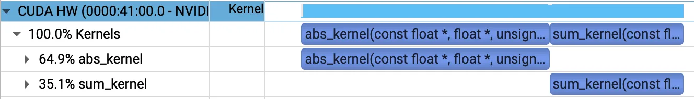
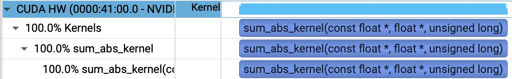

## Abstract

CUDA 연산을 여러 kernel로 나누면 kernel 사이에 값이 남는다. 다음 kernel이 그 값을 읽으려면 producer가 만든 intermediate를 global memory에 저장해야 한다. Kernel fusion이 먼저 줄이는 비용은 kernel 개수보다 이 materialization에서 생기는 memory traffic이다.

중간값을 없앤 뒤에는 누가 그 값을 보관할지가 문제다. 계산이 한 thread에서 끝나면 register 몇 개로 충분하다. 여러 thread가 값을 공유하면 shuffle과 shared memory, barrier가 필요하다. 범위가 여러 block으로 넓어지면 workspace나 atomic, 별도 reduction kernel이 다시 등장한다.

Fusion의 범위는 이 ownership 경계에서 정해진다. Materialization으로 사라질 byte를 먼저 계산한다. 중간값을 thread·warp·block·GEMM tile 가운데 어디에 둘지 정한 뒤에는 그 선택이 만든 resource 비용을 측정해야 한다. 가장 큰 kernel이 좋은 게 아니다. 없애려던 비용보다 새 비용이 작을 때까지만 합치면 된다.

---

## 1. Materialization 비용

### Kernel 경계의 Intermediate

연산 graph에서 값을 만드는 쪽을 producer, 그 값을 사용하는 쪽을 consumer라고 한다. 둘이 별도 kernel에서 실행되면 intermediate는 producer가 끝난 뒤에도 남아 있어야 한다. 이 값을 global memory의 tensor로 저장하는 과정이 materialization이다.



*`abs`가 output 크기의 intermediate를 쓰고 `sum`이 읽는 trace다. Kernel 실행 구간만 보이며 reduction 내부 단계는 나타나지 않는다. Source: [NVIDIA Technical Blog — Kernel Fusion, Figure 1](https://developer.nvidia.com/blog/kernel-fusion-in-nvidia-cuda-optimizing-memory-traffic-and-launch-overhead/)*



*Reduction 안에서 `abs`를 계산해 원소별 intermediate를 없앤 trace다. Source: [NVIDIA Technical Blog — Kernel Fusion, Figure 2](https://developer.nvidia.com/blog/kernel-fusion-in-nvidia-cuda-optimizing-memory-traffic-and-launch-overhead/)*

```text
unfused: producer → global-memory materialization → consumer
fused:   producer → register / shared memory → consumer
```

위처럼 producer와 consumer를 합쳐 intermediate를 없애는 방식이 vertical fusion이다. 서로 독립적인 작은 연산을 한 kernel에 묶는 horizontal fusion은 dispatch 비용이나 input read를 공유한다. Producer–consumer 사이의 intermediate를 없애는 방식은 아니다.

별도 consumer가 intermediate를 HBM이 아니라 L2에서 읽는 경우도 있다. 다만 cache residency는 capacity, eviction, traversal order에 따라 달라진다. Kernel 안에서 값을 register나 shared memory에 유지하는 것과 같은 조건으로 볼 수 없다. Logical traffic은 식으로 계산하고 physical traffic은 profiler에서 따로 확인해야 한다.

### Byte Budget

`x`, `scale`, `shift`가 각각 $N$개 원소를 가진 tensor이고 표현식마다 별도 kernel을 실행한다고 하자.

```python
u = x * scale
v = u + shift
out = relu(v)
```

원소 하나가 $b$바이트일 때 tensor 크기를 $S=Nb$로 둘 수 있다. Cache reuse를 제외하면 unfused path에는 tensor 크기의 read 또는 write가 여덟 번 발생한다.

$$
T_{\mathrm{unfused}} \approx 8S.
$$

하나의 kernel로 합치면 `u`와 `v`는 잠깐 쓰고 버리는 값이 된다.

```cpp
float value = x[i] * scale[i] + shift[i];
out[i] = fmaxf(value, 0.0f);
```

$$
T_{\mathrm{fused}} \approx 4S.
$$

세 번의 input read와 최종 store만 남는다. $8S\rightarrow4S$는 cache reuse를 제외한 값이다. `scale`이나 `shift`가 scalar, 짧은 broadcast vector, cache-resident data라면 실제 traffic은 이보다 작다. Stride나 write allocation이 개입하면 더 커지기도 한다.

이 계산은 speedup을 예측하지 않는다. 없앨 수 있는 logical traffic의 상한을 잡을 뿐이다. 계산한 byte가 작거나 profiler에서 이미 cache가 대부분 흡수하고 있다면 fusion으로 얻을 여지도 작다.

### Launch Overhead와 CUDA Graph

CPU submission과 launch overhead가 병목이라면 CUDA Graph가 더 직접적인 해법이다. Workflow를 실행 가능한 graph로 미리 준비해 launch 설정 비용을 줄이는 방식이다.

CUDA Graph를 써도 연산은 별도의 kernel node로 남고 그 사이의 materialized intermediate 역시 사라지지 않는다. Fusion은 data boundary를 줄이고 CUDA Graph는 작업 제출 비용을 줄인다. 병목이 둘 다라면 함께 적용할 수도 있다. 이 구분은 [CUDA 13.3 Programming Guide의 CUDA Graph 모델](https://docs.nvidia.com/cuda/archive/13.3.0/cuda-programming-guide/04-special-topics/cuda-graphs.html)을 따른다.

[VARCO3D 2.0 최적화](/blogs/posts/optimizing-sparse-3d-generation-inference-kor/)에서도 차이가 드러났다. `aten::gelu`를 standalone custom `gelu_tanh` kernel로 교체했지만 eager path보다 느렸다. GEMM output을 저장한 뒤 GELU가 다시 읽고 쓰는 경계가 그대로였기 때문이다.

Bias와 GELU를 cuBLASLt epilogue로 옮기자 이 왕복이 사라졌고 standalone call도 `_addmm_activation`으로 바뀌었다. Custom GELU는 consumer 구현만 바꿨지만 epilogue fusion은 GEMM과 GELU 사이의 materialization을 없앴다. 결과는 bitwise exact가 아닌 tolerance 기준으로 검증했다.

---

## 2. Intermediate Ownership

Kernel 경계를 없앤다고 값 자체가 사라지지는 않는다. Consumer가 사용을 마칠 때까지 누군가는 값을 보관해야 한다. 어느 실행 단위가 그 값을 끝까지 맡을 수 있는지에 따라 fusion의 난이도와 비용이 달라진다.

| Ownership 범위 | 대표적인 연산 | Intermediate가 머무는 곳 | 새로 필요한 비용 |
| --- | --- | --- | --- |
| Thread 하나 | Elementwise chain | Register | Live register와 instruction |
| Warp 또는 block | Row reduction, normalization | Register, shuffle, shared memory | Barrier와 on-chip reduction |
| GEMM tile | Prologue, epilogue | Accumulator, operand tile | Layout 변환과 mainloop resource pressure |
| 여러 block | 큰 reduction, 충돌하는 scatter | Partial workspace 또는 global output | Atomic, 추가 kernel, 정해지지 않은 누적 순서 |

### Thread-local Ownership

다음 elementwise 식에서는 thread 하나가 index $i$를 처음부터 끝까지 처리한다.

$$
out_i=\operatorname{clamp}(x_i s_i+t_i,\ell,u)
$$

`x_i s_i`, `+t_i`, `clamp` 사이의 값은 다른 thread가 볼 필요가 없다. Shape, stride, aliasing, side effect에 문제가 없다면 register에 둔 채 계산을 마친다. Graph compiler가 자동으로 fusion하기도 쉬운 경우다.

[PyTorch Inductor](https://docs.pytorch.org/docs/main/user_guide/torch_compiler/torch.compiler_get_started.html)는 NVIDIA GPU의 이런 graph에서 주로 Triton kernel을 생성한다. 경계를 정하는 쪽은 graph compiler이고 Triton은 kernel language와 compiler를 제공한다. [XLA](https://openxla.org/xla/architecture)와 [TensorRT](https://docs.nvidia.com/deeplearning/tensorrt/latest/performance/best-practices.html)도 compilation stage에서 비슷한 결정을 내린다.

Python 표현식이 한 줄이라는 사실만으로 kernel도 하나라고 단정할 수는 없다. 생성된 graph나 kernel trace를 확인해야 한다.

### Warp·Block Ownership

LayerNorm, RMSNorm, Softmax는 row의 여러 원소를 하나의 statistic으로 줄인다. 한 thread가 결과를 독점할 수 없으므로 warp shuffle이나 shared memory로 partial state를 합쳐야 한다. Row 전체가 한 warp나 block에 들어오면 reduction과 normalization을 같은 kernel에서 끝낼 수 있다.

평균과 분산을 계산하는 Welford state는 $(n,\mu,M_2)$로 쓴다. 비어 있지 않은 partial state $A$, $B$에 대해 $\delta=\mu_B-\mu_A$라 두면

$$
n=n_A+n_B,
\qquad
\mu=\mu_A+\delta\frac{n_B}{n},
$$

$$
M_2=M_{2,A}+M_{2,B}+\delta^2\frac{n_A n_B}{n}
$$

으로 합친다. Warp와 block이 작은 state만 주고받기 때문에 원소별 intermediate를 global memory에 저장하지 않아도 된다. 반면 한 block이 row 전체를 맡지 못하면 input을 다시 읽거나 partial-result workspace를 남겨야 한다. Atomic이나 별도 kernel이 필요한 경우도 있다. Combine rule은 [Chan, Golub, LeVeque의 parallel variance 분석](https://doi.org/10.1080/00031305.1983.10483115)을 따른다.

FlashAttention도 같은 ownership 문제에 속한다. Score tile을 online softmax와 $V$ multiplication에 바로 넘기고 row state만 이어 간다. 전체 score와 probability matrix를 저장하지 않는 대신 CTA가 감당하는 tile과 state가 ownership의 단위가 된다.

### GEMM Tile Ownership

Linear layer는 GEMM 뒤에 bias와 activation을 붙이는 일이 많다. 세 연산을 별도 kernel로 실행하면 output 크기의 tensor가 stage 사이에 남는다. Epilogue fusion은 GEMM 결과를 global memory에 저장하기 전에 bias와 activation을 적용한다.


*전통적인 CUTLASS GEMM hierarchy다. Thread별 accumulator fragment가 epilogue tile과 functor를 거쳐 global memory에 저장된다. 그림은 인용한 CUTLASS 모델의 register-accumulator path를 나타내며 Blackwell SM100 경로는 아래에서 구분한다. Source: [NVIDIA CUTLASS — Efficient GEMM in CUDA, Epilogue](https://docs.nvidia.com/cutlass/latest/media/docs/cpp/efficient_gemm.html#epilogue)*

다음 계산에서

$$
Z=\alpha AB+\beta C,
\qquad
D=\operatorname{GELU}(Z+b),
$$

$S$를 $M\times N$ output의 byte 크기라 하자. 두 path가 공통으로 읽는 A, B, optional C와 더 작은 broadcast bias는 계산에서 제외한다. GEMM, bias, activation을 따로 실행하면 output과 intermediate traffic은 대략

$$
T_{\mathrm{unfused}}\approx5S
$$

다. 같은 범위에서 fused epilogue는 최종 store만 남겨 $T_{\mathrm{fused}}\approx S$까지 줄일 수 있다. Training에서는 activation과 pre-activation을 함께 반환하기도 한다.

$$
D=\operatorname{GELU}(Z),
\qquad
\mathrm{Aux}=Z.
$$

Backward에 쓸 `Aux`가 남아도 GEMM과 activation 사이의 kernel 경계는 사라진다.

Accumulator가 놓이는 위치는 architecture마다 다르다. Hopper까지 널리 쓰인 CUTLASS path는 MMA 결과를 register fragment 형태로 epilogue에 넘기는 경우가 많다. Blackwell SM100의 TCGen05 path는 accumulator를 TMEM에 저장한다. Epilogue는 TMEM subtile을 register로 읽어 fusion을 적용한 뒤 shared memory와 TMA를 거쳐 저장한다. 어느 쪽이든 global output을 materialize하기 전에 변환한다는 원리는 같다. 자세한 흐름은 [CUTLASS SM100 epilogue 설명](https://docs.nvidia.com/cutlass/latest/media/docs/pythonDSL/cute_dsl_api/utils_sm100.html#background-sm100-epilogue-flow)에 나와 있다.

Prologue는 GEMM의 반대쪽 경계를 다룬다. Quantized weight에서

$$
W=\operatorname{dequant}(W_q;s,z)
$$

라면 dense temporary weight를 따로 만들지 않는다. Operand tile을 가져올 때 unpack, scaling, layout transform을 함께 처리한다. Temporary는 사라지지만 instruction과 register 사용량, operand 공급 압력은 늘어난다.

### Multi-block·Irregular Ownership

Ownership이 한 block을 넘어서면 fusion만으로 중간 상태를 가두기 어렵다. 큰 reduction은 block별 partial result를 저장해 다시 합쳐야 한다. 여러 block이 같은 주소를 갱신하는 scatter에는 atomic이나 별도의 병합 단계가 필요하다.

`batch_ids`로 parameter row를 고르는 token-wise affine transform을 보자.

```python
scale_token = scale[batch_ids]
shift_token = shift[batch_ids]
out = x * scale_token + shift_token
```

Eager mode에서는 affine operation 전에 `[T,C]` gather 결과 두 개가 생길 수 있다. Compiler, DSL kernel, fused custom operator는 token을 처리하면서 선택된 parameter 값을 바로 읽어 이 intermediate를 없앤다. 하지만 index가 들어오는 순간 read locality와 write ownership은 data에 따라 달라진다.

구현 전에는 channel 방향이 연속적인지, 가까운 token이 같은 key를 충분히 재사용하는지부터 살핀다. Sorting이나 binning 비용을 downstream stage와 나눌 여지가 있는지도 봐야 한다. Scatter에서는 같은 key를 warp나 block 안에서 먼저 합쳐 global atomic 수를 줄일 수 있는지가 중요하다.

```cpp
atomicAdd(output + index[i], value[i]);
```

Update가 hot destination에 몰리면 atomic이 serialize되고 accumulation order도 data에 따라 바뀐다. Warp aggregation, block-local partial, spatial binning은 global atomic을 줄이는 대신 추가 작업이나 새로운 materialization을 만든다. Irregular gather/scatter라고 곧바로 custom CUDA를 택할 이유는 없다. Graph compiler, Triton 같은 GPU DSL, library primitive, custom operator를 representation과 conflict 분포에 맞춰 비교해야 한다.

---

## 3. Ownership 확장의 비용

### Live state와 synchronization

Fusion은 intermediate를 없애는 대신 그 값의 live range를 늘린다. Thread 안에서는 register가 더 오래 살아 있다. Warp나 block으로 범위가 넓어지면 shuffle, shared memory, barrier가 붙는다. 여러 block이 참여하면 partial workspace와 atomic, 추가 kernel 가운데 적어도 하나가 다시 필요해진다.

Register pressure가 높아지면 occupancy가 떨어지거나 local-memory spill이 생긴다. Shared-memory 사용량이 늘면 resident block 수가 줄고 barrier는 producer보다 늦은 consumer를 기다리게 한다. Occupancy 자체가 목표는 아니지만 active warp가 너무 적으면 memory와 instruction latency를 숨기기 어렵다.

Asynchronous copy나 multi-stage pipeline은 data movement를 compute와 겹쳐 일부 latency를 숨긴다. 그만큼 buffer와 pipeline state도 필요하다. Pipelining은 늘어난 비용을 감출 수 있을 뿐 fusion의 이득을 보장하지는 않는다.

### Layout과 tuned mainloop

Producer와 consumer가 같은 layout과 tile shape를 선호한다는 보장은 없다. Transform 하나를 없애면서 contiguous access가 strided access로 바뀌면 traffic이 줄어도 kernel은 느려질 수 있다. Consumer-oriented packing이나 shared-memory transpose는 upstream conversion, tail, alignment를 포함한 전체 경로에서 측정해야 한다.

또 하나의 비용은 이미 튜닝된 library kernel을 포기하면서 생긴다.

```text
fast library GEMM + small separate kernel
versus
custom fused GEMM with a slower mainloop
```

cuBLASLt나 CUTLASS가 지원하는 epilogue라면 tuned mainloop를 유지하면서 경계를 없앨 수 있다. 더 넓은 custom fusion은 줄어든 traffic과 launch 비용이 mainloop 성능 하락, workspace, dispatch, backward recomputation보다 클 때만 이득이다.

### Numerical contract

Fusion은 intermediate의 rounding point를 없애기도 한다. Unfused BF16 GEMM은 FP32 accumulator를 BF16으로 저장할 때 반올림한다. Fused epilogue는 최종 store까지 더 높은 precision을 유지한다. FMA contraction이나 reduction tree가 달라져도 finite-precision 결과는 바뀐다.

$$
\operatorname{fl}(\operatorname{fl}(a+b)+c)
\not\equiv
\operatorname{fl}(a+\operatorname{fl}(b+c)).
$$

Benchmark 전에 필요한 numerical contract부터 정해야 한다.

| Contract | 요구 사항 |
| --- | --- |
| Mathematical equivalence | 실수 산술에서 같은 연산 |
| Tolerance-based equivalence | 명시한 absolute/relative error 범위 안의 결과 |
| Determinism | 명시한 조건에서 같은 구현을 반복 실행했을 때 같은 결과 |
| Byte-exact reference match | 지정한 reference path와 같은 bit |

이들은 서로 다른 요구사항이며 하나를 만족한다고 나머지가 자동으로 보장되지는 않는다. Deterministic한 결과가 reference와 다르기도 한다. 결과가 tolerance 안에 들어와도 낮은 bit는 실행마다 달라질 수 있다. 선택한 contract에 따라 intermediate rounding, Tensor Core mode, FMA, reduction reassociation, atomic order의 허용 범위가 달라진다.

---

## 4. Fusion 중단 기준

### 구현 계층

Fusion을 곧바로 CUDA로 짤 필요는 없다. 없애려는 경계를 표현하는 가장 높은 수준부터 검토한다.

| Control surface | 적합한 경우 |
| --- | --- |
| Framework/compiler fusion | Graph와 규칙적인 layout에 전체 경계가 드러나는 경우 |
| CUDA Graph | Materialization은 남겨도 되며 launch/submission overhead가 지배적인 경우 |
| CCCL algorithm: Thrust 또는 CUB | Transform, reduce, scan, sort, reduce-by-key가 유지보수되는 primitive와 맞는 경우 |
| cuBLASLt 또는 vendor fused operator | GEMM 뒤의 연산이 지원되는 epilogue와 layout에 맞는 경우 |
| CUTLASS / CuTe DSL / GPU kernel DSL | Tile dataflow나 prologue·epilogue를 더 세밀하게 제어해야 하는 경우 |
| Custom CUDA operator | Ownership, indexing, atomic, integration을 위 계층에서 제대로 표현하기 어려운 경우 |

CCCL에는 Thrust와 CUB가 들어 있다. Thrust는 높은 수준의 parallel algorithm을, CUB는 `DeviceReduce` 같은 device·block·warp primitive를 제공한다. 여러 primitive를 조합했다고 single-kernel fusion이 되는 것은 아니며 temporary storage와 실행 단계도 비용에 포함해야 한다. [CCCL/CUB `DeviceReduce` 문서](https://nvidia.github.io/cccl/unstable/cub/api/structcub_1_1DeviceReduce.html)가 그 범위를 설명한다.

### 검증 항목

Baseline과 candidate는 같은 end-to-end 구간, shape 분포, dtype, warm-up 조건에서 비교한다. 측정값은 fusion으로 줄이려던 비용과 연결해야 한다.

| 주장 | 확인할 항목 |
| --- | --- |
| 경계가 사라졌다 | Kernel trace와 launch 수, 대상 allocation의 부재, 예상한 logical intermediate write/read byte |
| Physical traffic이 줄었다 | Nsight Compute **Memory Workload Analysis**의 device-memory·L2 byte/throughput과 cache behavior |
| Resource 비용이 이득을 지우지 않았다 | **Launch Statistics**와 **Occupancy**의 thread당 register, static/dynamic shared memory, theoretical·achieved occupancy, local-memory traffic 또는 spill instruction |
| 본 계산이 느려지지 않았다 | 해당하는 경우 GEMM/mainloop throughput, 전체 kernel time, cast·reorder·workspace·allocation·dispatch를 포함한 end-to-end latency |
| Correctness가 유지됐다 | 선택한 numerical contract 아래의 대표 shape, tail-heavy shape, conflict가 집중된 입력 |

표의 section 이름은 [Nsight Compute Profiling Guide](https://docs.nvidia.com/nsight-compute/ProfilingGuide/index.html#sections-and-rules)를 따른다. Raw metric identifier는 architecture와 tool version에 따라 달라질 수 있어 section 단위로 적었다.

다음 중 하나라도 나타나면 candidate를 버리거나 fusion 범위를 좁힌다.

- 목표로 삼은 intermediate가 여전히 쓰이고 읽힌다.
- 중요한 shape의 end-to-end 개선이 run-to-run noise 안에 있거나 오히려 느려진다.
- Spill, shared-memory 사용량, occupancy 하락, 느려진 library mainloop가 byte 절감 효과를 삼킨다.
- Preprocessing, workspace, backward recomputation이 비용을 측정 구간 밖으로 옮겼을 뿐이다.
- 선택한 numerical contract를 위반한다.

Kernel 하나로 합칠 수 있다는 사실은 그 경계를 없애야 한다는 근거가 아니다. Ownership이 넓어지는 순간 추가되는 state와 synchronization을 포함해 end-to-end에서 이겨야 한다.

---

## Fusion의 기준

Kernel fusion은 intermediate의 저장 위치와 수명을 바꾸는 최적화다. 먼저 materialization의 byte를 센다. 그런 다음 consumer가 끝날 때까지 값을 소유할 실행 단위를 정한다. Thread-local chain은 register에서 끝나지만 reduction은 warp와 block의 협력이 필요하다. GEMM prologue와 epilogue는 tile 안에서 값을 소비하는 대신 빠른 mainloop를 지켜야 한다. 여러 block이 얽히면 workspace와 atomic이 다시 나타난다.

그다음에야 구현 계층을 고른다. Compiler나 library가 경계를 없앨 수 있다면 그쪽이 우선이다. Custom kernel은 더 높은 계층에서 ownership과 dataflow를 표현하지 못할 때 필요하다. 측정 결과 tuned library와 작은 별도 kernel이 더 빠르면 경계를 남기는 편이 맞다. Fusion은 kernel 수가 아니라 실제로 사라진 materialization과 그 대가로 판단한다.

---

## References

Architecture별 설명은 2026년 8월 현재의 CUDA 13.3 Programming Guide와 CUTLASS 4.6.1을 기준으로 확인했다. 다른 toolkit이나 GPU generation을 대상으로 할 때는 instruction path와 profiler 세부 사항을 다시 확인해야 한다.

1. NVIDIA, *Kernel Fusion in NVIDIA CUDA: Optimizing Memory Traffic and Launch Overhead*: [https://developer.nvidia.com/blog/kernel-fusion-in-nvidia-cuda-optimizing-memory-traffic-and-launch-overhead/](https://developer.nvidia.com/blog/kernel-fusion-in-nvidia-cuda-optimizing-memory-traffic-and-launch-overhead/)
2. NVIDIA, *CUDA 13.3 Programming Guide — CUDA Graphs*: [https://docs.nvidia.com/cuda/archive/13.3.0/cuda-programming-guide/04-special-topics/cuda-graphs.html](https://docs.nvidia.com/cuda/archive/13.3.0/cuda-programming-guide/04-special-topics/cuda-graphs.html)
3. NVIDIA, *CUTLASS — Efficient GEMM in CUDA*: [https://docs.nvidia.com/cutlass/latest/media/docs/cpp/efficient_gemm.html](https://docs.nvidia.com/cutlass/latest/media/docs/cpp/efficient_gemm.html)
4. NVIDIA, *CUTLASS — SM100 Epilogue Flow*: [https://docs.nvidia.com/cutlass/latest/media/docs/pythonDSL/cute_dsl_api/utils_sm100.html#background-sm100-epilogue-flow](https://docs.nvidia.com/cutlass/latest/media/docs/pythonDSL/cute_dsl_api/utils_sm100.html#background-sm100-epilogue-flow)
5. NVIDIA, *CCCL/CUB DeviceReduce*: [https://nvidia.github.io/cccl/unstable/cub/api/structcub_1_1DeviceReduce.html](https://nvidia.github.io/cccl/unstable/cub/api/structcub_1_1DeviceReduce.html)
6. NVIDIA, *Nsight Compute Profiling Guide*: [https://docs.nvidia.com/nsight-compute/ProfilingGuide/](https://docs.nvidia.com/nsight-compute/ProfilingGuide/)
7. PyTorch, *Torch Compiler — Getting Started*: [https://docs.pytorch.org/docs/main/user_guide/torch_compiler/torch.compiler_get_started.html](https://docs.pytorch.org/docs/main/user_guide/torch_compiler/torch.compiler_get_started.html)
8. OpenXLA, *XLA Architecture*: [https://openxla.org/xla/architecture](https://openxla.org/xla/architecture)
9. NVIDIA, *TensorRT Performance Best Practices*: [https://docs.nvidia.com/deeplearning/tensorrt/latest/performance/best-practices.html](https://docs.nvidia.com/deeplearning/tensorrt/latest/performance/best-practices.html)
10. T. F. Chan, G. H. Golub, R. J. LeVeque, *Algorithms for Computing the Sample Variance: Analysis and Recommendations*: [https://doi.org/10.1080/00031305.1983.10483115](https://doi.org/10.1080/00031305.1983.10483115)
