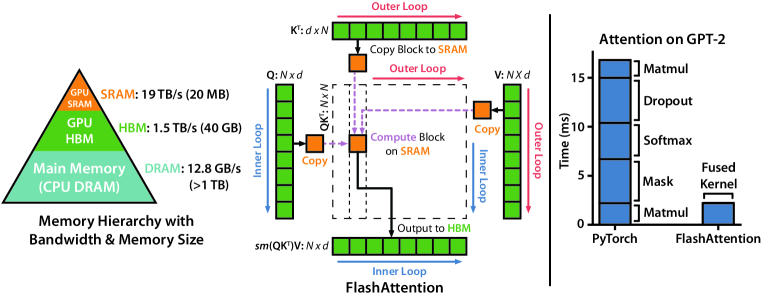
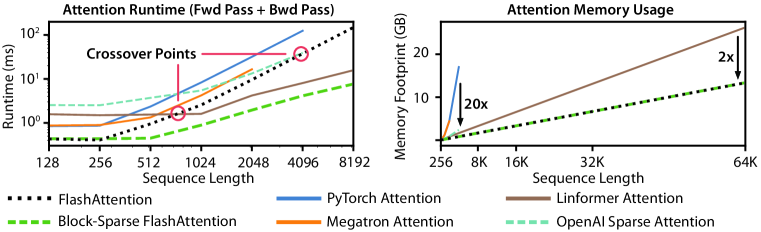

## Abstract

Scaled Dot-Product Attention, 줄여서 SDPA는 query와 key의 유사도를 구하고 softmax로 정규화한 뒤 그 가중치로 value를 합치는 연산이다. Transformer를 비롯한 현대 딥러닝 모델에서 가장 널리 쓰이는 연산 중 하나다.

수식만 보면 두 번의 행렬곱 사이에 softmax를 적용하는 단순한 구조처럼 보인다. 하지만 이를 세 단계로 나눠 실행하는 naive attention은 token 수의 제곱만큼 커지는 score와 probability 행렬을 HBM에 저장하고 다시 읽는다. 이 중간 결과에서 발생하는 memory traffic은 많은 workload에서 latency와 memory usage의 bottleneck이 된다.

FlashAttention은 SDPA 수식을 바꾸지 않는다. Attention을 tile로 나누고 online softmax로 행별 통계를 이어 가면서 score와 probability 행렬을 HBM에 만들지 않도록 같은 연산을 재구성한다.

이번 글에서는 이 방식이 attention forward와 backward의 memory traffic 및 latency를 어떻게 줄이는지 살펴본다. 이어 FA1에서 FA4까지 중간 상태의 소유 범위와 hardware pipeline이 어떻게 달라졌는지, PyTorch와 cuDNN의 SDPA backend에서 실제 kernel을 어떻게 확인해야 하는지도 다룬다.

---

## 1. Attention의 Memory Traffic



*GPU 메모리 계층과 FlashAttention의 타일형 데이터 흐름, 중간 행렬을 저장하는 baseline과의 실행 시간 비교. 하드웨어와 측정값은 2022년 FA1 논문의 실험 환경에 해당한다. 출처: [FlashAttention 논문 Figure 1](https://arxiv.org/abs/2205.14135).*

한 attention head의 입력을 다음과 같이 두자.

$$
Q \in \mathbb{R}^{N_q \times d},
\qquad
K \in \mathbb{R}^{N_k \times d},
\qquad
V \in \mathbb{R}^{N_k \times d_v}.
$$

Score, probability, output은

$$
S=\frac{QK^\top}{\sqrt d}+B+M,
\qquad
P_{ij}=\frac{\exp(S_{ij})}{\sum_{k=0}^{N_k-1}\exp(S_{ik})},
\qquad
O=PV
$$

이다. $B$는 선택적인 bias, $M$은 additive mask다. Self-attention에서는 $N_q=N_k=N$이다. 세 단계를 나누고 중간 행렬을 저장하는 baseline은 다음처럼 실행된다.

```text
QKᵀ → S를 HBM에 저장
S    → 행별 softmax → P를 HBM에 저장
P,V  → PV → O 저장
```

두 행렬곱의 연산량은 각각 $O(N_qN_kd)$와 $O(N_qN_kd_v)$이며 중간 행렬 하나는 $O(N_qN_k)$ 공간을 차지한다.

FlashAttention은 $S$와 $P$를 HBM에 저장하고 다시 읽는 왕복을 없애지만 dense attention의 이차 연산량은 그대로 남는다.

FA1 논문의 입출력 분석은 위의 일반 표기보다 좁은 조건을 사용한다. Head 하나인 self-attention에서 $Q,K,V\in\mathbb R^{N\times d}$이고 HBM과 SRAM만 있는 2단계 메모리 모형을 가정한다. SRAM에 담을 수 있는 원소 수 $M_{\mathrm{SRAM}}$은

$$
d \le M_{\mathrm{SRAM}} \le Nd
$$

를 만족한다고 가정한다. 이때 FA1의 HBM 원소 접근 횟수는

$$
\Theta\!\left(\frac{N^2d^2}{M_{\mathrm{SRAM}}}\right)
$$

이고 중간 행렬을 저장하는 baseline은 $\Theta(Nd+N^2)$이다. 두 값은 알고리즘 모형에서 계산한 원소 접근 횟수이며 실제 cache 동작과 HBM transaction은 아키텍처에 따라 달라진다. [FA1 논문은 이 가정과 lower bound가 적용되는 범위를 함께 명시한다](https://arxiv.org/abs/2205.14135).

이 baseline은 현재 framework의 기본 동작을 의미하지 않는다. 2026년 8월 기준으로 [PyTorch SDPA](https://docs.pytorch.org/docs/stable/generated/torch.nn.functional.scaled_dot_product_attention)는 입력 조건에 따라 backend를 선택하고 [cuDNN SDPA](https://docs.nvidia.com/deeplearning/cudnn/latest/operations/Attention.html)도 FA2 기반 구현을 자동 또는 명시적으로 선택할 수 있다. 같은 API를 호출해도 실제로 실행한 kernel은 다를 수 있다.

---

## 2. Tiled Online Softmax

Softmax의 probability는 행 전체의 reduction에 의존하므로 일반적인 elementwise 연산처럼 GEMM epilogue에 바로 붙일 수 없다. FlashAttention은 reduction 결과를 tile 사이에 이어지는 상태로 유지한다.

한 query 행에서 지금까지 처리한 key 집합을 $A$라 하자. 다음 세 값을 유지한다.

$$
m_A=\max_{j\in A}s_j,
$$

$$
\ell_A=\sum_{j\in A}\exp(s_j-m_A),
$$

$$
o_A=\sum_{j\in A}\exp(s_j-m_A)v_j.
$$

$m_A$는 누적 최댓값, $\ell_A$는 정규화 합, $o_A$는 value가 가중된 분자다. 마지막 key까지 처리하면

$$
O=\frac{o_A}{\ell_A}
$$

를 얻는다.

기존 key 집합을 $A$, 새 block을 $B$라 하자. 두 지역 상태를 합칠 기준은

$$
m=\max(m_A,m_B)
$$

이다. 다음 관계에 따라

$$
e^{s_j-m}=e^{s_j-m_A}e^{m_A-m},
$$

나머지 상태도 합칠 수 있다.

$$
\ell=e^{m_A-m}\ell_A+e^{m_B-m}\ell_B,
$$

$$
o=e^{m_A-m}o_A+e^{m_B-m}o_B.
$$

실제 kernel은 score block $s^{(b)}$에서 상태를 바로 갱신한다.

$$
m_b=\max_j s_j^{(b)},
\qquad
m_{\mathrm{new}}=\max(m_{\mathrm{old}},m_b),
$$

$$
\ell_{\mathrm{new}}
=e^{m_{\mathrm{old}}-m_{\mathrm{new}}}\ell_{\mathrm{old}}
+\sum_j e^{s_j^{(b)}-m_{\mathrm{new}}},
$$

$$
o_{\mathrm{new}}
=e^{m_{\mathrm{old}}-m_{\mathrm{new}}}o_{\mathrm{old}}
+\sum_j e^{s_j^{(b)}-m_{\mathrm{new}}}v_j.
$$

Score가 `[1, 2]`와 `[3, 4]`로 나뉘었다면 첫 block의 분모에 $e^{2-4}$를 곱한다.

$$
\ell=e^{-2}(e^{-1}+1)+(e^{-1}+1)=e^{-3}+e^{-2}+e^{-1}+1.
$$

이는 전체 행에서 4를 뺀 stable softmax의 분모와 같으며 병합식 자체는 실수 연산에서 정확하다.

식은 이 상태를 어떤 loop, CTA, warp가 소유할지 정하지 않으며 세대별 구현 차이는 상태의 소유 관계와 pipeline에서 나온다.

---

## 3. FA1에서 FA4까지

FA1의 Algorithm 1은 K/V block column $j$를 바깥쪽 loop에 둔다.

```text
for each K/V block j:
    load K_j, V_j once
    for each Q block i:
        load Q_i and partial O_i, m_i, l_i
        compute S_ij and update O_i, m_i, l_i
        store partial O_i, m_i, l_i
```

K/V block 하나를 여러 Q block에 재사용하는 대신 바깥쪽 loop를 돌 때마다 Q와 정규화된 partial output 상태를 HBM에서 다시 읽는다. 이 때문에 $S/P$를 저장하지 않아도 모든 입력을 한 번만 읽는 것은 아니다.

FA2는 두 loop의 순서를 바꿔 CTA 하나가 query row block을 소유하게 한다. Q, online softmax 상태, 아직 정규화하지 않은 output 분자는 on-chip에 유지한 채 K/V block을 순회한다.

```text
for each Q block i in one CTA:
    load Q_i
    m_i = -inf; l_i = 0; o_i = 0

    for each K/V block j:
        load K_j, V_j
        S_ij = Q_i K_j^T * scale + bias + mask
        update m_i, l_i, o_i

    O_i = o_i / l_i
    L_i = m_i + log(l_i)
    store O_i, L_i
```

FA1은 block마다 정규화된 partial output을 저장하지만 FA2는 아직 나누지 않은 $o_i$를 유지하고 마지막에 한 번만 나눠 행렬곱 밖의 연산을 줄인다.

K/V를 warp별로 나누고 partial output을 shared memory에서 합치는 방식도 바뀌었다. Q row와 output slice를 warp별로 나누며 layout이 맞으면 MMA fragment와 row 상태를 register에 두고 shared memory에는 Q/K/V tile과 layout 변환만 남긴다. Tile이 커지면 재사용과 자원 사용량이 함께 늘어난다.


| 버전  | 주된 병목                                                  | 소유권 또는 파이프라인의 대응                                                           | 수치적 범위                                    |
| --- | ------------------------------------------------------ | -------------------------------------------------------------------------- | ----------------------------------------- |
| FA1 | $S/P$를 HBM에 저장                                         | K/V 바깥쪽 loop, Q/O 행 상태를 반복 방문                                              | 실수 연산에서 dense attention과 정확히 동등           |
| FA2 | Occupancy, 행렬곱 외 연산, warp 사이 교환                        | Q 바깥쪽 loop, CTA가 행 block 소유, warp별 Q/output 분할                             | 같은 수학적 함수, 다른 부동소수점 순서                    |
| FA3 | 충분히 쓰이지 못한 Hopper 비동기 unit                             | TMA producer, WGMMA consumer, GEMM–softmax 중첩                              | FP16/BF16 경로와 별도의 FP8 경로                  |
| FA4 | Softmax와 shared memory보다 빠르게 확장된 Blackwell Tensor Core | TMEM으로 완전히 비동기인 MMA, 큰 tile, 두 종류의 지수 함수, 조건부 rescale, backward의 2-CTA MMA | 2026년 3월 v1 preprint, 다항식 `exp2`는 명시적인 근사 |


FA3는 TMA load를 발행하는 producer warpgroup과 WGMMA·softmax를 수행하는 consumer를 분리해 데이터 이동과 연산을 겹치고 $QK^\top$, softmax, $PV$를 엇갈려 실행한다.

FP8 forward에는 별도의 수치 처리가 들어간다. Q/K/V를 block별로 양자화하기 전에 Q와 K에 직교 변환을 적용해 $QK^\top$는 보존하면서 outlier를 분산한다. Block quantization과 incoherent processing은 FP8 오차를 줄이는 장치이며 FP16/BF16 pipeline과는 구분해야 한다. [FA3 논문도 세 기여를 구분해 설명한다](https://arxiv.org/abs/2407.08608).

FA4는 Blackwell을 대상으로 한 2026년 3월 arXiv v1 preprint이며 아직 여러 플랫폼에서 검증된 표준 구현은 아니다.

Accumulator를 TMEM에 저장하는 완전 비동기 MMA를 사용하고 output 보정을 critical path 밖으로 옮긴다. 대부분의 `exp2`는 하드웨어 `MUFU.EX2`로 계산하고 tile에 따라 일부만 FMA 다항식으로 근사하며 논문에서 사용한 근사 비율은 10–25%다.

조건부 rescale은 누적 최댓값이 threshold 이상 커질 때까지 output accumulator의 rescale을 미루면서 마지막 정규화에 필요한 전체 scale은 계속 추적한다. Backward에서는 CTA 두 개가 MMA를 함께 수행해 shared-memory traffic과 $dQ$의 atomic accumulation 횟수를 줄인다. [FA4 v1에서 알고리즘과 B200 실험 범위를 확인할 수 있다](https://arxiv.org/abs/2603.05451).

Mask와 bias도 데이터 흐름에 영향을 준다. Causal attention은 완전히 future인 tile을 건너뛰고 diagonal tile에만 predicate를 적용하며 식으로 계산할 수 있는 bias는 score tile 안에서 만든다. 임의의 dense $N_q\times N_k$ bias는 큰 입력 stream을 추가해 새로운 병목이 될 수 있다.

---

## 4. Backward Recomputation과 Determinism

Forward는 전체 $S/P$ 대신 $Q/K/V/O$와 행별 logsumexp 하나만 저장한다.

$$
L_i=m_i+\log\ell_i=\log\sum_k e^{S_{ik}}.
$$

Backward에서는 저장하지 않은 score tile을 다시 계산하고

$$
P_{ij}=\exp(S_{ij}-L_i)
$$

로 probability를 복원해 바로 사용하며 큰 activation을 저장하는 대신 Tensor Core 연산을 다시 수행한다.

Dropout이 없고 output gradient가 $dO$라면

$$
dV=P^\top dO,
\qquad
dP=dOV^\top
$$

이다. Softmax gradient에 필요한 행별 항은 이미 저장한 output에서 구할 수 있다.

$$
D_i=\sum_{a=0}^{d_v-1}dO_{ia}O_{ia}=\sum_jP_{ij}dP_{ij}.
$$

$$
dS_{ij}=P_{ij}(dP_{ij}-D_i),
$$

$$
dQ=\frac{dSK}{\sqrt d},
\qquad
dK=\frac{dS^\top Q}{\sqrt d}.
$$

다음은 FA2에서 사용하는 대표적인 **sequence-parallel 비결정적** mapping이며 다른 backward schedule도 가능하다.

```text
for each K/V block j in one CTA:
    load K_j, V_j
    initialize dK_j, dV_j

    for each Q block i:
        load Q_i, dO_i, L_i, D_i
        recompute S_ij and P_ij = exp(S_ij - L_i)
        dV_j += P_ij^T dO_i
        dP_ij = dO_i V_j^T
        dS_ij = P_ij * (dP_ij - D_i)
        dK_j += dS_ij^T Q_i / sqrt(d)
        atomicAdd(dQ_i, dS_ij K_j / sqrt(d))

    store dK_j, dV_j
```

CTA가 $dK_j$와 $dV_j$를 끝까지 소유하므로 두 값에는 CTA 사이 reduction이 필요 없다. 반면 여러 K/V-column CTA가 같은 $dQ_i$에 기여하며 atomic add의 순서가 정해져 있지 않아 dropout이 없어도 이 경로는 비결정적이다.

결정적 구현은 중간 기여분을 workspace에 저장하거나 고정된 순서로 합산하므로 그만큼 메모리와 연산을 더 사용한다. [공식 FlashAttention 구현](https://github.com/Dao-AILab/flash-attention)은 별도의 deterministic backward를 제공하며 더 느리고 메모리를 더 쓴다고 명시한다. cuDNN의 지원 범위는 architecture와 version에 따라 달라진다.

Dropout mask의 재현과 gradient accumulation의 결정성은 별개의 문제다.

$$
P^{\mathrm{drop}}_{ij}=\frac{Z_{ij}}{1-p}P_{ij}
$$

에서 softmax 정규화는 dropout 전에 끝나며 $V$에는 $P^{\mathrm{drop}}$을 곱한다. Backward는 forward에서 사용한 $Z_{ij}$를 다시 만들어야 한다.

Counter-based RNG는 **논리적인 attention 위치** $(\text{batch},\text{head},i,j)$를 같은 counter와 난숫값에 연결한다. 이 mapping과 저장한 RNG 상태가 같으면 forward와 backward의 tile 순회 순서는 달라도 되지만 dropout mask를 정확히 복원해도 gradient accumulation은 비결정적일 수 있다.

---

## 5. 실행 구간과 Backend 선택

FlashAttention이라는 이름만으로 실제 kernel을 알 수는 없다. Training, prefill, decode는 주된 병목이 서로 다르고 input layout과 mask도 backend 선택에 영향을 준다.


| 구간                            | 주된 부담                                                    | Kernel/backend 선택에 주는 의미                                                |
| ----------------------------- | -------------------------------------------------------- | ----------------------------------------------------------------------- |
| Training 또는 긴 prefill         | $S/P$ activation traffic, dense matmul, backward 상태      | Fused training SDPA와 재계산이 주된 이점을 제공하는 경우가 많다                            |
| 짧은 prefill 또는 작은 batch/head 수 | Launch와 준비 비용, tile tail, 부족한 병렬 작업                      | Framework/vendor heuristic과 대안을 실제 shape에서 비교해야 한다                      |
| Decode, $N_q\approx1$         | KV-cache bandwidth, paging, split-KV reduction, batching | Decode와 KV cache에 맞춘 kernel이 필요하며 training/prefill schedule만으로 해결되지 않는다 |
| GQA/MQA                       | KV head 재사용, 적은 KV head에 여러 Q head 연결, reduction shape   | Grouped-head를 직접 지원하는지 확인하고 재사용과 병렬성의 균형을 측정한다                          |
| Paged 또는 variable-length 입력   | Indirection, load balance, padding 낭비, 물리 layout         | Paged/ragged SDPA나 serving kernel을 쓰고 mask/layout 조합의 지원 여부를 확인한다       |




*2022년 FA1 논문에서 A100으로 측정한 forward–backward 실행 시간과 메모리 사용량. FA2–FA4 비교가 아니다. Linformer와 block-sparse 곡선은 서로 다른 approximate attention을 계산한다. 출처: [FlashAttention 논문 Figure 3](https://arxiv.org/abs/2205.14135).*

Backend 지원 범위는 빠르게 바뀌므로 본문은 2026년 8월의 PyTorch 2.13 문서, cuDNN 9.13.1, Dao-AILab repository를 기준으로 확인했다.

Dtype, head dimension, mask, stride, GQA, paging, determinism, GPU architecture에 따라 backend가 바뀌거나 fallback이 발생할 수 있으므로 선택된 backend와 kernel trace를 직접 확인해야 한다. PyTorch에서는 `torch.nn.attention.sdpa_kernel()`로 후보 backend를 제한할 수 있다.

---

## Closing

FlashAttention의 공통 기반은 tile마다 이어지는 $(m,\ell,o)$ 상태다. FA1은 이 상태로 $S/P$의 HBM 저장을 없앴고 FA2는 query CTA가 row 상태를 끝까지 소유하도록 바꿨다. FA3와 FA4는 Hopper와 Blackwell에 맞춰 producer, consumer, on-chip storage, 연산 pipeline을 다시 구성했다.

버전이 같다고 numerical contract와 성능 특성까지 같은 것은 아니다. FP8 quantization, 다항식 `exp2`, atomic add, dropout RNG mapping, decode의 KV-cache scheduling은 각각 따로 검증하고 backend도 API 이름이 아니라 실제로 실행된 kernel을 기준으로 확인해야 한다.

---

## 참고 문헌

1. Tri Dao et al., [*FlashAttention: Fast and Memory-Efficient Exact Attention with IO-Awareness*](https://arxiv.org/abs/2205.14135)
2. Tri Dao, [*FlashAttention-2: Faster Attention with Better Parallelism and Work Partitioning*](https://arxiv.org/abs/2307.08691)
3. Jay Shah et al., [*FlashAttention-3: Fast and Accurate Attention with Asynchrony and Low-precision*](https://arxiv.org/abs/2407.08608)
4. Ted Zadouri et al., [*FlashAttention-4: Algorithm and Kernel Pipelining Co-Design for Asymmetric Hardware Scaling* — arXiv v1, 2026년 3월](https://arxiv.org/abs/2603.05451)
5. Dao-AILab, [*FlashAttention reference implementation*](https://github.com/Dao-AILab/flash-attention)
6. PyTorch, [`scaled_dot_product_attention` 문서 — PyTorch 2.13](https://docs.pytorch.org/docs/stable/generated/torch.nn.functional.scaled_dot_product_attention)
7. NVIDIA, [*cuDNN Scaled Dot Product Attention* — cuDNN 9.13.1 기준 확인](https://docs.nvidia.com/deeplearning/cudnn/latest/operations/Attention.html)
