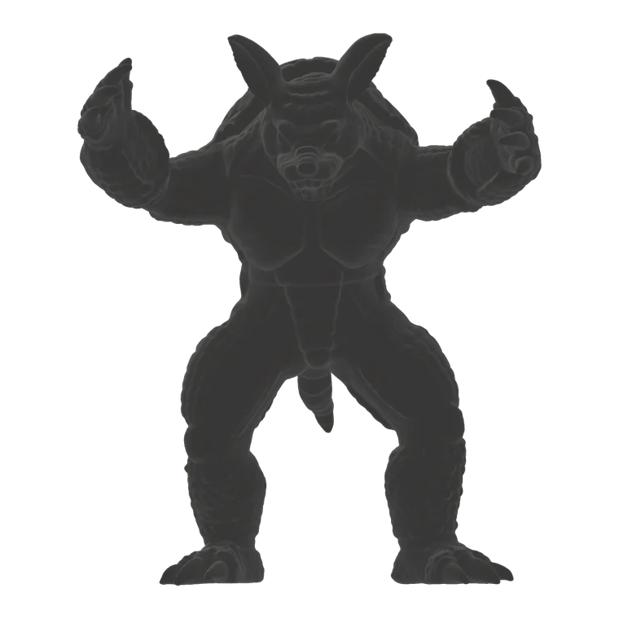
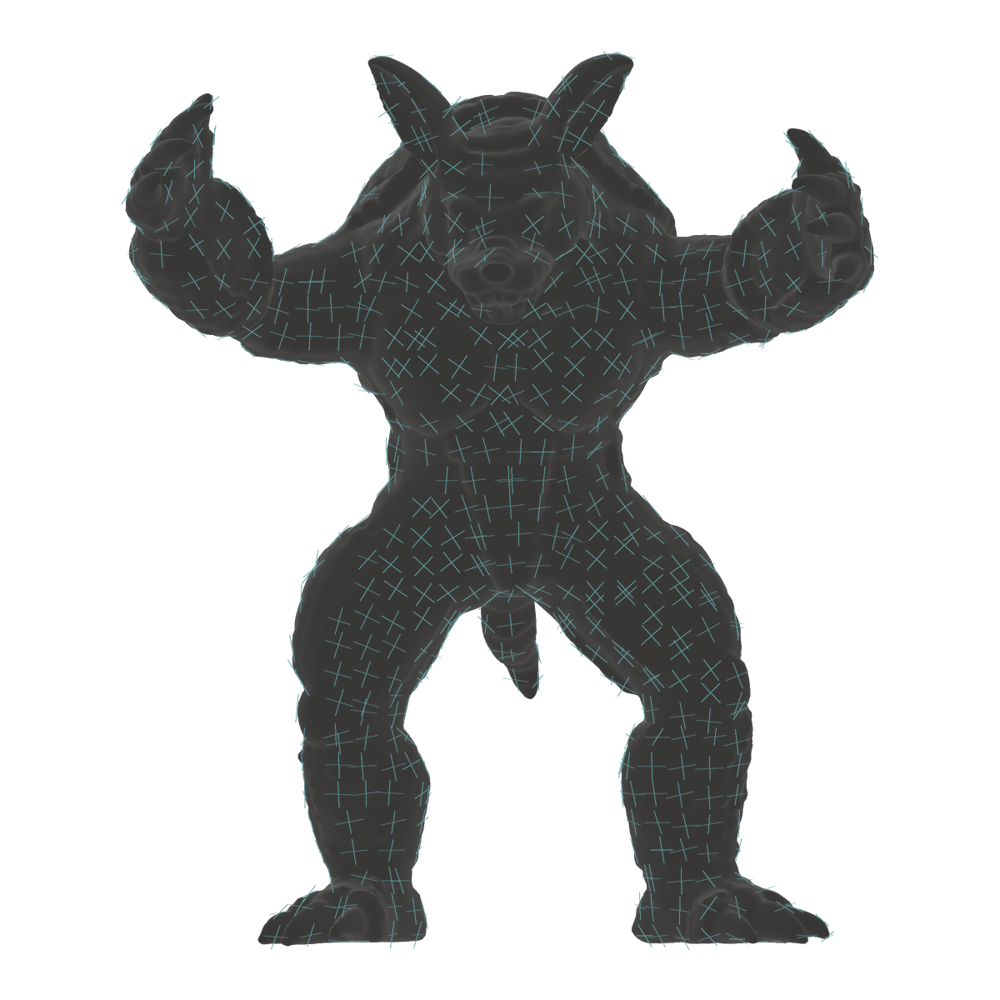
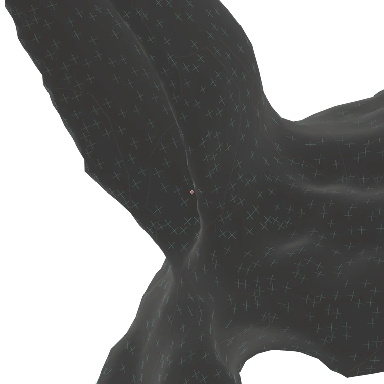
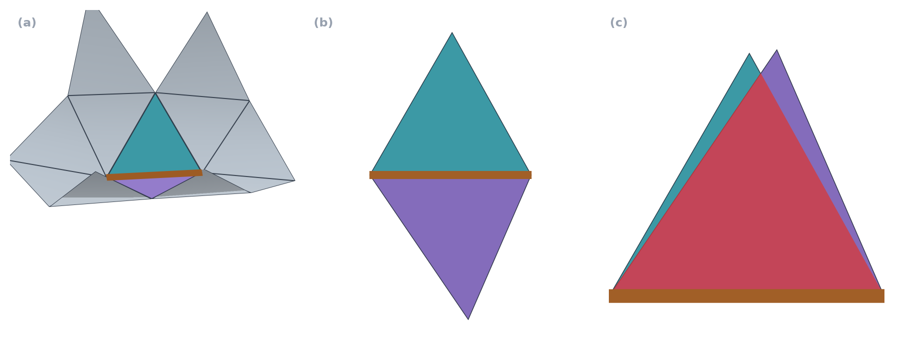
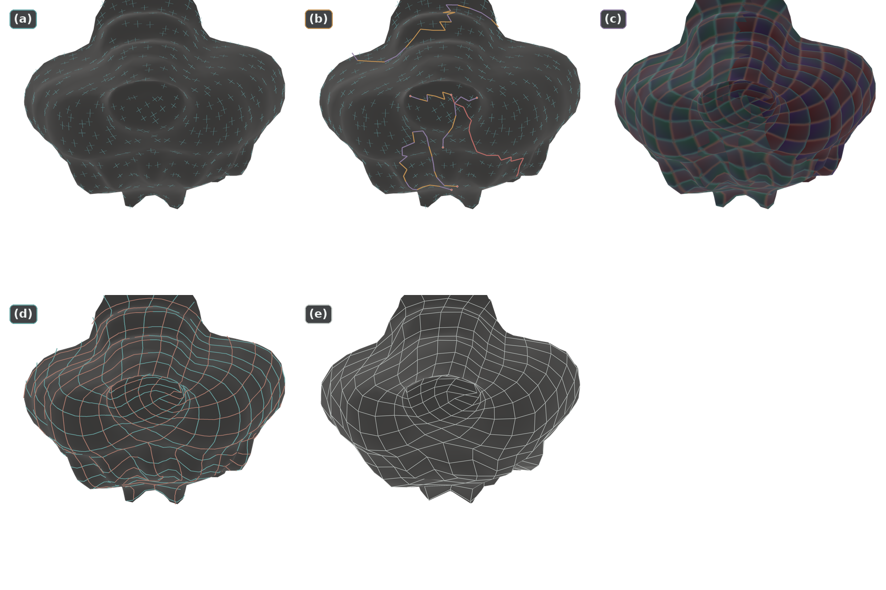
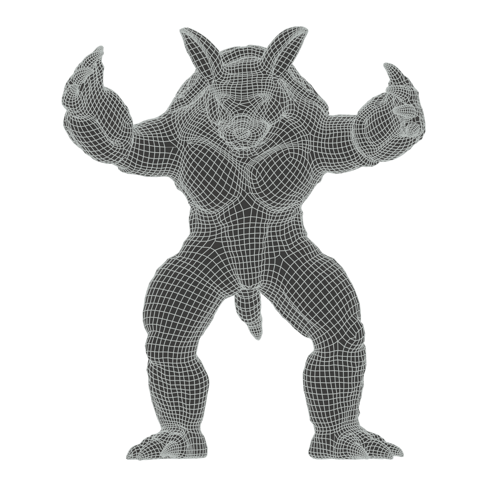

<link rel="stylesheet" href="/blogs/posts/260818_quad_remesh/assets/quad-remesh.css">

# Quad Remeshing: Cross Field & Integer-Grid Map

When you look at a well-designed quad mesh, something stands out before the individual quads: the edge loops around the eyes, the long strips across the cheeks, and the grid bending with the shape of a joint. Individual faces may be slightly distorted, yet neighboring faces carry the same flow forward. How can we recover this structure from a triangle mesh?

Pairing two adjacent triangles gives us a quad easily enough. Repeating this choice across the mesh, however, will not produce a loop around an eye on its own. Directions and spacing must agree across distant regions, and wherever the number of grid rows changes, the connectivity must accommodate that change.

This post explores quad remeshing by **computing a direction field on the surface and placing an integer grid in coordinates aligned with that field**. Remeshing algorithms do not all follow the same steps, but understanding this approach explains why cross fields, singularities, parameterization, and mixed-integer optimization appear together in one problem.

The Armadillo example was remeshed with the custom [CUDA-accelerated, CoMISo-like integer PDE solver](https://github.com/hwanhuh/CUDA-Lattice-Quadratice-Solver) used in Varco3D. The computations are illustrated with Manim videos on simple surfaces.

## 1. Triangle Pairing & Lattice

Let the input triangle mesh be $M=(V,E,F)$. We assume a manifold surface with consistently oriented faces, two faces incident on each interior edge, and one face incident on each boundary edge.

Pairing adjacent triangles based only on their local shape can improve the quality of individual quads to some extent. It does not guarantee that a direction chosen on one face will continue onto the next. Following opposite edges may lead to a zigzagging flow or a short closed loop, and some triangles may remain unpaired.

<figure class="post-media quad-remesh-video">
  <video controls loop muted playsinline preload="none" width="1280" height="720" poster="/blogs/posts/260818_quad_remesh/assets/manim/pairing-vs-lattice.webp" aria-label="Local pairing removes interior triangle edges; a globally aligned lattice organizes directions across the surface.">
    <source src="/blogs/posts/260818_quad_remesh/assets/manim/pairing-vs-lattice.mp4" type="video/mp4">
    <a href="/blogs/posts/260818_quad_remesh/assets/manim/pairing-vs-lattice.mp4">View MP4</a>
  </video>
  <figcaption>Local pairing removes interior triangle edges; a globally aligned lattice organizes directions across the surface.</figcaption>
</figure>

The triangle mesh provides the substrate for computing directions and coordinates: a *computational carrier*. The final quad vertices and edges are created on this substrate, so they need not follow the connectivity of the input triangles. To build new connectivity, we first need to decide how the grid should flow across the surface.

It helps to separate the properties of a surface grid into four components.

| Component | What it determines |
|---|---|
| Orientation | The directions of the two quad axes |
| Scale | Grid spacing and density |
| Phase | Where the grid lines actually lie |
| Topology | How strips and loops connect, and where the number of rows changes |

Consider two planar grids with identical orientation and spacing. Shifting one by half a cell places its vertices at different positions. Their orientation and scale agree, but their phase differs. Wrapping the grid around a curved surface also requires the number of cells around a loop to fit. Even if the first three components are locally well chosen, the final connection can still fail to line up.

A cross field specifies orientation, while a sizing field specifies spacing. The positions of the lines are determined by solving for coordinates, and integer constraints on seams and cycles make the global connectivity consistent. The preferred orientation and density depend on the application. A mesh intended for deformation may call for a different grid than one intended to preserve sharp features.

### Integer Lattice

Let us first express the desired result in coordinates. Given two planar coordinates $u,v$, we can draw the integer lines

$$
u=k,\qquad v=l,\qquad k,l\in\mathbb Z
$$

Their intersections become grid vertices, and each region $[k,k+1]\times[l,l+1]$ enclosed by adjacent integer lines becomes a cell.

We can do the same on a surface patch $C_i$ by assigning it a coordinate map

$$
\Phi_i=(u_i,v_i):C_i\rightarrow\mathbb R^2
$$

The integer grid drawn in the parameter plane is then pulled back onto the surface. With a suitable map, we obtain the following correspondence.

$$
\begin{aligned}
\text{integer lattice point}&\longleftrightarrow\text{quad vertex},\\
\text{integer grid segment}&\longleftrightarrow\text{quad edge},\\
\text{unit square}&\longleftrightarrow\text{quad face}.
\end{aligned}
$$

<figure class="post-media quad-remesh-video">
  <video controls loop muted playsinline preload="none" width="1280" height="720" poster="/blogs/posts/260818_quad_remesh/assets/manim/grid-extraction.webp" aria-label="Integer cells in UV are interpolated within the triangles and pulled back onto the original surface as quads.">
    <source src="/blogs/posts/260818_quad_remesh/assets/manim/grid-extraction.mp4" type="video/mp4">
    <a href="/blogs/posts/260818_quad_remesh/assets/manim/grid-extraction.mp4">View MP4</a>
  </video>
  <figcaption>Integer cells in UV are interpolated within the triangles and pulled back onto the original surface as quads.</figcaption>
</figure>

A single grid line may cross many input triangles. Nor does every input vertex need integer coordinates: new vertices and lines are created where the interpolated $u,v$ values within the triangles become integers. This is why the resolution of the input mesh and that of the output quads must be distinguished.

### Chart & Seam

A closed surface cannot be covered by a single planar coordinate system without overlap or singularities. In practice, we cut the surface into charts and store separate coordinate copies on either side of each cut, or seam.

<figure class="post-media quad-remesh-video">
  <video controls loop muted playsinline preload="none" width="1280" height="720" poster="/blogs/posts/260818_quad_remesh/assets/manim/cut-charts.webp" aria-label="Duplicating seam coordinates across two charts preserves their correspondence to the original surface points.">
    <source src="/blogs/posts/260818_quad_remesh/assets/manim/cut-charts.mp4" type="video/mp4">
    <a href="/blogs/posts/260818_quad_remesh/assets/manim/cut-charts.mp4">View MP4</a>
  </video>
  <figcaption>Duplicating seam coordinates across two charts preserves their correspondence to the original surface points.</figcaption>
</figure>

Flattening each chart well in isolation is not enough. Even when a surface point has two coordinate representations, grid lines must continue across the seam. A square grid is unchanged by a $90^\circ$ rotation or a translation by an integer number of cells, so these transformations can serve as the transition rules between charts. This is where the integer constraints of an integer-grid map come from, as we will see later.

Joining the grid across charts introduces another problem that cannot be resolved merely by choosing coordinate origins. On a surface such as a sphere, the connectivity of the grid itself must change somewhere.

## 2. Singularity & Topology

In a planar square grid, four edges and four faces meet at each interior vertex. The number of incident edges is called the valence, so a regular vertex has valence $4$. At a corner of a cube, only three faces meet, giving it valence $3$. Such a vertex is called an extraordinary vertex or an irregular vertex.

Even if each face of a cube is finely subdivided, only three grid directions still meet at each of its eight original corners. New vertices inside the faces and along the original edges have valence $4$, but the connectivity at the eight corners remains. Rounding the cube into a shape close to a sphere does not change this relationship.

### Valence & Index

If we view a regular vertex as four $90^\circ$ sectors, we can count vertices of other valences in the same way. For a vertex where $n_v$ sectors meet, define the index as

$$
I_v=\frac{4-n_v}{4}
$$

This counts the combinatorial sectors of the square grid, rather than actual angles in 3D. The corner angles of a curved quad need not be exactly $90^\circ$.

| Valence | Index | Difference from a regular vertex |
|---:|---:|---|
| $3$ | $+\frac14$ | One sector missing |
| $4$ | $0$ | Four sectors meet |
| $5$ | $-\frac14$ | One extra sector |

The difference also appears in the grid directions around the vertex. Choose one axis as $+u$ near a corner of a cube, then follow the same branch as you move onto neighboring faces. After passing through three sectors and returning to the starting face, a quarter-turn remains between the initial branch and an adjacent branch. Depending on the traversal direction and sign convention, this can be written as $+u\rightarrow+v$ or $+u\rightarrow-v$.

The cross formed by all four branches looks identical after a $90^\circ$ rotation. Which branch we called $+u$, however, has changed. A point around which the original direction labels cannot be restored after a full loop is associated with a cross-field singularity. On a curved surface, the rotation contributed by the surface itself must also be accounted for. We will examine the actual computation after introducing tangent frames.

### Euler Characteristic

The number of such vertices is also tied to the topology of the surface. In an all-quad mesh without boundary, each face has four edges and each edge is shared by two faces, so $4F=2E$. The sum of all vertex valences is $2E$, giving

$$
\begin{aligned}
\sum_v\left(4-\operatorname{val}(v)\right)
&=4V-2E\\
&=4V-4F\\
&=4(V-E+F)\\
&=4\chi(M).
\end{aligned}
$$

The sum of the indices therefore equals the Euler characteristic. Here, $V,E,F$ denote the numbers of vertices, edges, and faces, respectively.

$$
\boxed{\sum_v I_v=\chi(M)}
$$

The surface of a cube is homeomorphic to a sphere, with $\chi(S^2)=2$. If every singularity has valence-$3$, exactly eight are required because $8\times\frac14=2$. The eight corners of a cube provide an example. Other spherical meshes may also contain valence-$5$ or higher-valence vertices, but the sum of the indices must still be $2$.

A torus, by contrast, has $\chi(T^2)=0$, so a quad grid with only regular vertices is possible. Positive and negative indices may also coexist as long as their sum is $0$. On a surface with boundary, contributions from the boundary and its corners must be included; the interior-vertex formula alone is insufficient.

Good remeshing cannot simply mean eliminating every irregular vertex. It must satisfy the index required by the surface while placing the necessary singularities where they suit the shape and grid flow. Let us now express this structure as a direction field on the input triangles.

## 3. Cross Field

<figure class="post-media quad-remesh-video">
  <video controls loop muted playsinline preload="none" width="1280" height="720" poster="/blogs/posts/260818_quad_remesh/assets/manim/carrier-patch.webp" aria-label="Crosses on three neighboring faces, with the highlighted face shown in an orthonormal basis. A·B·C correspond in both views.">
    <source src="/blogs/posts/260818_quad_remesh/assets/manim/carrier-patch.mp4" type="video/mp4">
    <a href="/blogs/posts/260818_quad_remesh/assets/manim/carrier-patch.mp4">View MP4</a>
  </video>
  <figcaption>Crosses on three neighboring faces, with the highlighted face shown in an orthonormal basis. A·B·C correspond in both views.</figcaption>
</figure>

For quad edges to follow the surface, their directions must lie in the tangent plane at each point. Given the unit normal $\mathbf n_p$ at a point $p$, the tangent plane is

$$
T_pM=\left\{\mathbf v\in\mathbb R^3\;\middle|\;\mathbf v\cdot\mathbf n_p=0\right\}
$$

Each face of a triangle mesh is planar, so we can assign an orthonormal basis $B_f=(\mathbf b_{f,1},\mathbf b_{f,2})$ to each face $f$ and express a direction with a single angle.

$$
\mathbf d_f(\theta_f)
=\cos\theta_f\,\mathbf b_{f,1}+\sin\theta_f\,\mathbf b_{f,2}
$$

### Parallel Transport

The difficulty is that neighboring faces use different tangent planes and bases. Having $\theta=0$ on both faces does not mean the directions agree in 3D. Conversely, directions that continue naturally along the surface can have different recorded angles when their bases differ.

Imagine two sheets of paper joined along an edge. Rotate one triangle about the shared edge to unfold both triangles into the same plane. Rotate its drawn arrow along with it, then read the arrow in the neighboring face's basis. This operation is discrete parallel transport.

<figure class="post-media quad-remesh-video">
  <video controls loop muted playsinline preload="none" width="1280" height="720" poster="/blogs/posts/260818_quad_remesh/assets/manim/parallel-transport.webp" aria-label="The face and its arrow are unfolded together about the shared edge before comparing directions.">
    <source src="/blogs/posts/260818_quad_remesh/assets/manim/parallel-transport.mp4" type="video/mp4">
    <a href="/blogs/posts/260818_quad_remesh/assets/manim/parallel-transport.mp4">View MP4</a>
  </video>
  <figcaption>The face and its arrow are unfolded together about the shared edge before comparing directions.</figcaption>
</figure>

Let $\alpha_{fg}$ be the angle added when transporting a direction from face $f$ to face $g$. Then

$$
\mathcal T_{f\rightarrow g}(\theta_f)=\theta_f+\alpha_{fg}
$$

We apply this correction before comparing neighboring directions, propagating a branch, or tracing a curve.

### 4-RoSy Representation

The edges of a square grid have no forward or backward orientation, and swapping the names of the two axes leaves the grid direction unchanged. Thus, in addition to $\mathbf d\sim-\mathbf d$, we have $\theta\sim\theta+\frac\pi2$. The direction represented on a face is a set of four branches:

$$
\mathcal C_f=\left\{\theta_f,\theta_f+\frac\pi2,\theta_f+\pi,\theta_f+\frac{3\pi}2\right\}
$$

Assigning this set across the surface gives a cross field, also called a 4-RoSy field. If we arbitrarily select one of the four branches on each face and compare their angles, even identical crosses can appear to differ by $90^\circ$. Multiplying the angle by four and storing it as a point on the unit circle removes this redundancy.

$$
\mathbf q_f=\begin{pmatrix}\cos4\theta_f\\\sin4\theta_f\end{pmatrix},
\qquad z_f=e^{i4\theta_f}
$$

Since $e^{i4(\theta_f+\pi/2)}=e^{i4\theta_f}$, all four branches map to the same value. In this representation, parallel transport becomes the 2D rotation $\mathcal R(4\alpha_{fg})$.

### Field Optimization

We now want neighboring crosses to agree after transport, while aligning with prescribed directions at sharp edges or boundaries. A conceptual energy for these requirements is

$$
\begin{aligned}
E_{\mathrm{cross}}
=&\sum_{(f,g)}w_{fg}
\left\|\mathbf q_g-\mathcal R(4\alpha_{fg})\mathbf q_f\right\|^2\\
&+\sum_f\lambda_f\left\|\mathbf q_f-\mathbf q_f^\star\right\|^2
\end{aligned}
$$

In the first term, $w_{fg}$ controls how strongly smoothness is enforced between neighboring faces. In the second, $\mathbf q_f^\star$ is a preferred direction derived from the geometry, and $\lambda_f$ reflects its reliability and importance.

For example, one axis of the cross can be aligned with the tangent of a sharp edge. Principal curvature directions are also useful, but they become unstable in nearly flat regions or where the two principal curvatures are similar. Strongly constraining these regions can make the field follow noise, so the guide weights are reduced there.

The angle is recovered from the computed $\mathbf q_f$ using

$$
\theta_f=\frac14\operatorname{atan2}(q_{f,y},q_{f,x})
$$

This angle is still defined modulo $\frac\pi2$. The quadratic energy above also does not guarantee unit length. In particular, minimizing the smoothness term without any guides admits the solution in which every $\mathbf q_f$ is zero, so normalization, anchors, or other additional measures are needed.

We can now see which way the grid should point on the surface. Each cross, however, still lacks coordinate-axis labels. We have not yet chosen which branch to call $+u$ or checked whether that choice can be propagated consistently across neighboring faces. The singularity seen earlier at the cube corner reappears at this stage. Singularities of a field solved in the complex representation are encoded in its winding; directly controlling their positions or indices requires additional constraints or postprocessing.

## 4. Winding & Branch Lifting

A cross on a single face tells us little about nearby singularities. We need to follow neighboring faces around a loop. Just as we traced a grid axis around the cube, we choose one branch of the computed field and keep following it.

### Winding & Singularity Index

Trace a branch through the three ideal quad sectors around a valence-$3$ vertex. On returning to the starting point, the cross looks the same, but the selected branch has rotated by a quarter-turn.

<figure class="post-media quad-remesh-video">
  <video controls loop muted playsinline preload="none" width="1280" height="720" poster="/blogs/posts/260818_quad_remesh/assets/manim/branch-holonomy.webp" aria-label="Following the three sectors around a valence-3 vertex changes the selected branch by 90°.">
    <source src="/blogs/posts/260818_quad_remesh/assets/manim/branch-holonomy.mp4" type="video/mp4">
    <a href="/blogs/posts/260818_quad_remesh/assets/manim/branch-holonomy.mp4">View MP4</a>
  </video>
  <figcaption>Following the three sectors around a valence-3 vertex changes the selected branch by 90°.</figcaption>
</figure>

We can express this through phase winding. Choose a continuous reference frame on a small disk enclosing a singularity and follow the phase of $z=e^{i4\theta}$. If the continuously unwrapped phase changes by $2\pi m_\gamma$ over one traversal of a loop $\gamma$, then

$$
m_\gamma=\frac{1}{2\pi}\Delta_\gamma\arg z,
\qquad
\boxed{I_\gamma=\frac{m_\gamma}{4}}
$$

Because the stored angle was multiplied by four, the cross index is $\frac14$ of the winding. For the sector defect of a valence-$3$ vertex, $m_\gamma=1$ and $I_\gamma=+\frac14$.

On an actual triangle mesh, each face has an independent frame, so simply adding raw angles does not recover this value. Parallel transport between neighboring faces and the geometric holonomy around the loop must both be included. In particular, omitting the angle defect at a polyhedral vertex conflates surface curvature with a field singularity.

Mathematical Notes · Holonomy, Index, Monodromy

**Holonomy of parallel transport itself.** Holonomy is the rotation that remains after a tangent vector is parallel transported around a closed path $\gamma$ and compared in the starting tangent plane. If a small positively oriented path encloses a disk $D$, then, with a fixed orientation convention, the rotation of the Levi-Civita connection is

$$
h_\gamma\equiv\int_D K\,dA\pmod{2\pi}
$$

In a polyhedral metric, where curvature is concentrated at interior vertices $v$ of the triangle mesh, the corresponding quantity is the angle defect

$$
\Omega_v=2\pi-\sum_{f\ni v}\beta_{f,v}
$$

Here, $\beta_{f,v}$ is the actual corner angle of an input triangle. This rotation belongs to **the surface connection**, so it is defined even before a particular cross field is chosen. [Crane et al.'s account of discrete connections](https://www.geometry.caltech.edu/pubs/CDS10.pdf) illustrates this distinction through triangle unfolding.

**The field index also includes relative rotation.** With $\alpha_{fg}$ denoting the transport angle from $f\to g$ defined earlier, let the small difference between the transported cross and the neighboring cross be

$$
\delta_{fg}=\operatorname{wrap}_{(-\pi/4,\,\pi/4]}
\left(\theta_g-\theta_f-\alpha_{fg}\right)
$$

The wrap operation selects a representative by adding or subtracting multiples of $\pi/2$. For a positively oriented vertex fan and consistent sign conventions, the index is

$$
\boxed{I_v=\frac1{2\pi}\left(\Omega_v+\sum_{(f,g)\in\partial v}\delta_{fg}\right)}
$$

The rotation of the field between faces and the geometric rotation must be **combined** to obtain a value in $\frac14\mathbb Z$. Counting only $\sum\delta_{fg}$, or calling $\Omega_v$ alone the cross index, confuses distinct quantities. This formula applies to the chosen discrete matching. If a difference falls at $\pm\pi/4$ or the rotation between samples is too large, matching ambiguities must also be handled. [The singularity-index formulation in MIQ](https://graphics.rwth-aachen.de/media/papers/bommes_zimmer_2009_siggraph_011.pdf) likewise uses both angle defects and frame transitions.

At a regular point of a smooth surface, the curvature integral around a small loop may be nonzero while the field index remains $0$. Conversely, a cross field on a flat disk can have a nonzero index if it is undefined at the center. Curvature and singularities are therefore related, but they carry different information.

**Branch monodromy captures the discrete part of this information.** If lifting and tracing a branch around a loop changes its branch number by $q_\gamma\in\mathbb Z_4$, the rotational component of the grid is $R^{q_\gamma}$. The sign relating $q_\gamma$ to $4I_\gamma$ can change with the direction in which axis transitions are recorded. Either way, modulo $4$ information cannot distinguish indices that differ by an integer. The affine monodromy of a coordinate chart includes a translation as well as this rotation.

The video in the main text shows branch rotation through ideal quad sectors. It does not imply that the actual angle defect of the curved carrier is exactly $\pi/2$. A cut can prevent this loop from closing within a chart, allowing the remaining branch transition to be recorded in the seam equations.

### Branch Lifting & Cut

To solve for coordinates, we must choose one branch as $+u$ and its adjacent branch as $+v$. On a seed face without a singularity, set

$$
\mathbf e_u=\mathbf d(\theta),
\qquad
\mathbf e_v=\mathbf d\left(\theta+\frac\pi2\right)
$$

When moving to a neighboring face, parallel transport $\mathbf e_u$ and choose the closest of that face's four cross branches as the new $\mathbf e_u$. Propagating this choice along the dual graph of face adjacencies is branch lifting.

We can, however, reach the same face by different paths. If a $+\frac14$ singularity lies between them, one path may require the rightward branch to be $+u$, while the other requires the upward branch. Both requirements cannot hold within the same region.

A cut moves this conflict to the boundary of the coordinate system. We cut so that the two paths do not meet again within one chart, treating vertices and edges on opposite sides of the seam as separate copies in the coordinate solve. Branch labels are chosen consistently within each chart, and the axis change across each seam is recorded separately. The singularity remains, but the inconsistency in defining coordinates becomes a transition between charts.

Changes in branch labels between adjacent faces can be recorded as rotations in $C_4$. The group $C_4$ consists of $0,1,2,3$ quarter-turns. The next figure denotes these rotations by $R_{ff}$.

*Thick lines mark connected branch transitions, and red points mark singularities. The order in which the lines appear is intended to show their connectivity.*

The positions of these lines depend on how the representative branch is chosen on each face. What matters is the mismatch that remains after accumulating transitions around a loop. Cutting all these lines does not, by itself, guarantee valid charts. Even a transition with rotation $0$ may need to be cut to open a handle or cycle, and additional cuts may reduce distortion.

Implementation Notes · Cut Graph &amp; Seam

A cut **duplicates the connectivity used to store coordinates**; it does not open a gap in the 3D surface. An input vertex $p$ is split into chart copies $p^+,p^-$, with their coordinates related by $\Phi_-(p^-)=R^r\Phi_+(p^+)+\mathbf t$. Even if the pieces are drawn apart on screen, they retain the identity of the original surface point. For piecewise-linear coordinates, applying the same affine transition at both endpoints of a seam edge ensures, by linear interpolation, that the relation also holds along its interior.

Resolving branch-label conflicts and making the parameter domain a disk are distinct tasks. Moving singularities to the boundary can still leave handles or non-contractible cycles. Conversely, drawing a plausible network of lines does not establish that its complement consists of valid charts. Face adjacencies must actually be cut, and boundary loops and connected components must be checked.

A spanning tree of the triangle dual graph provides one way to understand the implementation. Start with all faces separated and attach them one at a time along tree edges. In a construction using separate triangle copies, without additional vertex identifications, the result is a disk. This can introduce many cuts, however, so practical algorithms restore some connections or add cuts while accounting for branch constraints, chart size, boundaries, and distortion. The edges with $R_{ff}\ne0$ alone therefore do not necessarily form a sufficient cut graph. An orientation chart with consistent branch choices, a parameterization chart used to solve coordinates, and a coarse quad patch bounded by separatrices may all differ.

Crossing seam transformations $G_1=(R_1,\mathbf t_1)$ and $G_2=(R_2,\mathbf t_2)$ in sequence gives the composition

$$
G_2\circ G_1=(R_2R_1,\ R_2\mathbf t_1+\mathbf t_2)
$$

Translations can simply be added only in the special case without rotation. The reverse seam is also not chosen independently; it is set to

$$
G^{-1}=(R^{-1},-R^{-1}\mathbf t)
$$

Accumulating loop holonomy with these rules lets us check the reciprocal and cycle conditions together with the phase of the integer grid.

Changing the reference branch or coordinate origin within a chart changes the representation of individual seams. The transformation around a full loop, however, changes only by conjugation with the reference-chart transformation, preserving connectivity properties such as whether it is the identity. The cut location is a choice of representation, but the monodromy that must be recorded across it cannot be omitted.

Mathematical Notes · Theorema Egregium

Gauss's **Theorema Egregium** states that Gaussian curvature $K$ is determined by the first fundamental form: the intrinsic metric of the surface. A local isometry $\Phi$ satisfies

$$
\langle d\Phi_p(\mathbf a),d\Phi_p(\mathbf b)\rangle
=\langle\mathbf a,\mathbf b\rangle
$$

for every pair of tangent vectors, so it also preserves curvature. The plane has curvature $0$. Mapping an open region with $K(p)\ne0$ to the plane must therefore introduce metric distortion. This is a local statement about smooth surfaces. Reading [the theorem alongside the definition of isometry](https://www.silviofanzon.com/2024-Differential-Geometry-Notes/sections/chap_4.html#conclusion-fts-and-theorema-egregium) makes the assumptions explicit.

Every face of a triangle mesh is flat and can individually be unfolded without changing lengths. The difficulty arises when the triangles are joined again. If the angles around an interior vertex do not sum to $2\pi$, its fan cannot close in the plane without overlap or a gap. Cutting through the vertex can open the fan, but it does not remove the angle defect encountered when the two seams are glued back together. Cutting a region with distributed smooth curvature likewise leaves the interior $K$ away from the cut unchanged.

<figure class="post-media quad-remesh-video">
  <video controls loop muted playsinline preload="none" width="1280" height="720" poster="/blogs/posts/260818_quad_remesh/assets/manim/gauss-and-cuts.webp" aria-label="A sphere unfolds with distortion, while a cylinder unfolds isometrically. Adding a cut does not change curvature.">
    <source src="/blogs/posts/260818_quad_remesh/assets/manim/gauss-and-cuts.mp4" type="video/mp4">
    <a href="/blogs/posts/260818_quad_remesh/assets/manim/gauss-and-cuts.mp4">View MP4</a>
  </video>
  <figcaption>A sphere unfolds with distortion, while a cylinder unfolds isometrically. Adding a cut does not change curvature.</figcaption>
</figure>

The spherical triangle in the video has three geodesic sides and three interior angles of $\pi/2$. Gauss–Bonnet also gives

$$
\alpha+\beta+\gamma-\pi=\int_D K\,dA
$$

so the angle sum on the sphere exceeds $\pi$. An isometry must preserve both geodesics and angles, which a straight-sided planar triangle cannot satisfy here. This comparison goes beyond an animation that merely flattens a 3D silhouette.

The lateral surface of a cylinder provides the opposite example. Up to a translation of the origin, consider the deformation

$$
X_k(s,z)=\left(\frac{\sin ks}{k},\frac{1-\cos ks}{k},z\right),
\qquad X_0(s,z)=(s,0,z)
$$

At $k=1/r$ it is a cylinder, and as $k\to0$ it becomes a planar strip. At every stage, $\|\partial_sX_k\|=\|\partial_zX_k\|=1$ and $\partial_sX_k\cdot\partial_zX_k=0$, so the metric remains $ds^2+dz^2$. The video moves the same material points using this formula. A single seam is still needed because the circumferential coordinate is periodic.

Thus, **whether a surface can be flattened without distortion** is a question about its metric, while **whether a single coordinate system and branch can be defined globally** is a question about topology and monodromy. A cut moves the second problem to chart boundaries. Smaller charts can help reduce distortion, but they cannot create an isometry forbidden by Theorema Egregium.

### Streamline & Coordinate Grid

Within a chart with assigned branches, we can also trace curves along the direction field. A streamline satisfies

$$
\gamma'(s)=\mathbf e_u(\gamma(s))
$$

Each time it crosses a triangle boundary, the direction is transported and the next branch is selected. Connecting separatrices—special streamlines incident on singularities—can produce a layout that divides the surface into large quad patches.

Tracing several streamlines from arbitrary starting points does not ensure that equal numbers of grid cells fit between them or that the lines match at opposite boundaries. Following directions and determining the spacing and positions of an entire grid are separate requirements. Some methods first construct an explicit layout; here, we solve for chart coordinates $u,v$ and extract their integer lines. The next quantity to choose is the grid spacing.

## 5. Coordinate Solve

After branch lifting, each face has two directions $\mathbf e_{u,f},\mathbf e_{v,f}$. Assigning the desired spacing specifies the directions and rates at which $u,v$ should increase. Whether the requirements on all faces can be realized by a single coordinate function must still be solved separately.

### 1D Parameterization

On a segment of length $\ell_i$, suppose the coordinate should increase by $1$ for every physical distance $h_i$. The endpoint values should then satisfy

$$
\frac{u_{i+1}-u_i}{\ell_i}\approx\frac1{h_i},
\qquad
u_{i+1}-u_i\approx\frac{\ell_i}{h_i}
$$

For an open line with no additional endpoint constraints, we can fix the value at one point and accumulate these differences in order.

Conflicts appear when endpoint values or closed paths impose additional conditions. If the desired increments sum to $10.4$ but the full path must span exactly $10$ cells, not every segment's requirement can be met exactly. We must decide how much to adjust each segment. Least squares is one way to distribute the discrepancy over the full path.

On a surface, these requirements are coupled across many triangles and loops at once. Accumulating coordinates along different paths must give the same value on arrival, a stronger condition than choosing a good direction independently on each face.

### Sizing Field

Let $h_{u,f},h_{v,f}$ be the target spacings along the two directions on face $f$. To make each coordinate increase by roughly $1$ over its corresponding spacing, define the target gradients as

$$
\mathbf g_{u,f}=\frac1{h_{u,f}}\mathbf e_{u,f},
\qquad
\mathbf g_{v,f}=\frac1{h_{v,f}}\mathbf e_{v,f}
$$

A smaller $h$ gives a larger gradient and a denser grid. Equal spacings give isotropic sizing; different spacings give anisotropic sizing, with different densities along the two axes.

Larger spacing can be assigned to flat regions and smaller spacing to regions of high curvature or fine detail. Externally prescribed densities, for example from a user brush or a simulation's resolution requirements, can also be incorporated. Abrupt changes in spacing between neighboring faces tend to create long, thin cells, so the sizing field is smoothed and its rate of change limited. With anisotropic sizing, the ratio between the two axis spacings is also kept from becoming excessive.

This also suggests a relationship to the target count. If the target directions are orthogonal and the actual spacing follows the target closely, a cell has area approximately $h_u h_v$, so the required density can be estimated by

$$
N_{\mathrm{target}}\approx\int_M\frac1{h_u(p)h_v(p)}\,dA
$$

For uniform spacing $h$, this becomes $N\approx A(M)/h^2$. This is an approximation for choosing the sizing, rather than an exact output count accounting for integer seam constraints, singularities, and postprocessing.

The coordinates should now satisfy $\nabla_Mu_f\approx\mathbf g_{u,f}$ and $\nabla_Mv_f\approx\mathbf g_{v,f}$. One distinction matters when reading these directions: $\nabla_Mu$ points in the direction of increasing $u$, while the isoline $u=k$ is perpendicular to that gradient. If the targets are followed exactly, the grid lines $u=k$ run along $\mathbf e_v$, and the lines $v=l$ run along $\mathbf e_u$.

### Integrability & Least Squares

A cross field supplies directions, but neither gradient magnitudes nor coordinate origins. Adding magnitudes through sizing does not guarantee that the resulting field is the gradient of a function. For example, the integral of the gradient of a single-valued function around a closed path must be $0$, while an independently specified target field may not satisfy this condition. The cross field and sizing describe the desired coordinate derivatives; the solver finds actual coordinate functions whose derivatives approximate these targets.

The most direct energy is an area-weighted least-squares objective.

$$
\begin{aligned}
E_{\mathrm{coord}}(u,v)
=&\sum_f A_f\left\|\nabla_Mu_f-\mathbf g_{u,f}\right\|^2\\
&+\sum_f A_f\left\|\nabla_Mv_f-\mathbf g_{v,f}\right\|^2.
\end{aligned}
$$

Here, $A_f$ is the triangle area. Both directional alignment and agreement with the target spacing are evaluated in this energy. It minimizes deviation from the target gradients, so this objective alone does not prevent every form of distortion or triangle inversion.

On a triangle mesh, $u,v$ are stored at each chart vertex and interpolated linearly inside each face. With linear basis functions $\phi_1,\phi_2,\phi_3$ on a triangle,

$$
\nabla_Mu_f
=u_1\nabla_M\phi_1+u_2\nabla_M\phi_2+u_3\nabla_M\phi_3
$$

Since the gradient is linear in the vertex values, the full problem is a sparse quadratic least-squares problem. Adding a constant to a coordinate leaves its gradient unchanged, so any remaining freedom in the origin must be removed, for example by fixing a reference point.

With the seams and integer variables fixed, the interior equilibrium conditions of this least-squares problem give the Poisson-type equations

$$
\Delta_Mu=\operatorname{div}_M\mathbf g_u,
\qquad
\Delta_Mv=\operatorname{div}_M\mathbf g_v
$$

These adjust the variation in coordinate values to match the local inflow and outflow of the target fields. The solution must also satisfy the prescribed boundary, feature, and seam conditions.

Local and global integrability are distinct. On a simply connected planar domain, being curl-free is the key condition. On a surface with non-contractible loops, such as a torus, a nonzero period—the integral around a full loop—can remain even when the local curl vanishes. Flattening a region where Gaussian curvature is not $0$ also cannot preserve both lengths and angles, so some distortion must be accepted.

Solving for coordinates reconciles these requirements. So far, however, every coordinate value has been allowed to be real. To close the actual grid, we must choose an integer number of cells, as in the earlier $10.4$-cell example. These choices become the integer variables in the next step.

## 6. Integer-Grid Map

After cutting into charts, the same 3D point $p$ has different coordinates on either side of a seam. Write the transition from chart $i$ to chart $j$ as

$$
\Phi_j(p)=R^{r_{ij}}\Phi_i(p)+\mathbf t_{ij},
\qquad
R=\begin{pmatrix}0&-1\\1&0\end{pmatrix},
\quad r_{ij}\in\{0,1,2,3\}
$$

Here, $R^{r_{ij}}$ specifies how many quarter-turns relate the two chart axes, and $\mathbf t_{ij}$ is the difference between their coordinate origins. Once branch lifting and cuts have been chosen, the rotations are usually already fixed. We now need to solve for coordinates and translations together.

### Integer Transition

The equation above can relate the coordinates across a seam even with real-valued translations. For the integer grids themselves to coincide, however, we need

$$
\mathbf t_{ij}\in\mathbb Z^2
$$

Quarter-turn rotations and integer translations preserve the integer lattice exactly:

$$
R^{r_{ij}}\mathbb Z^2+\mathbf t_{ij}=\mathbb Z^2
$$

Consider the simple case without rotation, with $\mathbf t_{ij}=(0.4,0)^T$. The line $u=k$ in chart $i$ corresponds to $u=k+0.4$ in chart $j$. The directions and spacing agree, but the line does not coincide with the integer lines on the other side. Extracting the grids independently in this state can produce broken edges or T-junctions at the seam, and cell boundaries may fail to close.

<figure class="post-media quad-remesh-video">
  <video controls loop muted playsinline preload="none" width="1280" height="720" poster="/blogs/posts/260818_quad_remesh/assets/manim/integer-seam.webp" aria-label="Integer translations align the grids, while a shift of 0.4 cells creates a mismatch at the seam.">
    <source src="/blogs/posts/260818_quad_remesh/assets/manim/integer-seam.mp4" type="video/mp4">
    <a href="/blogs/posts/260818_quad_remesh/assets/manim/integer-seam.mp4">View MP4</a>
  </video>
  <figcaption>Integer translations align the grids, while a shift of 0.4 cells creates a mismatch at the seam.</figcaption>
</figure>

### Cycle Period

After matching one seam, we must check consistency around a loop crossing several seams. Composing the coordinate transformations along a loop $\gamma$ gives

$$
G_\gamma(\mathbf x)=R_\gamma\mathbf x+\mathbf t_\gamma
$$

For a loop that encloses no singularity and can be contracted to a point, we need $R_\gamma=I$ and $\mathbf t_\gamma=\mathbf0$: returning to the same location must not change the coordinates.

A loop enclosing a singularity may have $R_\gamma\ne I$. The $+\frac14$ index seen earlier corresponds to a quarter-turn of the axes. Along a non-contractible loop, such as one around a torus handle, a translational period $\mathbf t_\gamma\ne\mathbf0$ may remain even when the rotation is $I$.

For example, gluing two sides of a rectangle to form a cylinder with seam translation $(n,0)$ places $n$ cells around its circumference. Changing $n$ does more than slightly move nearby coordinates: it changes the number of cells around the cylinder. On a general surface, integer periods likewise count the grid cells accumulated along a loop. This is why integer variables affect the final connectivity.

### Singularity Coordinates

The position of a singularity has its own compatibility condition. If the transformation around a loop is $G_\gamma(\mathbf x)=R_\gamma\mathbf x+\mathbf t_\gamma$, its center must satisfy

$$
(I-R_\gamma)\mathbf x_s=\mathbf t_\gamma
$$

For example, the fixed point of a $90^\circ$ rotation with $\mathbf t_\gamma=(1,0)^T$ is $(\frac12,\frac12)^T$. Integer translations alone therefore do not guarantee that singularities lie on integer-grid vertices.

To extract a singularity $s$ as an extraordinary vertex, we must also constrain its coordinates to

$$
\mathbf x_s=\Phi(s)\in\mathbb Z^2
$$

This places the valence-$3$/$5$ vertices discussed earlier at intersections of integer lines, rather than inside cells.

In the implementation used here, seam translations are restricted to $\mathbf t_{ij}\in2\mathbb Z^2$. This condition is preserved under composition of seam transitions, so the fixed point of the quarter-turn monodromy at a valence-$3$/$5$ singularity lies at integer coordinates. This stronger restriction on translations satisfies the singularity's integer-coordinate condition.

### Mixed-Integer Optimization

Let $\mathbf x$ collect the real-valued coordinates of all chart vertices, and let $\mathbf z$ represent the integer degrees of freedom for seam translations, periods, and singularity coordinates. A mixed-integer problem can generally be written as

$$
\begin{aligned}
\min_{\mathbf x,\mathbf z}\quad&f(\mathbf x,\mathbf z)\\
\text{subject to}\quad&A\mathbf x+B\mathbf z=\mathbf b,\\
&C\mathbf x+D\mathbf z\le\mathbf d,\\
&\mathbf x\in\mathbb R^n,\quad\mathbf z\in\mathbb Z^m
\end{aligned}
$$

A quadratic objective with linear constraints gives an MIQP. For $\mathbf y=(\mathbf x^T,\mathbf z^T)^T$, a general quadratic objective has the form $\frac12\mathbf y^TQ\mathbf y+\mathbf q^T\mathbf y$ and may include cross terms between continuous and integer variables.

For the coordinate energy from the previous section, the structure is easier to read in the following special form.

$$
\begin{aligned}
\min_{\mathbf x,\mathbf z}\quad&\frac12\mathbf x^TH\mathbf x+\mathbf c^T\mathbf x\\
\text{subject to}\quad&A\mathbf x+B\mathbf z=\mathbf b,\\
&C\mathbf x+D\mathbf z\le\mathbf d,\\
&\mathbf x\in\mathbb R^n,\quad\mathbf z\in\mathbb Z^m.
\end{aligned}
$$

The terms $H,\mathbf c$ encode the energy for matching the desired directions and spacing. Equality constraints enforce seam and cycle compatibility; inequalities can impose variable bounds or additional conditions as needed. Even without an energy term directly on the integer variables, their chosen values change the feasible coordinates and the resulting distortion. A general positive-determinant condition, however, cannot simply be expressed by the linear inequalities in this formulation.

Once the integer variables are fixed, the remaining coordinate problem can be handled by a sparse quadratic solve. The difficult part is choosing the integer combination. A practical approach first relaxes the integer constraints to obtain a continuous solution, then repeatedly fixes some variables to integers and resolves the rest. The rounding, fixing, and re-solving strategies in CoMISo follow this approach.

Algorithm Notes · CoMISo Greedy Rounding

Here we examine CoMISo's classic **iterative greedy rounding** approach. This is distinct from an exact MIQP solver that searches the possible integer combinations, and it is not a description of every backend added later. The account follows [the algorithm described by Bommes, Zimmer, and Kobbelt](https://graphics.rwth-aachen.de/media/papers/bommes_2011_cas1_1.pdf) and [CoMISo's elimination of equality constraints](https://www.graphics.rwth-aachen.de/software/comiso/).

**1. Solve the continuous problem with equality constraints incorporated.** Eliminate seam and feature constraints to retain only feasible coordinates, then temporarily relax integrality and find the quadratic energy's minimizer. Rather than treating every input UV value as a rounding candidate, maintain a separate index set $\mathcal I$ for degrees of freedom that must be integer, such as translations or designated corners.

Elimination must preserve the integer lattice as well. Computing a general real-valued nullspace basis and declaring arbitrary reduced variables integer does not preserve the original integer constraints. The paper eliminates continuous variables first and discusses cases in which a constraint involving only integer variables can, after normalization, safely eliminate a variable with coefficient $\pm1$. The same guarantee cannot be extended to an arbitrary integer equality system without these conditions.

**2. Choose the candidate closest to an integer in the current solution.** Let $\mathcal I_k$ be the set of candidates not yet fixed. The basic greedy rule is

$$
j=\operatorname*{argmin}_{i\in\mathcal I_k}
\left|y_i^{(k)}-\operatorname{round}(y_i^{(k)})\right|,
\qquad m_j=\operatorname{round}(y_j^{(k)})
$$

Then add $y_j=m_j$ as a new equality. This is a heuristic that tries small perturbations first, rather than a proof of a globally optimal choice over the integer-feasible set.

**3. Substitute the fixed values into the remaining equations and solve again.** Write the reduced energy as $E(\mathbf y)=\frac12\mathbf y^T H\mathbf y-\mathbf b^T\mathbf y$, and partition the variables into the accumulated fixed set $F$ and the remaining free set $U$. The next solve is

$$
H_{UU}\mathbf y_U=\mathbf b_U-H_{UF}\mathbf m_F
$$

An implementation may retain identity rows and columns at fixed-variable positions instead of removing those rows and columns. In either case, the fixed values contribute to the right-hand side, and the next integer candidate is selected from the **updated solution**.

In a sparse system, the residual initially affected by fixing one variable may also be local. The paper's three-level solver applies local Gauss–Seidel there; if it does not converge within the configured iteration limit, it proceeds to conjugate gradient and then sparse Cholesky. Each level can be disabled, so a run does not necessarily use all three. The method also includes simultaneous rounding of candidates with influence bounds ensuring that they do not alter one another's rounding decisions. Spatial distance alone is not taken as evidence of independence.

Repeat until $\mathcal I_k$ is empty. Since previously chosen integers remain fixed, the feasible set of an exactly solved continuous subproblem shrinks, and its minimum energy cannot decrease. Seam residuals, integer residuals, and map validity must still be checked at the end. These checks are distinct from certifying a global optimum.

<figure class="post-media quad-remesh-video">
  <video controls loop muted playsinline preload="none" width="1280" height="720" poster="/blogs/posts/260818_quad_remesh/assets/manim/lattice-fixing.webp" aria-label="After fixing each integer, the remaining coordinates are solved again before choosing the next candidate.">
    <source src="/blogs/posts/260818_quad_remesh/assets/manim/lattice-fixing.mp4" type="video/mp4">
    <a href="/blogs/posts/260818_quad_remesh/assets/manim/lattice-fixing.mp4">View MP4</a>
  </video>
  <figcaption>After fixing each integer, the remaining coordinates are solved again before choosing the next candidate.</figcaption>
</figure>

The video reproduces this procedure with a small KKT system. The initial relaxation for the four integer variables $(t_u,t_v,c_u,c_v)$ is

$$
(t_u,t_v,c_u,c_v)
\approx(4.913835,\ 0.691573,\ 6.628090,\ 1.911269)
$$

The actual computation proceeds as follows.

| Step | Newly fixed constraint | Energy after re-solving |
|---|---|---:|
| Relaxation | None | $4.904531$ |
| 1 | $t_u=5$ | $4.905699$ |
| 2 | $c_v=2$ | $4.906447$ |
| 3 | $t_v=1$ | $4.921409$ |
| 4 | $c_u=6$ | $5.003745$ |

Immediately rounding the initial $c_u=6.628090$ would give $7$. After fixing $t_v=1$ and solving again, however, $c_u\approx6.471282$, so the final choice is $6$. This is a concrete reason why the result differs from rounding all initial values at once.

Translations must not be rounded independently for each seam, because in general

$$
\operatorname{round}(\mathbf a+\mathbf b)
\ne\operatorname{round}(\mathbf a)+\operatorname{round}(\mathbf b)
$$

For example, without rotation, three seam translations in one coordinate may be $0.4,0.4,-0.8$. Their sum is $0$, but rounding them individually to $0,0,-1$ gives a sum of $-1$. Small adjustments to individual seams can shift an entire loop by one cell.

Integer decisions must therefore be made on variables that satisfy the seam and cycle constraints. After choosing integers, we solve the continuous coordinates again while keeping those values fixed. The degrees of freedom that determine grid connectivity must be integer; most triangle-corner UV values remain real throughout.

We now have coordinates whose integer grids match across charts, whose loops close with the prescribed cell counts, and whose singularities lie on grid vertices. One issue remains: if the coordinates invert or collapse triangles, extracting valid quads can still be difficult even when the integer lines match.

## 7. Quad Extraction

### Fold-over & Map Validity

Read the vertices of an oriented input triangle in the order $A\rightarrow B\rightarrow C$. Its signed UV area tells us whether the orientation is preserved:

$$
A_f^{\mathrm{UV}}=\frac12\det\left(\Phi(B)-\Phi(A),\Phi(C)-\Phi(A)\right)
$$

Taking the reference orientation as positive, a negative area indicates a fold-over, while $0$ indicates degeneracy. Equivalently, the local Jacobian $J_f$ of the coordinate map

$$
\begin{aligned}
\det J_f>0&\quad\text{orientation preservation},\\
\det J_f=0&\quad\text{degeneracy},\\
\det J_f<0&\quad\text{fold-over}.
\end{aligned}
$$

gives the same classification.

*The center shows a valid unfolding; the right shows a comparison with one face flipped. The red region is the overlap.*

In these regions, pulling a unit cell back onto the surface can produce a tangled boundary or an interior that is not a valid disk. The energy matching directions and spacing does not guarantee the determinant's sign. Integer seam constraints specify how the grid connects, but they do not prevent triangle inversions.

Practical parameterization methods use distortion barriers or orientation-preserving constraints, and may relax sizing in problematic regions or split charts and solve again. Even preserving the orientation of every triangle does not automatically guarantee that the entire chart is free of overlap.

This connects the motivations behind [Mixed-Integer Quadrangulation](https://publications.rwth-aachen.de/record/133928) and [Integer-Grid Maps for Reliable Quad Meshing](https://ris.uni-paderborn.de/record/60452). MIQ treats field-aligned seamless parameterization together with integer constraints, while IGM proposes incorporating the conditions for valid quad extraction into the formulation.

However, my attempts to implement IGM did not reproduce the reliability described in the paper. The current implementation uses MIQ-style integer constraints with separate validity checks.

### Cell Connectivity

In an ideal integer-grid map, vertices come from $\Phi^{-1}(\mathbb Z^2)$ and edges from the isolines $u=k$ and $v=l$. Knowing where the segments lie, however, does not complete the mesh connectivity. We must identify whether two intersections found on opposite sides of a seam are the same vertex, connect segments in order to form closed boundaries, and verify that each boundary encloses a single cell.

Numerical error complicates this process. When an integer line nearly passes through an input vertex, neighboring triangles may interpret the same intersection slightly differently. In very thin UV triangles, distinct events can appear almost coincident. Simply merging nearby coordinates can remove a necessary edge or create an incorrect face.

*Coordinates and integer lines turn the direction field into quad connectivity.*

Extraction therefore records not only the coordinates of an intersection but also which triangle and edge it came from. Shared edges and seam transitions identify matching events, and the edge order around each vertex determines how cell boundaries connect. A resulting loop can be used as a face only after confirming that it is closed, correctly oriented, and bounds a single disk.

[QEx: Robust Quad Mesh Extraction](https://www.graphics.rwth-aachen.de/publication/03204/) addresses consistent recovery of this connectivity from numerically imperfect parameterizations, including the handling of local fold-overs.

### Geometry Cleanup

Once connectivity is established, vertex positions and face shapes can still be improved. Generated vertices are projected onto the original surface and smoothed tangentially; points constrained to features or boundaries are placed accordingly. This stage also includes improving quad angles, aspect ratios, and scaled Jacobians, and cleaning up very short edges or small faces.

The strips and singularity placement established earlier must be respected. Aggressive Laplacian smoothing can erode sharp features, and removing unnecessary valence-$3$/$5$ pairs can alter the surrounding flow, losing the benefits of the coordinate stage. Finally, we also check for self-intersections, non-manifold configurations, and distance error relative to the original surface.

## 8. Fundamentals & Implementation

Quad remeshing requires direction fields, coordinates, integer constraints, and extraction to work together. Cross-field directions are translated into coordinates, integer constraints on seams and cycles are enforced, and the grid is reconstructed as an actual mesh.

Understanding the underlying mathematics and graphics concepts made implementation and optimization much easier. Knowing what each stage must solve and which conditions it must satisfy makes it clear what to ask an agent to do and how to check the result. This implementation, built on a custom CUDA solver, is used in Varco3D. After switching to it, we did not renew the contract for the commercial application QuadRemesher.

Without understanding the core ideas, simply asking an agent to “build me QuadRemesher” makes it difficult to get beyond combining publicly available algorithms. To improve an implementation in the desired direction, we need to be able to identify which stage and which conditions to revisit when the result goes wrong.

Even when vibe coding, I found it essential to have a solid grasp of the fundamentals. Understanding the structure of the problem and working with an agent to implement and validate it lets us improve and optimize the algorithm for the results we want.
