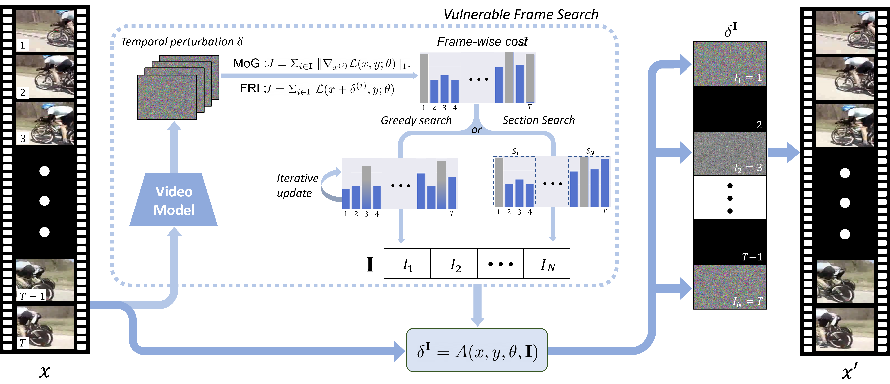
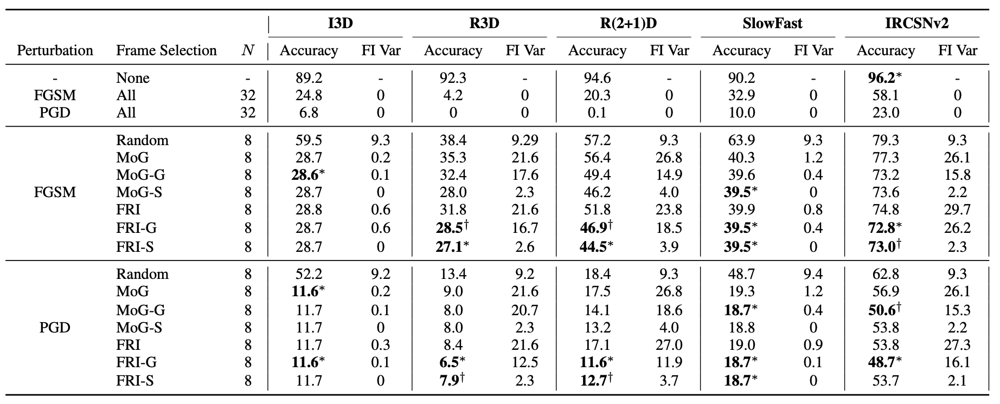

:::{.row .gx-5 .justify-content-center}
:::{.col-11 .col-lg-10 .col-xl-8 .col-xxl-7}

:::{.fs-6}
**Role:** Research Lead
:::

## Overview

---

- present a framework to generate a temporally sparse adversarial attack, called Search-and-Attack scheme, which first retrieves the most vulnerable frames and then attacks only those frames on Videos.
- Since the most vulnerable set of frames involves an expensive combinatorial optimization problem, we introduce alternative surrogate objective functions : Magnitude of the Gradients **(MoG)** and Frame-wise Robustness Intensity **(FRI)**.

## Method

---

### Problem Definition

Deep neural networks (DNNs) are highly effective in tasks like image and video classification,
but they are vulnerable to adversarial attacks, where small, deliberate perturbations to the input can cause the network to misclassify the data.

While adversarial attacks have been extensively studied in the image domain, their impact on video data has received less attention.
Existing video attacks either modify all frames or sample frames uniformly, failing to account for temporal dependencies between frames.
This approach is suboptimal, especially for video classification models that leverage temporal information.

The challenge addressed in this paper is to develop a method that efficiently identifies and perturbs only the most vulnerable frames in a video, resulting in a temporally sparse adversarial attack that is both effective and less perceptible.

The problem is formally defined as a mixed-integer non-linear program (MINLP):

:::{.math-container}
$$ \max_{\delta, I} \ L(x + \delta_I, y; \theta) \quad \text{subject to} \quad |I| = N, \quad \| \delta(i) \|_\infty \leq \epsilon, \quad \delta_I = \sum_{i \in I} \delta(i)
$$
:::

Here, $L(x + \delta_I, y; \theta)$ represents the loss function of the neural network with perturbed input,
$x$ is the input video, $y$ is the ground truth label, $\delta_I$ is the perturbation
applied only to the selected frames $I$, $\epsilon$ is the maximum allowable perturbation,
and $|I| = N$ ensures that only $N$ frames are attacked.

### Sparse Adversarial Attack for Video

The paper introduces a novel "Search-and-Attack" framework that consists of two stages: **Search** and **Attack**.

#### Search Stage

The goal of this stage is to identify the most vulnerable frames in a video that should be targeted by the adversarial attack.
This is achieved using surrogate objective functions:

**Magnitude of Gradient.** This function estimates the vulnerability of each frame by calculating the L1-norm of the gradient of the loss function
with respect to the frame:

:::{.math-container}
$$ \mathcal{L}(x + \delta^{\mathbf{I}}, y; \theta) \approx \mathcal{L}(x, y; \theta) + \langle  \nabla_{{x}}\mathcal{L}(x, y; \theta), \delta^{\mathbf{I}} \rangle $$
:::
we can approximate the object with 1st Taylor approximation as follows:

:::{.math-container}
$$ \mathcal{L}(x, y; \theta) + \langle  \nabla_{{x}}\mathcal{L}(x, y; \theta), \delta^{\mathbf{I}} \rangle \\  \le \mathcal{L}(x, y; \theta) + \varepsilon \cdot \sum\limits_{i \in \mathbf{I}}\; \|\nabla_{{x}_{i}}\mathcal{L}(x, y; \theta)\|_1. $$
:::

**Frame-wise Vulnerability.** This function assumes local linearity of the loss function around each frame and sums up the loss increases when perturbing each frame individually

:::{.math-container}
$$ \mathcal{L}(x + \delta)  - \mathcal{L}(x)= \mathcal{L} (x + \sum_{i \in \mathbf{I}} \delta^{(i)}) - \mathcal{L}(x)\\   \approx  \sum_{{i \in \mathbf{I}}} \left ( \mathcal{L}(x + \delta^{(i)}) - \mathcal{L}(x) \right ) $$
:::
Similar to MoG, the surrogate loss function can be further simplified by removing the constant L(x). The second surrogate objective function is given as :

:::{.math-container}
$$ J_{\text{FRI}}(x, \mathbf{I}, y; \theta) = \sum_{{i \in \mathbf{I}}} \mathcal{L}(x + \delta^{(i)}, y; \theta) $$
:::

Based on these surrogate losses, frames are selected using either a single-step method or more complex iterative search methods.

#### Atack Stage

Once the vulnerable frames are identified, adversarial perturbations are generated using methods such as FGSM (Fast Gradient Sign Method) or PGD (Projected Gradient Descent),
but only applied to the selected frames. For example, in the FGSM attack, the perturbation is calculated as

:::{.math-container}
$$\delta_{\text{FGSM}}(x, y, \theta, I) = \epsilon \cdot \text{sign}(\nabla_x L(x, y; \theta)) \odot M_I$$
:::

where $M_I$ is a mask that applies the perturbation only to the selected frames $I$.

## Experiments

---

Extensive experiments were conducted on three public benchmark datasets—UCF101, HMDB51, and Kinetics400—using widely adopted action recognition models like I3D, R3D, and SlowFast. The experiments reveal that the proposed Search-and-Attack method, particularly the combination of Greedy Search with FRI and PGD (FRI-G + PGD), significantly reduces the classification accuracy of the models by attacking only a small subset of frames, achieving comparable or superior performance to state-of-the-art dense attacks. The Section Search method, combined with FGSM, also demonstrated strong performance with reduced computational cost, highlighting the effectiveness of the framework in generating temporally sparse but powerful adversarial perturbations.

{.img-thumbnail}
:::
:::
