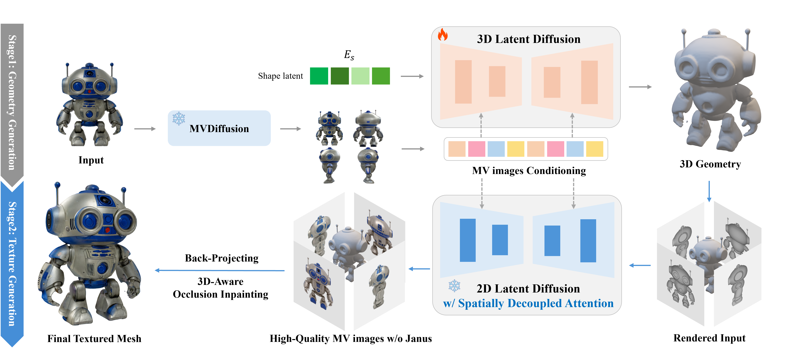
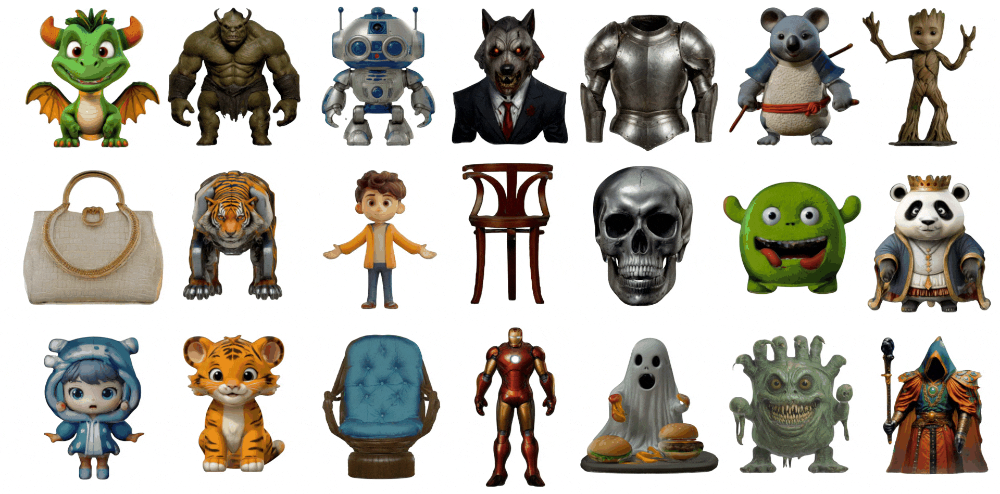

:::{.container .portfolio-details-container .col-11}

:::{.row .gy-4}

:::{.col-9 .col-lg-8 .col-xl-7 .col-xxl-6}
:::{.portfolio-description}

## Project Overview

This project introduces **CaPa (Carve-n-Paint Synthesis)**, a method for generating 4K textured 3D meshes with a practical runtime. Addressing the cost of traditional 3D asset creation pipelines, CaPa produces textured mesh assets in under 30 seconds. This makes the approach relevant for production settings such as game development, movie production, and VR/AR experiences.

CaPa achieves this through a two-stage approach: **Carving** (shape synthesis) and **Painting** (texture synthesis).
The Carving stage focuses on efficiently constructing the 3D mesh geometry, while the Painting stage synthesizes and applies a detailed 4K texture to the carved mesh.
This process separates geometry and texture generation, making the resulting assets easier to mesh, texture, and use in downstream 3D workflows.

:::{.mt-4}
**Key Contributions:**

- **CaPa**: a novel two-stage framework for efficient 4K textured mesh generation.
- **Mesh-Optimized 3D Generation Pipeline**: Separating geometry and texture generation, enabling effective meshing and enhancing the practicality of 3D asset generation
- **Spatially Decoupled Cross Attention**: A model-agnostic, training-free solution to generate 4K textures without additional training, super-resolution, and janus problem.
- **3D-aware Fast Occlusion Inpainting**: A robust inpainting solution for handling occluded regions in 3D textures, reducing visible seams, and preserving texture fidelity.

:::
:::
:::

:::{.col-lg-4}
:::{.portfolio-info}

### Project Details

- **Role**: Research Lead, Geometry & Texture Generation
- **Category**: Research, 3D Generation, Texture Synthesis, Deep Learning
- **Technology**: 3D Asset Generation, Neural Rendering, Texture Synthesis
- **Project URL**: [Project Page](https://ncsoft.github.io/CaPa)
- **Paper URL**: [Paper](https://arxiv.org/abs/2501.09433)
- **Related Project**: [Texture Copilot](https://www.youtube.com/embed/HvyPxxDzrwo?si=fvLPdWsv613WCRTu)
- **Skills Demonstrated**: 3D Computer Vision, 3D Generation, Generative Models, Latent Diffusion

:::
:::

:::
:::

:::{.container .col-11}

:::{.section-title}

:::{.portfolio-description}

## Results Showcase

**Interactive 4K Textured Mesh Examples**

For a closer look at CaPa's outputs, please visit the [project page](https://ncsoft.github.io/CaPa). There, you can explore interactive 4K textured meshes in detail.

**Diverse 4K Textured Meshes Generated by CaPa**

The following examples show 4K textured meshes generated by CaPa across several object categories.

:::{.gif-container}

:::
:::

:::
:::
