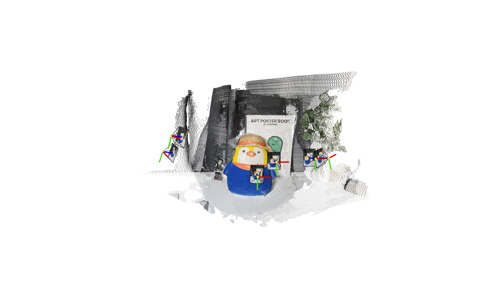

## VGGSfM vs. MASt3R

I evaluated [VGGSfM](https://vggsfm.github.io/) and [MASt3R](https://arxiv.org/abs/2406.09756) on 5-, 10-, and 27-view image sets.
Both outputs were converted to COLMAP format, inspected in one Viser tool, and used to initialize the same 2DGS path.

### VGGSfM: pose-first

Joint recovery and differentiable bundle adjustment produced sparser points but more consistent poses.

### MASt3R: density-first

Dense matching recovered more structure, but the camera estimates required further refinement.

### Sparse-view reconstruction

Both learned pipelines reconstructed sparse scenes where the tested COLMAP configuration failed to initialize.

### Pose refinement

A follow-up experiment refined MASt3R cameras during Radiance Field training and recovered a cleaner result.

## Results

VGGSfM stayed within 0.01 angular distance of the COLMAP reference, while MASt3R exceeded 0.1, explaining why the denser point cloud did not always render better.

### Reconstructed point clouds

<table>
  <tr>
    <th>MASt3R</th>
    <th>VGGSfM</th>
  </tr>
  <tr>
    <td></td>
    <td></td>
  </tr>
</table>

### Downstream 2DGS reconstruction

<table>
  <tr>
    <th>MASt3R</th>
    <th>VGGSfM</th>
  </tr>
  <tr>
    <td><video autoplay loop muted playsinline preload="metadata" poster="/blogs/posts/240721_sfm/assets/pen_sparse_mast3r_2dgs-poster.jpg" aria-label="2DGS initialized from MASt3R"><source src="/blogs/posts/240721_sfm/assets/pen_sparse_mast3r_2dgs.mp4" type="video/mp4"></video></td>
    <td><video autoplay loop muted playsinline preload="metadata" poster="/blogs/posts/240721_sfm/assets/pen_sparse_vggsfm_2dgs-poster.jpg" aria-label="2DGS initialized from VGGSfM"><source src="/blogs/posts/240721_sfm/assets/pen_sparse_vggsfm_2dgs.mp4" type="video/mp4"></video></td>
  </tr>
</table>

### MASt3R with camera-pose refinement

<video controls muted loop preload="metadata" aria-label="MASt3R reconstruction after camera-pose refinement">
  <source src="/blogs/posts/240721_sfm/assets/further_pose_opt.mp4" type="video/mp4">
</video>

The result confirmed that learned reconstruction and differentiable pose refinement can be complementary.
The repository has since attracted more than 230 GitHub stars.
