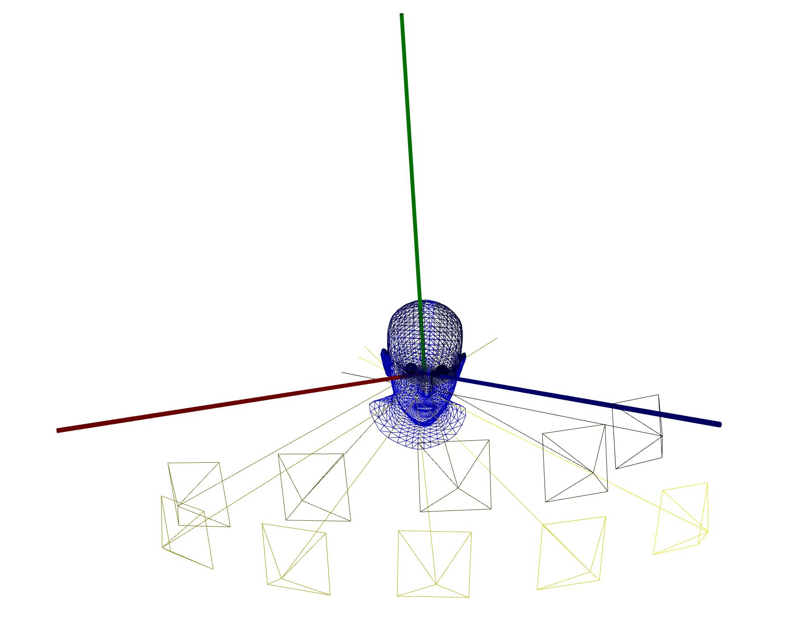
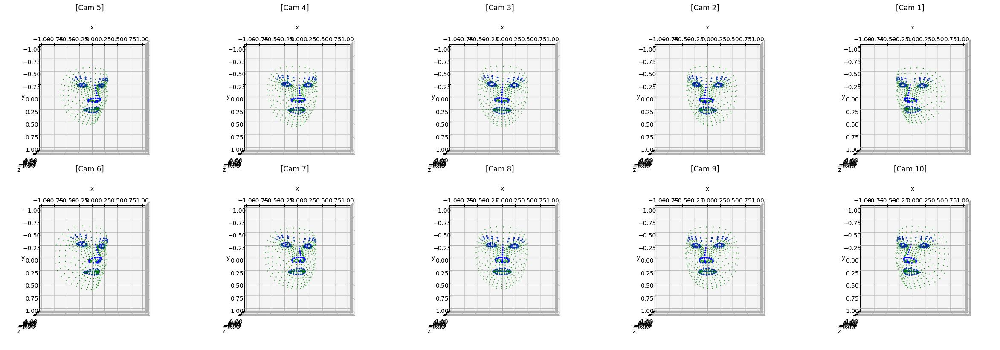

:::{.row .gx-5 .justify-content-center}
:::{.project-readable .portfolio-description}
:::{.fs-6}
**TL; DR:** This project presents an accelerated facial NeRF pipeline utilizing multi-camera setups to capture multi-view data for novel view synthesis.
:::
:::{.fs-6}
**Role:** Research Lead, Neural Avatar Reconstruction
:::
:::{.fs-6}
**Keywords:** Facial NeRF, Multi-Camera Setup, 3D Morphable Model (3DMM)
:::

## Overview

---

This project introduces an accelerated method for face NeRF using multi-camera captures to gather multi-view data for novel view synthesis (NVS). By utilizing a feed-forward approach to estimate 3D Morphable Model (3DMM) parameters, we significantly reduce preprocessing times compared to traditional methods. We further adapt the reconstructed mesh for efficient ray-casting in a perspective projection, optimizing both speed and accuracy for facial reconstruction tasks.

## Key Structures

---

### Multi-Camera Face Captures

{width=60%}

In traditional neural radiance field (NeRF) setups, monocular portrait synthesis has been a common approach, often limited by the reliance on single-view data, which constrains the performance of novel view synthesis (NVS). Our project addresses this limitation by employing multi-camera captures, enabling us to gather richer, multi-view data essential for improved NVS performance.

### Fast Feed-Forward Face Blendshape Prediction

To efficiently estimate the 3D Morphable Model (3DMM) parameters, we implemented a feed-forward approach.
While methods like MICA utilize a frame-wise, mesh-based differentiable rendering pipeline for parameter estimation, this technique, though accurate, is computationally expensive, requiring over 15 hours of preprocessing for just 3-5 minutes of video.

Given that extreme precision in 3DMM parameter estimation is not critical for our purposes, we adopted the faster feed-forward method. This allows us to trade off some reconstruction accuracy while dramatically reducing the preprocessing time to just a few minutes for the same input video duration.

Below is the comparison between famouse optimization-based 3DMM estimation method: [MICA](https://zielon.github.io/mica/)  and feed-forward-based method: [EMOCA](https://emoca.is.tue.mpg.de/). (Data: a famouse president obama)

<table>
<tr>
<th>MICA</th>
<th>EMOCA</th>
<th>Comparison</th>
</tr>
</table>
:::{.text-center}
<video style="width: 100%" muted autoplay playsinline loop>
<source src="assets/obm-ezgif.com-resize-video.mp4" type="video/mp4">
</video>
:::

### Mesh Adaptation for Multi-Camera System

Once the 3DMM parameters are estimated, we construct a 3D mesh that serves as a proxy for ray-casting operations.
The challenge here lies in adapting the pre-trained network, which was trained under the assumption of an orthographic camera model.

Since we are working within a perspective projection framework, we reverse-projected the mesh to fit how it would appear under a perspective camera model.
Using this back-projection, we construct a coarse mesh in the world coordinate system, which serves as the basis for building a bounding volume hierarchy (BVH) to facilitate efficient ray-casting during rendering.

Below is a visualization of our back-projected canonical mesh. The first column displays the canonical mesh used for 3DMM estimation, while the third through fifth columns show the back-projected canonical mesh from different camera perspectives.

<table>
<tr>
<th>Canonical</th>
<th>EMOCA</th>
<th>Cam #1</th>
<th>Cam #2</th>
<th>Cam #3</th>
</tr>
</table>
:::{.text-center}
<video style="width: 100%" muted autoplay playsinline loop>
<source src="assets/hwan_vis_mesh_pose_multicam-ezgif.com-crop-video.mp4" type="video/mp4">
</video>
:::

### Reconstructed Neural Portrait

---

Below is the reconstructed neural portrait result. Unlike monocular reconstruction algorithms, our method correctly captures torso movement as well. The use of multi-view images obtained from multi-camera setups ensures high visual fidelity in the output. Additionally, since the structure is based on predicting face deformations through 3DMM parameters, the reconstructed neural avatar can be manipulated for further adjustments.

<table>
<tr>
<th>Reconstructed Neural Portrait</th>
<th>Novel View Synthesis</th>
</tr>
</table>
:::{.text-center}
<video style="width: 100%" muted autoplay playsinline loop>
<source src="assets/hwan_nerf.mp4" type="video/mp4">
</video>
:::
---

This project successfully integrates multi-camera setups with accelerated facial NeRF, showcasing the potential for efficient and high-fidelity facial reconstruction. By leveraging feed-forward methods for 3DMM estimation and adapting ray-casting for perspective projections, we achieve a significant reduction in preprocessing time while maintaining high visual fidelity.

:::
:::
