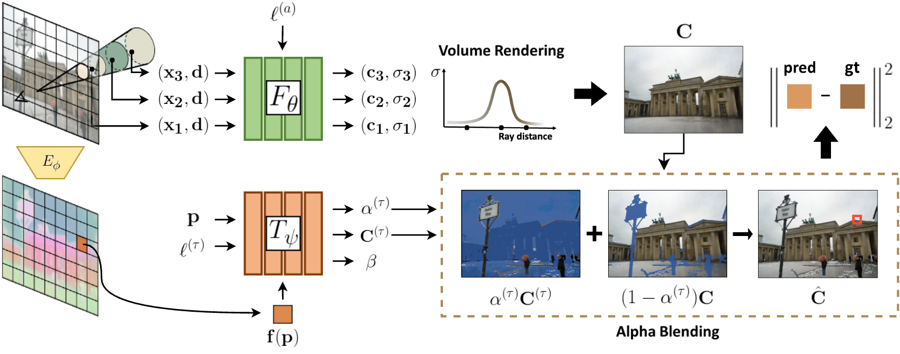
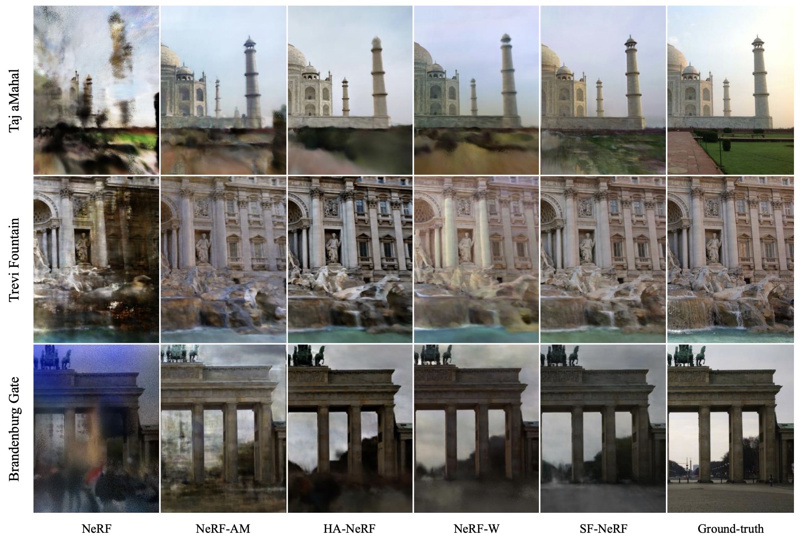
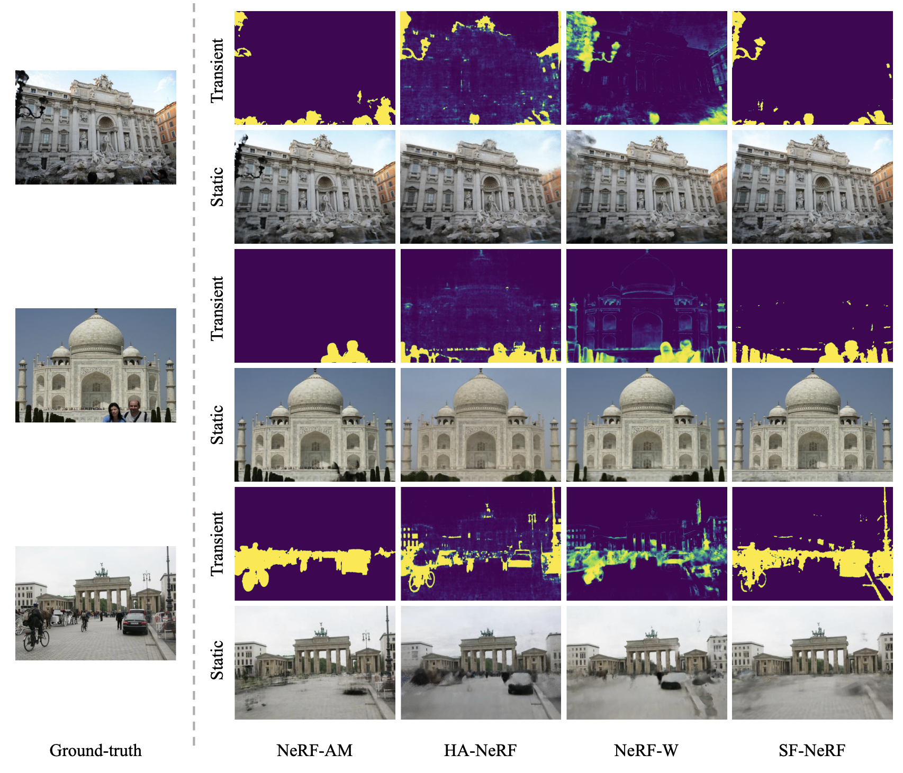

:::{.row .gx-5 .justify-content-center}
:::{.col-9 .col-lg-8 .col-xl-7 .col-xxl-6}
:::{.fs-6}
**TL; DR:** We introduce **SF-NeRF**, an advanced framework for reconstructing neural scene representations from a small number of unconstrained in-the-wild photos.
:::
:::{.fs-6}
**Keywords:** Neural Rendering, Radiance Fields, NeRF in-the-wild
:::

## Overview

---

SF-NeRF tackles the challenge of decomposing transient and static phenomena in neural scene reconstruction.
At its core is *FilterNet*, an additional MLP module designed to predict the transient components of each image.
FilterNet leverages semantic information extracted from an image encoder pretrained in an unsupervised manner, which is key to enabling few-shot learning.

Our framework is tailored for scenes captured under unconstrained conditions, such as varying illuminations and occlusions, commonly found in tourist photos. By utilizing DINO-based semantic features, we introduce an occlusion filtering module that predicts the transient color and its opacity for each pixel, enabling robust neural scene reconstruction even with limited data.

## Methodology

---

### Neural Radiance Fields

The core NeRF model represents a scene as a continuous volumetric radiance field $F_\theta$,
which maps a 3D position $ \mathbf{x} $ and viewing direction $ \mathbf{d} $ to a color $ \mathbf{c} $ and density $ \sigma $:

:::{.math-container}
$$
[\sigma, \mathbf{z}] = \text{MLP}_{\theta_1}(\gamma_{\mathbf{x}}(\mathbf{x})), \quad \mathbf{c} = \text{MLP}_{\theta_2}(\gamma_{\mathbf{d}}(\mathbf{d}), \mathbf{z})
$$
:::

where $\gamma_{\mathbf{x}} $ and $ \gamma_{\mathbf{d}} $ are positional encoding functions.

The expected color $C(\mathbf{r})$ along a camera ray $\mathbf{r}(t) = \mathbf{o} + t\mathbf{d}$ is computed using volume rendering:

:::{.math-container}
$$ C(\mathbf{r}) = \sum_{k=1}^{K} T(t_k) \alpha(t_k) \mathbf{c}(t_k)
$$
:::

where $\alpha(t_k) = 1 - \exp(-\sigma(t_k) \delta_k) $ and $T(t_k) = \exp\left(-\sum_{k'=1}^{k-1} \sigma(t_{k'}) \delta_{k'}\right)$.

### NeRF w/ Latent Embeding

To make more robust representation for the wild images, the radiance and density can be conditioned on an appearance embedding $ \mathbf{l}_i $ for each image $I_i$:

:::{.math-container}
$$
\mathbf{c}_i = \text{MLP}_{\theta_2}(\gamma_{\mathbf{d}}(\mathbf{d}), \mathbf{z}, \mathbf{l}_i), \quad C_i(\mathbf{r}) = \sum_{k=1}^{K} T(t_k) \alpha(t_k) \mathbf{c}_i(t_k)
$$
:::

The purpose of the embedding is to capture and represent the variations in appearance and lighting conditions across different images of the same scene.
These variations can include changes in illumination, color tone, and other environmental factors that differ from image to image.

### Dientangling Transients and Statics Using FilterNet

{.img-thumbnail}

To achieve consistent scene decomposition, we use an additional MLP module, dubbed FilterNet.
FilterNet receives feature maps $f_i(\mathbf{p})$ extracted from the input image by a pretrained **DINO** image encoder $E_\phi$.
These features help FilterNet predict transient objects from images.

Using Filternet, we model transient phenomena by learning image-dependent 2D maps: transient RGBA and uncertainty maps.
The final predicted pixel color $\hat{C}_i(\mathbf{r})$ is obtained by blending the static color $C_i(\mathbf{r})$ and transient color:

:::{.math-container}
$$ \hat{C}_i(\mathbf{r}) = \alpha_i^{(\tau)}(\mathbf{p}_r) C_i^{(\tau)}(\mathbf{p}_r) + \left(1 - \alpha_i^{(\tau)}(\mathbf{p}_r)\right) C_i(\mathbf{r})
$$
:::

where $ \alpha_i^{(\tau)}(\mathbf{p}_r)$ is the transient opacity, $C_i^{(\tau)}(\mathbf{p}_r)$ is the transient color, and $\mathbf{p}_r$ is the pixel corresponding to ray $\mathbf{r} $.

For each ray $\mathbf{r}$ in image $\mathcal{I}_i$, we train FilterNet to disentangle transient components from the scene in an unsupervised manner with loss $\mathcal{L}^{(i)}_\text{t}$:

:::{.math-container}
$$
\mathcal{L}^{(i)}_\text{t}(\mathbf{r}) = \frac{\big\lVert \hat{\mathbf{C}}_i(\mathbf{r})- \bar{\mathbf{C}}_i(\mathbf{r})\big\rVert^2_2}{2\beta_i(\mathbf{r})^2} + \frac{\log\beta_i(\mathbf{r})^2}{2} + \lambda_\alpha \alpha^{(\tau)}_i\hspace{-0.05cm}(\mathbf{r}),
$$
:::

where $\bar{\mathbf{C}}$ is the ground-truth color.

The first and second terms can be viewed as the negative log likelihood of $\bar{\mathbf{C}}_i(\mathbf{r})$
which is assumed to follow an isotropic normal distribution with mean $\hat{\mathbf{C}}_i(\mathbf{r})$
and variance $\beta_i(\mathbf{r})^2$.
The third term discourages \jaewon{FilterNet} from describing static phenomena.

#### Remark. Comparison to Latent NeRF and NeRF-W

- **Latent NeRF**
 primarily uses appearance embeddings to model varying lighting and view-dependent effects. However, it does not specifically address the challenge of transient occlusions or moving objects, making it less effective in dynamic real-world scenes.

- **NeRF-W**
 improves on Latent NeRF by introducing a transient head to handle scene variations. However, it requires a significant amount of training data to separate transient and static components effectively, limiting its applicability in few-shot scenarios.

**SF-NeRF** overcomes these limitations by integrating semantic guidance through FilterNet, which enables an effective decomposition of static and transient components even with minimal training images. The reparameterization and smoothness techniques further enhance its ability to produce clear and accurate scene reconstructions without the artifacts that commonly affect Latent NeRF and NeRF-W in challenging conditions.

## Experiments

---

The overall quantitative results and qualitative results demonstrate that the SF-NeRF mostly outperforms the baselines in the few-shot setting in the wild images.

SF-NeRF significantly outperforms NeRF-W and Latent NeRF in novel view synthesis tasks, particularly in few-shot settings. Evaluations on the Phototourism dataset—featuring diverse and unconstrained photographs—demonstrate SF-NeRF's superior ability to handle transient occluders and achieve high-quality scene reconstructions with just 30 images per landmark.

:::{.text-center}
{.img-thumbnail}
:::
:::{.text-center}
{.img-thumbnail}
:::
:::
:::
