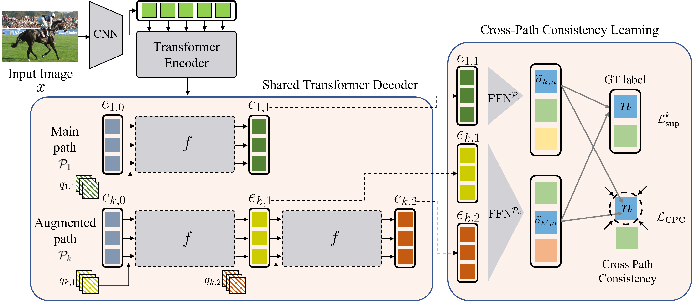
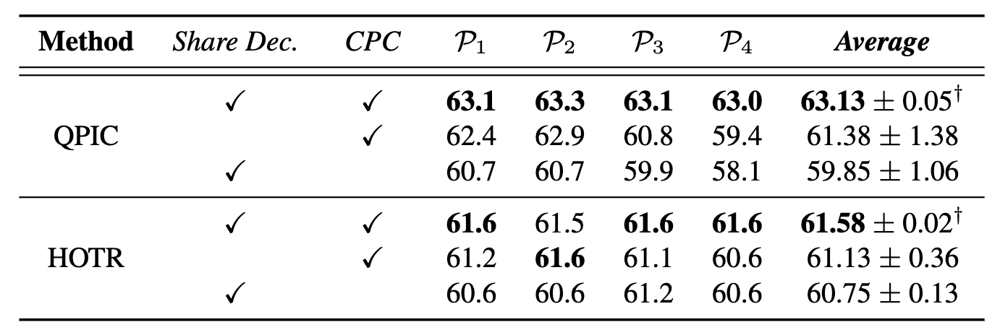
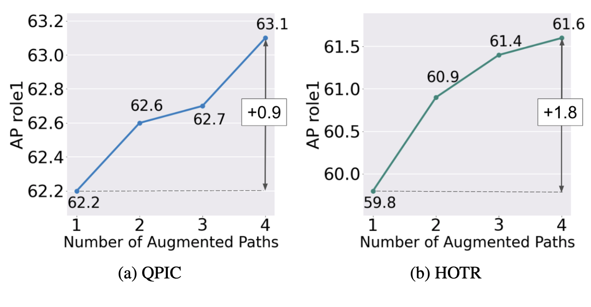

:::{.row .gx-5 .justify-content-center}
:::{.col-11 .col-lg-10 .col-xl-8 .col-xxl-7}

:::{.fs-6}
**Role:** Research Lead
:::

## Overview

---

1. We present DETR-based HOI detectors, which directly predicts the HOI triplets (Image -> HOI)
1. We propose cross-path consistency learning (CPC), which leverages augmented decoding paths (Right Fig.).
1. CPC enforces all the possible predictions from permuted inference sequences to be consistent.

## Problem Definition

---

Human-Object Interaction (HOI) detection is a complex visual recognition task that involves identifying objects and classifying their interactions with humans.

Recent advances have introduced transformer-based architectures that predict HOI triplets in an end-to-end manner, but these models still lack the ability to fully leverage the different paths through which HOI predictions can be made.

The core challenge addressed in this paper is to improve the generalization and consistency of transformer-based HOI models by utilizing all possible prediction paths during training without increasing model capacity or inference time.

The problem is formally framed as ensuring consistency across different decoding paths, where the objective is to make predictions invariant to the sequence of sub-task predictions. This leads to the following optimization problem:

:::{.math-container}
$$
\min_{\theta} \sum_{(k,k')\in K} L_{CPC} \left(f_{P_k}(x; \theta), f_{P_{k'}}(x; \theta)\right)
$$
:::
where $ L_{CPC} $ is the Cross-Path Consistency (CPC) loss that enforces consistency between predictions from different paths $ P_k $ and $ P_{k'} $.

## Method

---

The proposed solution is a novel end-to-end learning strategy called **Cross-Path Consistency (CPC) Learning** for transformers in HOI detection. The method consists of two key components: **Decoding-Path Augmentation** and **Cross-Path Consistency Regularization**.

- **Decoding-Path Augmentation:**
The method leverages various sequences of sub-task predictions (e.g., $x \rightarrow HOI$, $x \rightarrow HO \rightarrow I $) by augmenting the decoding paths within the transformer architecture. Four augmented paths are considered:
:::{.math-container}
$$
P_1 = x \rightarrow HOI, \\ P_2 = x \rightarrow HO \rightarrow I, \\ P_3 = x \rightarrow HI \rightarrow O, \\ P_4 = x \rightarrow OI \rightarrow H
$$
:::
These paths represent different sequences in which the sub-tasks of human detection ($H$), object detection ($O$), and interaction classification ($I$) are performed.

- **Cross-Path Consistency Learning:** The CPC learning framework ensures that predictions across these different paths remain consistent. The outputs from different paths are trained to match each other by adding a consistency loss term:
:::{.math-container}
$$
L_{CPC} = \frac{1}{S} \sum_{(k,k') \in K} \sum_{n=1}^{N} L_{P_k P_{k'}}^n
$$
:::
where $L_{P_k P_{k'}}^n $ is the consistency loss for the $n$-th ground truth across paths $ P_k$ and $ P_{k'}$, $S$ is the total number of path pairs, and $N$ is the number of ground truth labels. The final training loss combines the supervision loss $L_k^{sup}$ for each path with the CPC loss:

:::{.math-container}
$$
L = \sum_k L_k^{sup} + w(t) \cdot L_{CPC}
$$
:::
where $w(t)$ is a ramp-up function for stable training.

## Experimental Results

---

The proposed CPC learning framework was evaluated on two popular HOI detection benchmarks: V-COCO and HICO-DET, using transformer-based models such as QPIC and HOTR as baselines.

Based on two popular DETR-based HOI detection model: QPIC and HOTR, the presented CPC demonstrates effectiveness and superiority compared to the baseline.

:::{.text-center}
{width=80% .img-thumbnail}
:::

Furthermore, we show the performance is gradually improved as augmented paths are added. The ablation study evidences that regardless of each path performance, taking advantage of more paths bolsters the learning capability.

:::{.text-center}
{width=80% .img-thumbnail}
:::
:::
:::
