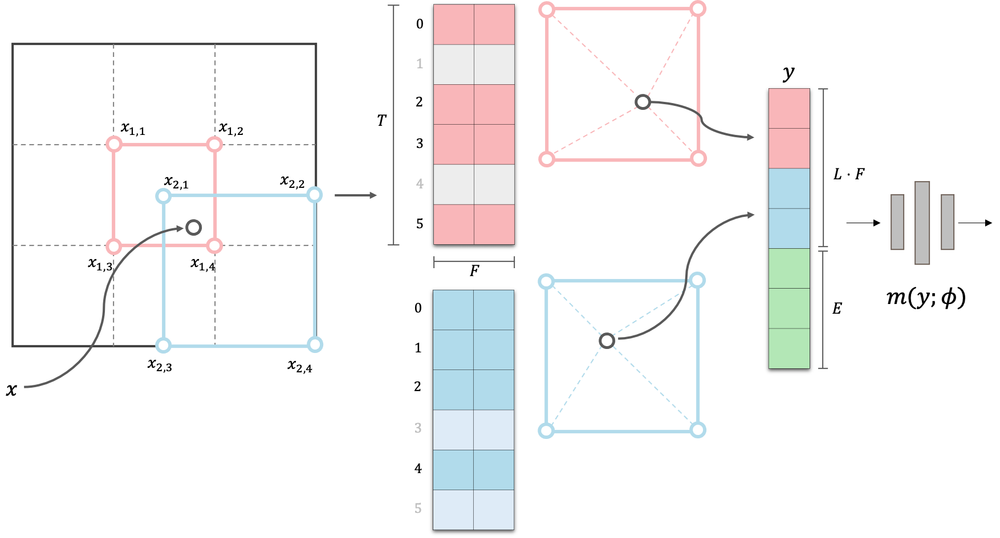
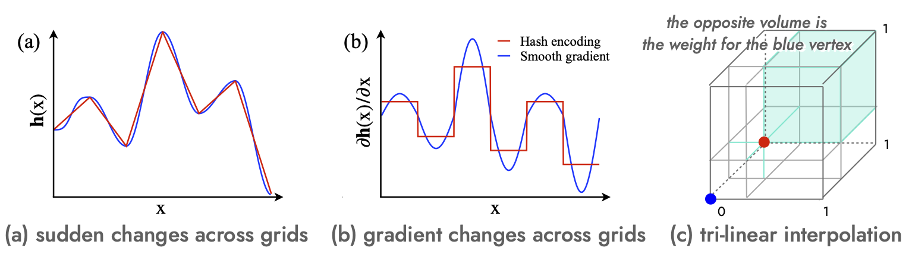
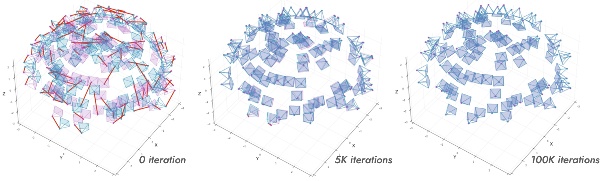
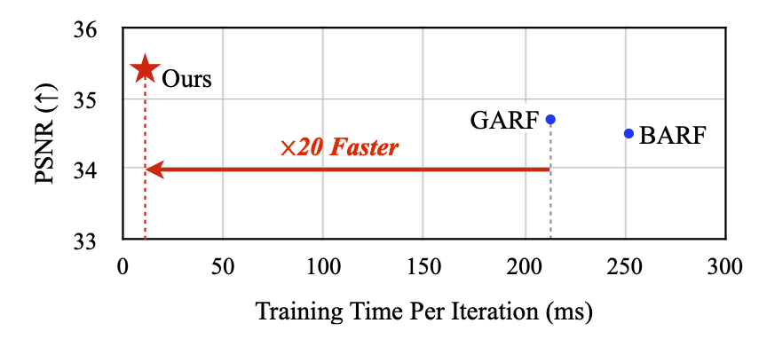
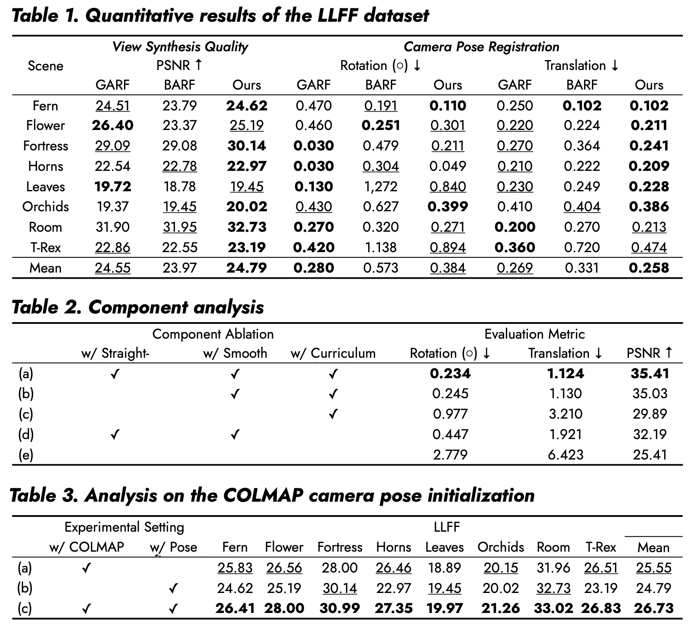

## Method

### Multi-Resolution Hash Encoding

1. Positional encoding uses hash tables to store multi-resolution features.
2. Each feature is the trilinear interpolation of the eight corner entries in a grid cell, weighted by the sample position.
3. Gradients cannot pass through the random hash indices themselves. They pass through the interpolation weights, whose coordinate derivatives are discontinuous across grid cells.

**Advantage:** fast convergence with strong reconstruction accuracy.

**Problem:** back-propagation through ray-sampled positions becomes unstable when the camera poses also have to move.

### Smooth Gradients for Stable Back-Propagation

**Derivative of Multi-Resolution Hash Encoding**

The Jacobian of the encoded feature at level $l$ is

$$
\begin{aligned}
\nabla_{\mathbf{x}}\mathbf{h}_{l}(\mathbf{x})
&=
\left[
\frac{\partial \mathbf{h}_{l}(\mathbf{x})}{\partial x_1},
\dots,
\frac{\partial \mathbf{h}_{l}(\mathbf{x})}{\partial x_d}
\right] \\
&=
\sum_{i=1}^{2^{d}}
\mathcal{H}_{l}\big(h_{l}(\mathbf{c}_{i,l}(\mathbf{x}))\big)
\left[
\frac{\partial w_{i,l}(\mathbf{x})}{\partial x_1},
\dots,
\frac{\partial w_{i,l}(\mathbf{x})}{\partial x_d}
\right].
\end{aligned}
$$

Let $\bar{i}$ be the corner paired with $\mathbf{c}_{i,l}$ along the $k$-th axis of the unit hypercube.
Among the $2^d$ corners, there are $2^{d-1}$ such pairs, and their interpolation-weight derivatives have opposite signs:

$$
\frac{\partial w_{\bar{i}_k,l}(\mathbf{x})}{\partial x_k}
=
-\frac{\partial w_{i,l}(\mathbf{x})}{\partial x_k}.
$$

Using those pairs, the $k$-th Jacobian component can be rewritten as

$$
\begin{aligned}
\frac{\partial \mathbf{h}_{l}(\mathbf{x})}{\partial x_k}
&=
\sum_{i=1}^{2^{d}}
\mathcal{H}_{l}\big(h_{l}(\mathbf{c}_{i,l}(\mathbf{x}))\big)
\frac{\partial w_{i,l}(\mathbf{x})}{\partial x_k} \\
&=
\sum_{i=1}^{2^{d-1}}
\left[
\mathcal{H}_{l}\big(h_{l}(\mathbf{c}_{i,l}(\mathbf{x}))\big)
-
\mathcal{H}_{l}\big(h_{l}(\mathbf{c}_{\bar{i}_k,l}(\mathbf{x}))\big)
\right]
\prod_{j \neq k}
\left(1-\left|\mathbf{x}_{l}-\mathbf{c}_{i,l}(\mathbf{x})\right|_j\right).
\end{aligned}
$$

The interpolation terms form a partition of unity:

$$
\sum_{i=1}^{2^{d-1}}
\prod_{j \neq k}
\left(1-\left|\mathbf{x}_{l}-\mathbf{c}_{i,l}(\mathbf{x})\right|_j\right)
=1.
$$

Therefore, $\partial\mathbf{h}_{l}(\mathbf{x})/\partial x_k$ is a convex combination of paired hash-entry differences.
Within a cell it is effectively piecewise constant along the $k$-th axis, then changes abruptly at the next boundary.
Those changes create the oscillating pose gradients.

We replace the linear interpolation gradient with an infinitely differentiable cosine weighting:

$$
\delta(w_{i,l})
=
\frac{1-\cos(\pi w_{i,l})}{2},
\qquad
\nabla_x\delta(w_{i,l})
=
\frac{\pi}{2}\sin(\pi w_{i,l})\nabla_x w_{i,l}.
$$

### Straight-Through Forward Function

Using nonlinear interpolation in the forward pass can hinder the original performance of Instant-NGP.
We therefore retain trilinear interpolation for the forward value and use the smooth function only for its gradient:

$$
\hat{w}_{i,l}
=
w_{i,l}
+\lambda\delta(w_{i,l})
-\lambda\tilde{\delta}(w_{i,l}),
$$

where $\tilde{\delta}(w_{i,l})$ denotes a value detached from the computational graph.
The two smooth terms cancel numerically in the forward pass, while the desired smooth derivative remains during back-propagation.

## Experiments

### Camera-Pose Refinement Progress

Red lines denote pose-error vectors between the ground-truth cameras and the optimized poses.

### Training Time per Iteration

- Retains Instant-NGP's fast convergence.
- Retains the reconstruction accuracy of multi-resolution hash encoding.
- Improves the stability of joint camera-pose refinement.

### Quantitative Results

Across synthetic and real novel-view-synthesis datasets, the method improved camera registration while retaining rapid neural-rendering convergence.
The work was published at **ICML 2023**, where the paper reported state-of-the-art pose-refinement performance.
