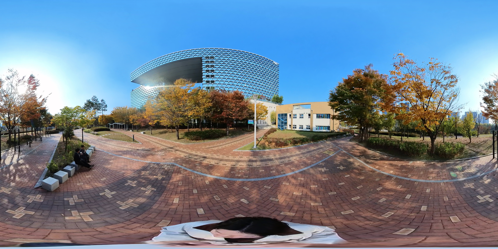
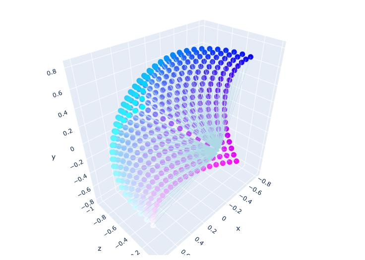
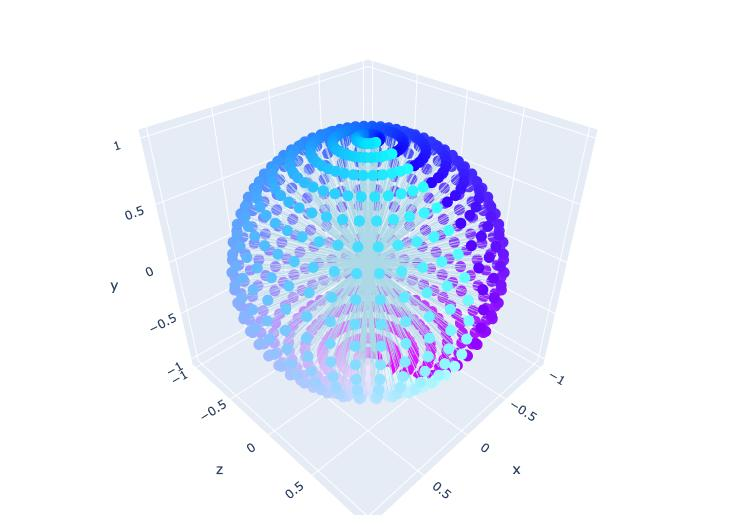
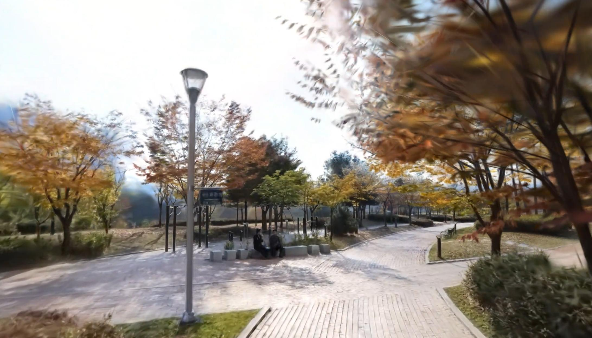
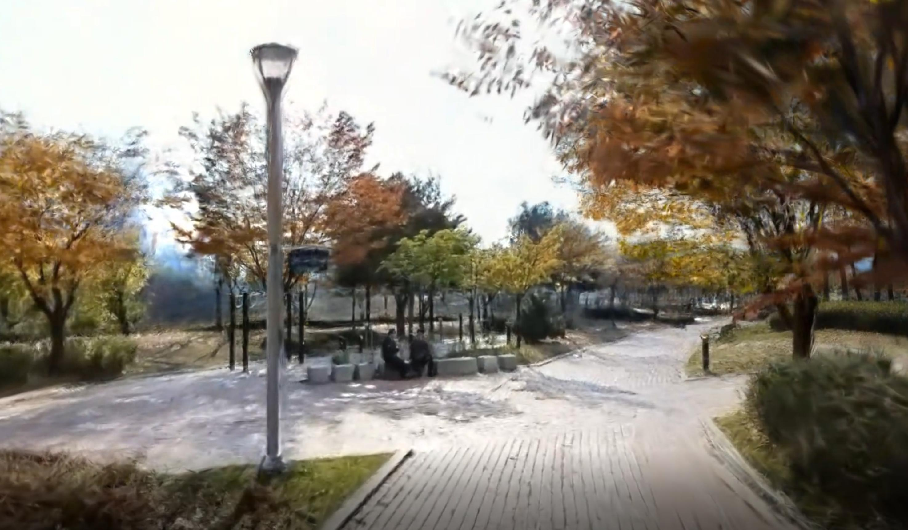
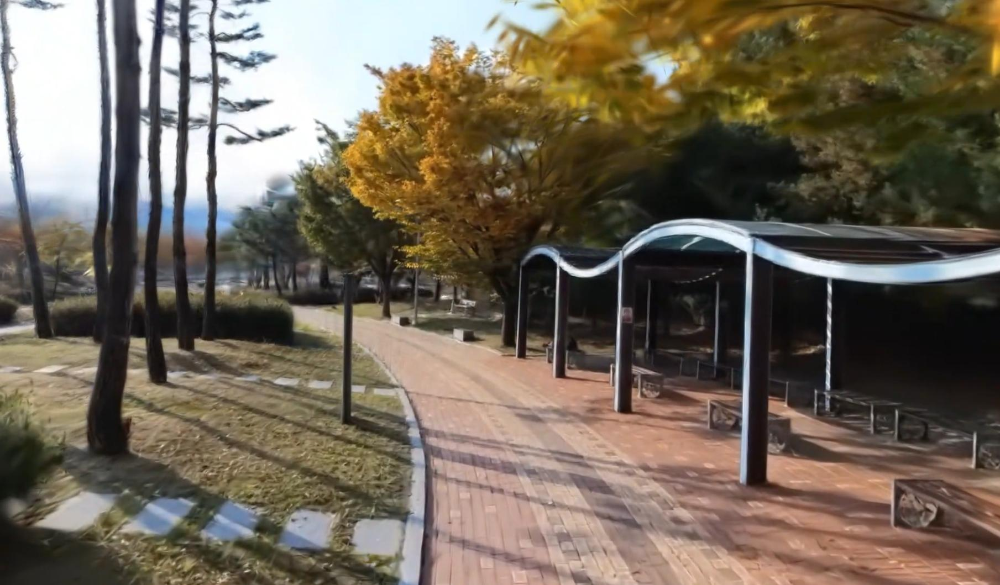
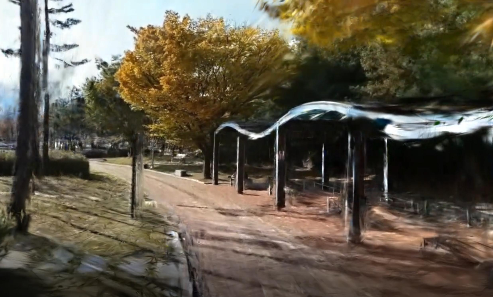
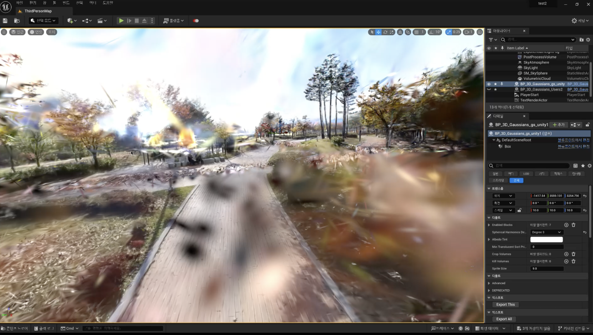
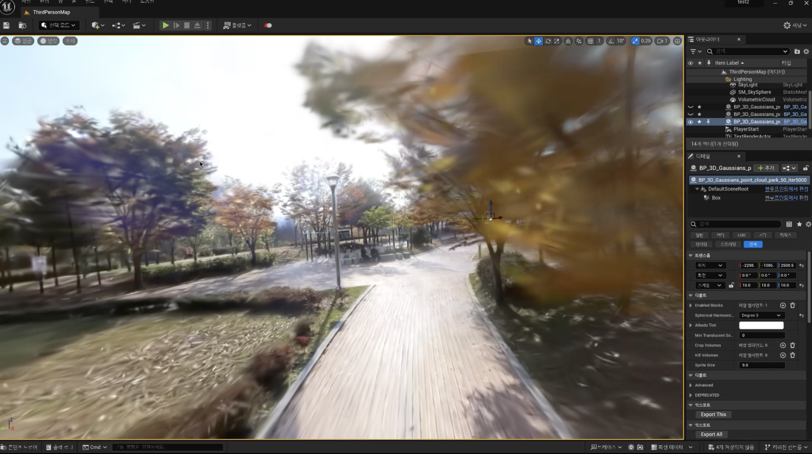

:::{.row .gx-5 .justify-content-center}
:::{.project-readable .portfolio-description}
:::{.fs-6}
**TL; DR:** This project proposes a unified pipeline that spans 360-camera captures to Gaussian Splatting-based scene reconstruction, enabling seamless integration into game and graphics engines such as Unity and Unreal.
:::
:::{.fs-6}
**Role:** Research Lead, Real-time Neural Rendering
:::
:::{.fs-6}
**Keywords:** Neural Rendering, Gaussian Splatting, 360 Camera, Camera Modeling
:::

## Overview

---

This project explores the integration of neural rendering techniques into game engines, bridging the gap between advanced 3D scene reconstruction and interactive applications. We develop a pipeline that efficiently processes 360-camera captures, reconstructs scenes using Gaussian Splatting, and optimizes the resulting assets for seamless deployment in game engines like Unity and Unreal.
The pipeline not only ensures high-fidelity scene modeling but also addresses practical challenges such as camera modeling and compatibility with existing game engine workflows, paving the way for more realistic and dynamic gaming environments.

:::{.video-container}
<iframe width="720" height="405" src="https://www.youtube.com/embed/3OqbvUaoNFw?si=GxEnL9nG7fuVT0x0" title="YouTube video player" frameborder="0" allow="accelerometer; autoplay; clipboard-write; encrypted-media; gyroscope; picture-in-picture; web-share" referrerpolicy="strict-origin-when-cross-origin" allowfullscreen></iframe>
:::

## Neural Rendering w/ 360 Videos

---

### Using 360 Camera for Effective Large Scene Capturing

To efficiently capture large scenes for 3D scene reconstruction, we utilize 360-degree videos as ground truth (GT) sources for novel view synthesis (NVS). Unlike standard cameras, 360 cameras are equipped with dual fisheye lenses positioned back-to-back, enabling them to capture a full spherical view of the environment in a single frame.
This configuration provides a significantly wider field of view compared to conventional cameras, allowing us to record extensive areas with fewer capture points. By leveraging this capability, we can efficiently gather high-quality data for large-scale scenes.

<figure>

<figcaption> a sample of captured 360 scene </figcaption>
</figure>

### Spherical 3D Gaussian Splatting

Initially, we trained the 3D Gaussian Splatting (GS) model using 360-degree equirectangular images.
However, the results were suboptimal, primarily due to ***stitching errors***inherent in the process of combining fisheye images to create 360-degree panoramas.
These errors introduced distortions and inconsistencies, which negatively impacted the quality of the reconstructed 3D scenes.

To overcome this limitation, we shifted to using the original fisheye images as our ground truth (GT) sources.
By directly utilizing fisheye images, we avoided the stitching artifacts and preserved the integrity of the captured data.
To further optimize this approach, we developed a ***custom CUDA-based Gaussian rasterization module*** tailored to the fisheye camera model.
This module extended the capabilities of the original rasterization module, which lacked native support for fisheye projections, enabling more accurate and efficient processing of spherical scene data.

<table>
<tr>
<th>Fisheye Camera Model</th>
<th>Spherical Camera Model</th>
</tr>
<tr>
<td></td>
<td></td>
</tr>
<tr>
<th colspan='2'> 3D GS Reconstruction </th>
</tr>
<tr>
<td></td>
<td></td>
</tr>
<tr>
<td></td>
<td></td>
</tr>
</table>

Here is the final reconstructed scene from 360 camera capture.

:::{.video-container}
<iframe width="720" height="405" src="https://www.youtube.com/embed/ISm-IL3HzmM?si=OyIAPB1Cgc70ADXU" title="YouTube video player" frameborder="0" allow="accelerometer; autoplay; clipboard-write; encrypted-media; gyroscope; picture-in-picture; web-share" referrerpolicy="strict-origin-when-cross-origin" allowfullscreen></iframe>
:::

## Gaussian Splatting w/ Game Engine

---

With the reconstructed 3D neural rendering scene, we further integrate it into game engines
such as Unity or Unreal, which offer powerful synthetic world generation capabilities.

The integration of the Gaussian Splatting and Game Engine can be easily implemented using
GS rasterization rule.
We further optimize it using vector-quantization so that the Unity-GS can be rendered within its
original rapid performance.

Below is the GS's virtual world experience which is fully interactive within the Unity engine,
with our neural avatar also reconstructed by radiance fields technique.

:::{.video-container}
<iframe width="720" height="405" src="https://www.youtube.com/embed/p5YXFOXWeW0?si=padif0-DUOVX4PHV" title="YouTube video player" frameborder="0" allow="accelerometer; autoplay; clipboard-write; encrypted-media; gyroscope; picture-in-picture; web-share" referrerpolicy="strict-origin-when-cross-origin" allowfullscreen></iframe>
:::

In Unreal Engine (UE), Gaussian Splatting scenes can be constructed similarly.
However, we've encountered a significant limitation:
Unreal's Niagara system can effectively render only up to 2 million particles. Given that a fully reconstructed scene often consists of over 6 million particles, this limitation leads to suboptimal results without optimization.
This issue has also been reported with the [XVERSE's UE GS plugin](https://github.com/xverse-engine/XV3DGS-UEPlugin/issues/6).

To overcome this, it's necessary to prune the splats so that the particle count stays within UE's upper limit.
We define the *contribution* of each splat as the sum of the intersected rays across all the training images.
Mathematically, this can be expressed as:

:::{.math-container}
$$ C = \sum_{k=1}^{n} C_k, \quad
C_k = \sum_{p \in \mathcal{P}_k} \alpha_i(p) \prod_{j=1}^{i(p)-1} (1 - \alpha_j)
$$
:::

We estimated the contribution of all trained splats and pruned the particles accordingly.
The pruned GS scene was then aligned.
This prune-and-refine process was iteratively optimized through only a few steps.
Below is a comparison between the original GS scene and the pruned GS scene in UE.

<table>
<tr>
<th> Original GS in UE </th>
<th> Pruned GS in UE</th>
</tr>
<tr>
<td></td>
<td></td>
</tr>
</table>
---

Below is the result video that demonstrates the interactive experience achieved with our pipeline in Unreal Engine, showcasing the fidelity and performance of pruned Gaussian Splatting.

:::{.video-container}
<iframe width="720" height="405" src="https://www.youtube.com/embed/FzoZVsvgVW0?si=GWOYlR0Ho8pgj2Cf" title="YouTube video player" frameborder="0" allow="accelerometer; autoplay; clipboard-write; encrypted-media; gyroscope; picture-in-picture; web-share" referrerpolicy="strict-origin-when-cross-origin" allowfullscreen></iframe>
:::

This pipeline demonstrates the potential of integrating advanced neural rendering techniques into interactive applications. Future work will explore further optimizations for real-time rendering and expanding the pipeline's scalability to larger scenes.

---

For more insights, see my blog post discussing the practical challenges and solutions for using NeRF in game engines: [Can NeRF be Used in Game?](../../../blogs/posts/?id=231130_nerf_in_game)

:::
:::
