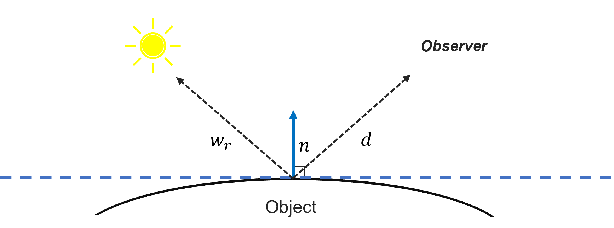

:::{.row .gx-5 .justify-content-center}
:::{.project-readable .portfolio-description}
:::{.fs-6}
**TL; DR:** This project aims to accelerate the separation of diffuse and specular color components in neural rendering, building on Ref-NeRF's directional embedding and Instant-NGP-based NeRFacto for faster performance.
:::
:::{.fs-6}
**Role:** Research Lead, Reflectance-aware Neural Rendering
:::
:::{.fs-6}
**Keywords:** Neural Rendering, Illumination Control, Physically-Based Rendering (PBR)
:::

## Overview

---

The core objective of my project is to achieve separation of diffuse and specular color components in neural rendering.
While models like [Ref-NeRF](https://dorverbin.github.io/refnerf/) have demonstrated success in this area through the use of directional embedding and structured model separation, their reliance on [Mip-NeRF](https://jonbarron.info/mipnerf/) results in slow performance.
To address this, I implemented key elements of Ref-NeRF using the [Insatnt-NGP](https://nvlabs.github.io/instant-ngp/)-based NeRFacto model as a foundation (presented by [NeRFStudio](https://docs.nerf.studio/)), enabling faster diffuse-specular disentanglement in an accelerated NeRF system.

## Key Structures

---

### Reflection Direction Parameterization

{width=70%}

Ref-NeRF reparameterizes outgoing radiance in terms of the reflection direction

:::{.math-container}
$$
\hat{\omega}_r = 2(\hat{\omega}_o \cdot \hat{n}) \hat{n} - \hat{\omega}_o,
$$
:::
where $\hat{\omega}_o$ is the viewing direction and $\hat{n}$ is the surface normal.

This approach enhances the interpolation of specular reflections by focusing on the reflected view direction rather than the direct one.

### Integrated Directional Encoding (IDE)

:::{.text-center}
<video style="width: 70%" muted autoplay playsinline loop>
<source src="assets/ide_animation.mp4" type="video/mp4">
</video>
:::

Drawing inspiration from Mip-NeRF, IDE employs spherical harmonics and a von Mises-Fisher (vMF) distribution to encode reflectance vectors. This method allows the model to efficiently handle varying material roughness. The expected spherical harmonics for the vMF distribution are approximated by:

:::{.math-container}
$$
E_{\hat{\omega} \sim \text{vMF}(\hat{\omega}r, \kappa)}[Y^m_{\ell}(\hat{\omega})] \approx A_{\ell}(\kappa) Y^m_{\ell}(\hat{\omega}r)
$$
:::
where $ A_{\ell}(\kappa) $ is the attenuation function based on roughness $\rho$.

### Diffuse and Specular Color Decomposition

Radiance is divided into diffuse ($c_d$) and specular ($c_s$) components, combined as:

:::{.math-container}
$$
c = \gamma(c_d + \gamma_s \odot c_s)
$$
:::
where $\gamma$ is a color transformation to sRGB, ensuring the final output falls within the $[0, 1]$ range.

## Implementation

---

Building on NeRFStudio's Nerfacto model, I integrated Ref-NeRF's directional embedding and model structure to enable diffuse-specular disentanglement. By leveraging Instant-NGP, I achieved significantly faster performance, addressing the speed limitations of Mip-NeRF-based approaches while maintaining a high-quality rendering of specular highlights and reflections.

Furthermore, implementing this project within NeRFStudio allowed for efficient rendering of scenes with dynamic camera paths, enhancing both the visual output and interaction with 3D scenes.

Below are my results for the Mip360 garden and two scenes I personally captured.

###### 1. Mip-NeRF 360 Garden

<table>
<tr>
<th>Full</th>
<th>Diffuse</th>
<th>Specular</th>
</tr>
</table>
:::{.video-container}
<video style="width: 100%" muted controls>
<source src="assets/gar.mp4" type="video/mp4">
</video>
:::

###### 2. Personal Capture #1

<table>
<tr>
<th>Full</th>
<th>Diffuse</th>
<th>Specular</th>
</tr>
</table>
:::{.video-container}
<video muted controls style="width: 100%">
<source src="assets/watch.mp4" type="video/mp4">
</video>
:::

###### 3. Personal Capture #2

<table>
<tr>
<th>Full</th>
<th>Diffuse</th>
<th>Specular</th>
</tr>
</table>
:::{.video-container}
<video muted controls style="width: 100%">
<source src="assets/benc.mp4" type="video/mp4">
</video>
:::
:::
:::
